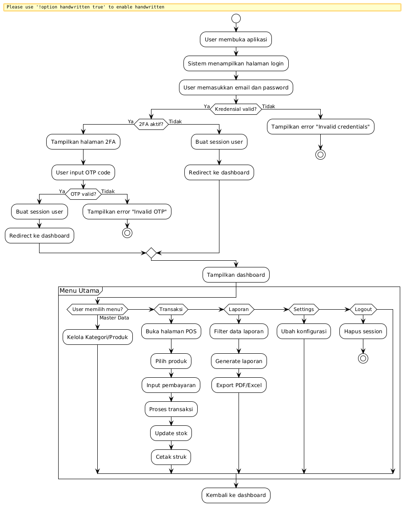

# 4.0 ANALISIS SISTEM

Analisis sistem merupakan tahapan awal dalam siklus pengembangan perangkat lunak yang bertujuan untuk mengidentifikasi permasalahan, kebutuhan, dan solusi yang tepat sebelum memasuki tahap perancangan. Pada sub-bab ini akan dijelaskan mengenai profil objek penelitian, analisis sistem yang sedang berjalan, serta solusi permasalahan yang ditawarkan melalui pembangunan Sistem POS DW.

---

## 4.0.1 Tentang Sistem POS DW

Sistem Point of Sale Data Warehouse (POS DW) merupakan sistem informasi penjualan yang dirancang untuk mendukung operasional bisnis retail dalam mengelola transaksi penjualan, manajemen produk, inventori, dan laporan penjualan. Sistem ini dibangun menggunakan framework Laravel 13 dengan bahasa pemrograman PHP 8.3 dan database MySQL 8.0.

Berdasarkan observasi yang dilakukan pada lingkungan bisnis retail skala kecil dan menengah, permasalahan yang dihadapi meliputi pencatatan transaksi yang masih dilakukan secara manual, sehingga data berisiko hilang atau rusak. Selain itu, pelaporan penjualan yang kurang efektif karena masih dilakukan secara manual menyebabkan proses analisis data menjadi lambat dan berpotensi terjadi kesalahan, sehingga menyulitkan pihak toko dalam mengambil keputusan tepat waktu. Pengelolaan stok produk juga menjadi tantangan karena informasi produk yang tidak terstruktur rentan memicu kesalahan, sehingga dapat terjadi kekurangan atau kelebihan barang.

Sistem POS DW dikembangkan menggunakan metodologi Agile dengan pendekatan Rapid Application Development (RAD) yang menekankan pada prototyping cepat, iterasi pengembangan, feedback kontinyu, dan deployment bertahap. Arsitektur sistem mengadopsi pola Model-View-Controller (MVC) dengan enhancement dari Livewire untuk reactive components.

*Sumber: Hasil Observasi (2026)*

---

## 4.0.2 Analisa Sistem Yang Sedang Berjalan

Analisis sistem yang sedang berjalan merupakan salah satu cara atau teknik untuk menguraikan masalah dan mencari gambaran dari sistem yang ada atau teknik yang sedang berjalan. Berdasarkan observasi pada lingkungan bisnis retail skala kecil dan menengah, proses bisnis penjualan yang umum berjalan adalah sebagai berikut:

1. Pelanggan datang langsung ke toko dan melihat produk yang tersedia.
2. Pelanggan memilih produk yang akan dibeli.
3. Admin atau kasir mencatat data pesanan pelanggan secara manual pada buku agenda.
4. Admin atau kasir melakukan pemeriksaan stok produk, kemudian menyerahkan barang kepada pelanggan.
5. Pelanggan menerima barang dan melakukan pembayaran.
6. Kasir membuat nota penjualan rangkap dua, nota putih diserahkan kepada pelanggan dan nota berwarna disimpan oleh kasir sebagai arsip.
7. Arsip nota direkap secara manual pada akhir hari untuk menjadi laporan penjualan.

Berikut merupakan proses bisnis yang sedang berjalan di lingkungan retail dan digambarkan dengan flowchart dokumen sistem penjualan yang dapat dilihat pada gambar 4.1.

### Gambar 4.1 Flowchart Sistem Penjualan Manual

*Sumber: Hasil Analisis (2026)*

Sistem manual yang sedang digunakan dalam penjualan menimbulkan beberapa permasalahan yang dapat dijelaskan sebagai berikut:

1. **Kesulitan dalam proses pencarian berkas** — Data transaksi yang tersimpan dalam bentuk buku agenda menyulitkan pencarian data historis penjualan.
2. **Keterlambatan proses perekapan laporan** — Laporan penjualan harus direkap secara manual sehingga membutuhkan waktu yang lama dan berpotensi terjadi kesalahan perhitungan.
3. **Kebutuhan tempat penyimpanan yang besar** — Laporan tersimpan dalam bentuk buku agenda besar dan kertas dalam jumlah besar yang disimpan di lemari arsip.
4. **Risiko hilangnya berkas** — Berkas yang telah dibuat dapat hilang atau rusak sehingga membutuhkan waktu dalam pelaksanaannya kembali.

*Sumber: Hasil Observasi (2026)*

---

## 4.0.3 Solusi Permasalahan Sistem

Berdasarkan analisa sistem yang sedang berjalan pada lingkungan bisnis retail, solusi yang tepat untuk permasalahan sistem ialah membuat suatu sistem informasi penjualan digital berbasis web yang dapat mempermudah admin dan kasir dalam mengelola transaksi, produk, stok, dan laporan penjualan.

Sistem POS DW dibangun menggunakan framework Laravel 13 dengan bahasa pemrograman PHP 8.3 dan database MySQL 8.0. Pemilihan teknologi ini didasarkan pada beberapa pertimbangan:

1. **Framework Laravel** merupakan framework PHP yang memiliki ekosistem lengkap, dokumentasi yang baik, dan fitur keamanan bawaan seperti CSRF protection, SQL injection prevention melalui Eloquent ORM, dan XSS protection.
2. **Livewire 4** memungkinkan pembuatan antarmuka reaktif tanpa perlu menulis kode JavaScript secara eksplisit, sehingga mempercepat proses pengembangan.
3. **MySQL 8.0** merupakan database relasional yang stabil dan memiliki performa tinggi untuk menangani transaksi penjualan.

Sistem yang dibangun bertujuan untuk:

1. Mempermudah admin dan kasir dalam mengelola transaksi penjualan secara digital.
2. Menyediakan laporan penjualan secara real-time dan akurat.
3. Mengelola stok produk secara terstruktur.
4. Menyediakan fitur keamanan berlapis melalui autentikasi dan otorisasi berbasis role.

*Sumber: Hasil Analisis Kebutuhan (2026)*

---

## Navigasi

| [← Daftar Isi](./README.md) | [← Induk Bab IV](./BAB-IV-PERANCANGAN-DAN-IMPLEMENTASI.md) | [4.1 Analisa Kebutuhan Sistem →](./4.1-analisis-kebutuhan-sistem.md) |
|:---:|:---:|:---:|
