# 4.2 PERANCANGAN SISTEM

Perancangan sistem merupakan tahapan yang sangat penting dalam siklus pengembangan perangkat lunak. Pada tahapan ini dilakukan pemodelan sistem menggunakan pendekatan berorientasi objek dengan menggunakan Unified Modeling Language (UML). Perancangan sistem bertujuan untuk memberikan gambaran yang jelas dan lengkap mengenai bagaimana sistem akan dibangun, baik dari segi alur proses, interaksi antar komponen, maupun struktur data yang digunakan.

Perancangan sistem POS DW mencakup beberapa aspek penting yang akan dijelaskan secara detail pada sub-bab berikut:

1. Flowchart Sistem untuk menggambarkan alur kerja sistem secara keseluruhan
2. Use Case Diagram untuk mengidentifikasi aktor dan fungsionalitas sistem
3. Activity Diagram untuk memodelkan alur aktivitas bisnis
4. Sequence Diagram untuk menjelaskan interaksi antar objek dalam sistem
5. Class Diagram untuk menggambarkan struktur class dan relasi antar class

---

## 4.2.1 Flowchart Sistem

Flowchart atau diagram alir merupakan representasi grafis dari langkah-langkah yang harus dilalui dalam suatu proses. Dalam konteks Sistem POS DW, flowchart digunakan untuk menggambarkan alur kerja aplikasi dari awal hingga akhir, mulai dari user membuka aplikasi hingga proses logout.

### Gambar 4.1 Flowchart Sistem POS DW

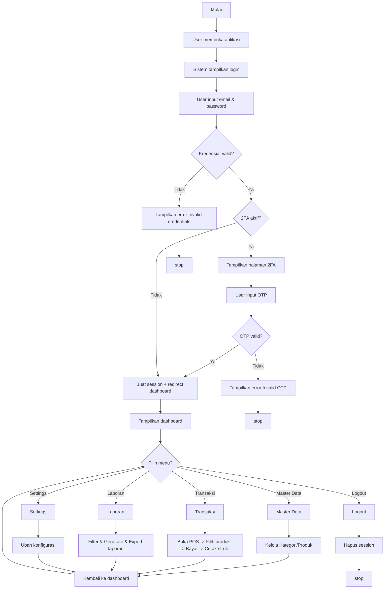

*Sumber: Hasil Perancangan (2026)*
### Penjelasan Flowchart

Flowchart sistem POS DW menggambarkan alur kerja aplikasi secara menyeluruh. Berikut adalah penjelasan detail setiap tahapan:

**1. Tahap Inisialisasi**

Proses dimulai ketika user membuka aplikasi melalui browser. Sistem kemudian akan menampilkan halaman login sebagai gerbang utama untuk mengakses sistem. Pada tahap ini, sistem belum memberikan akses ke halaman manapun sebelum user berhasil melakukan autentikasi.

**2. Tahap Autentikasi**

Tahap autentikasi merupakan proses verifikasi identitas user. User memasukkan email dan password yang akan divalidasi oleh sistem. Terdapat dua decision point pada tahap ini:

- **Decision Point 1 - Validasi Kredensial**: Sistem akan memeriksa kecocokan email dan password dengan data yang tersimpan di database. Jika kredensial tidak valid, sistem akan menampilkan pesan error dan proses dihentikan. Jika valid, proses dilanjutkan ke pengecekan 2FA.

- **Decision Point 2 - Verifikasi 2FA**: Jika user telah mengaktifkan Two Factor Authentication (2FA), sistem akan menampilkan halaman khusus untuk memasukkan kode OTP. Sistem akan memvalidasi kode OTP yang dimasukkan. Jika OTP tidak valid, sistem menampilkan error dan proses dihentikan. Jika valid, atau jika 2FA tidak aktif, sistem akan membuat session user dan mengarahkan ke dashboard.

**3. Tahap Menu Utama**

Setelah berhasil login, sistem menampilkan dashboard yang berisi informasi statistik dan navigasi menu. User dapat memilih menu yang tersedia sesuai dengan hak akses yang dimiliki:

- **Master Data**: Menu untuk mengelola kategori dan produk
- **Transaksi**: Menu untuk melakukan transaksi penjualan POS
- **Laporan**: Menu untuk melihat dan mengekspor laporan
- **Settings**: Menu untuk mengatur konfigurasi sistem
- **Logout**: Menu untuk keluar dari sistem

**4. Tahap Transaksi**

Pada menu transaksi, user dapat memilih produk, memasukkan pembayaran, dan memproses transaksi. Setelah transaksi berhasil, sistem secara otomatis akan mengurangi stok produk dan menampilkan struk yang dapat dicetak.

**5. Tahap Logout**

Ketika user memilih menu logout, sistem akan menghapus session user, membersihkan data autentikasi, dan mengembalikan user ke halaman login.

---

## 4.2.2 Use Case Diagram

Use case diagram merupakan diagram UML yang digunakan untuk menggambarkan interaksi antara aktor (pengguna) dengan sistem. Diagram ini menunjukkan fungsionalitas yang disediakan oleh sistem dan siapa saja yang dapat mengakses fungsionalitas tersebut.

### Gambar 4.2 Use Case Diagram Sistem POS DW

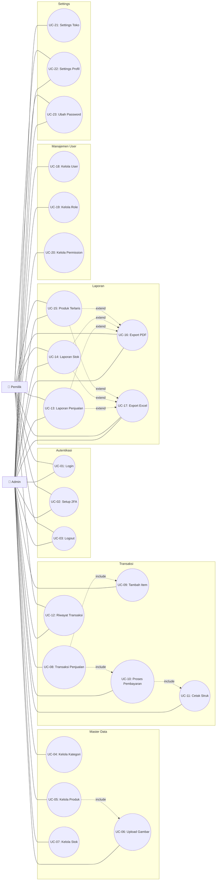

*Sumber: Hasil Perancangan (2026)*
### Identifikasi Aktor

Berdasarkan hasil analisis kebutuhan sistem, terdapat dua aktor yang akan berinteraksi dengan sistem POS DW. Berikut adalah penjelasan masing-masing aktor:

**Tabel 4.1 Daftar Aktor Sistem**

| No | Aktor | Deskripsi | Hak Akses Utama |
|----|-------|-----------|-----------------|
| 1 | Admin | Pengguna dengan hak akses penuh terhadap seluruh sistem. Admin bertanggung jawab dalam pengelolaan master data, transaksi penjualan, pengaturan sistem, dan manajemen user | Kelola seluruh modul (master data, transaksi, laporan, user, role, permission, settings) |
| 2 | Pemilik | Pengguna yang bertugas melakukan monitoring dan analisis bisnis. Pemilik membutuhkan data laporan untuk pengambilan keputusan | Lihat dashboard, generate laporan, lihat riwayat transaksi, export laporan ke PDF/Excel, update profil |

*Sumber: Analisis Kebutuhan Sistem (2026)*

### Daftar Use Case

Sistem POS DW memiliki 23 use case yang merepresentasikan seluruh fungsionalitas yang tersedia. Berikut adalah daftar lengkap use case beserta deskripsi dan aktor yang terlibat:

**Tabel 4.2 Daftar Use Case**

| Kode | Use Case | Deskripsi | Aktor |
|------|----------|-----------|-------|
| UC-01 | Login | Proses autentikasi user ke dalam sistem menggunakan email dan password | Admin, Pemilik |
| UC-02 | Setup 2FA | Mengaktifkan atau menonaktifkan fitur Two Factor Authentication | Admin, Pemilik |
| UC-03 | Logout | Proses keluar dari sistem dan menghapus session | Admin, Pemilik |
| UC-04 | Kelola Kategori | Mengelola data kategori produk (Create, Read, Update, Delete) | Admin |
| UC-05 | Kelola Produk | Mengelola data produk termasuk informasi detail, harga, dan stok | Admin |
| UC-06 | Upload Gambar Produk | Mengunggah dan mengelola gambar untuk setiap produk | Admin |
| UC-07 | Kelola Stok | Melakukan penyesuaian stok produk secara manual | Admin |
| UC-08 | Transaksi Penjualan | Melakukan proses transaksi penjualan dari awal hingga akhir | Admin |
| UC-09 | Tambah Item ke Cart | Menambahkan produk ke dalam keranjang belanja | Admin |
| UC-10 | Proses Pembayaran | Melakukan kalkulasi dan memproses pembayaran transaksi | Admin |
| UC-11 | Cetak Struk | Mencetak struk atau invoice hasil transaksi | Admin |
| UC-12 | Lihat Riwayat Transaksi | Melihat daftar transaksi yang telah dilakukan | Admin, Pemilik |
| UC-13 | Laporan Penjualan | Menghasilkan laporan penjualan berdasarkan periode waktu | Admin, Pemilik |
| UC-14 | Laporan Stok | Menghasilkan laporan stok produk termasuk stok menipis | Admin, Pemilik |
| UC-15 | Laporan Produk Terlaris | Menghasilkan laporan produk dengan penjualan tertinggi | Admin, Pemilik |
| UC-16 | Export PDF | Mengekspor laporan ke dalam format PDF | Admin, Pemilik |
| UC-17 | Export Excel | Mengekspor laporan ke dalam format Excel | Admin, Pemilik |
| UC-18 | Kelola User | Mengelola data pengguna sistem (CRUD) | Admin |
| UC-19 | Kelola Role | Mengelola role atau peran pengguna dalam sistem | Admin |
| UC-20 | Kelola Permission | Mengelola hak akses untuk setiap role | Admin |
| UC-21 | Settings Toko | Mengatur konfigurasi toko (nama, alamat, logo, telepon) | Admin |
| UC-22 | Settings Profil | Memperbarui profil pengguna (nama, email) | Admin, Pemilik |
| UC-23 | Ubah Password | Mengganti password akun pengguna | Admin, Pemilik |

*Sumber: Analisis Kebutuhan Sistem (2026)*

### Relasi Include dan Extend

Pada use case diagram terdapat beberapa relasi yang menjelaskan ketergantungan antar use case:

- **Relasi Include**: Use case UC-08 (Transaksi Penjualan) mencakup UC-09 (Tambah Item ke Cart) dan UC-10 (Proses Pembayaran). Ini berarti bahwa untuk melakukan transaksi penjualan, user harus terlebih dahulu menambahkan item ke keranjang dan melakukan proses pembayaran. Selanjutnya, UC-10 (Proses Pembayaran) mencakup UC-11 (Cetak Struk) yang berarti setelah pembayaran berhasil, sistem akan mencetak struk secara otomatis. UC-05 (Kelola Produk) mencakup UC-06 (Upload Gambar Produk) karena dalam pengelolaan produk, pengguna dapat mengunggah gambar produk.

- **Relasi Extend**: UC-13 (Laporan Penjualan), UC-14 (Laporan Stok), dan UC-15 (Laporan Produk Terlaris) memiliki relasi extend ke UC-16 (Export PDF) dan UC-17 (Export Excel). Ini berarti bahwa export laporan merupakan fungsionalitas opsional yang dapat dilakukan setelah laporan ditampilkan.

### Deskripsi Use Case

Berdasarkan diagram use case, berikut adalah deskripsi detail untuk setiap use case dalam bentuk tabel yang menjelaskan Nama, ID Use Case, Aktor, Deskripsi, Exception, Precondition, Skenario Normal (Aktor dan Sistem), Skenario Alternatif, serta Post Condition.

#### Deskripsi Use Case Admin dan Pemilik

Deskripsi use case yang dapat dilakukan oleh aktor Admin dan Pemilik adalah sebagai berikut.

**Tabel 4.3 Deskripsi Use Case Login**

| Nama | Login |
|------|-------|
| **ID Use Case** | UC-01 |
| **Aktor** | Admin dan Pemilik |
| **Deskripsi** | Dilakukan oleh aktor untuk masuk ke dalam sistem |
| **Exception** | Login gagal karena email atau password salah |
| **Precondition** | Email dan password sudah harus tersimpan dalam database |

| Aktor | Sistem |
|-------|--------|
| 1. Membuka halaman website | 2. Menampilkan halaman website |
| 3. Memilih menu login | 4. Menampilkan halaman login |
| 5. Melakukan login dengan mengisi email dan password | |
| 6. Memilih tombol login | 7. Membuka koneksi ke database |
| | 8. Melakukan validasi email dan password |
| 10. Login berhasil, masuk ke menu utama | 9. Validasi berhasil, masuk ke menu utama |

| Skenario Alternatif |
|---------------------|
| 9a. Validasi gagal, sistem menampilkan peringatan dan memberi kesempatan login kembali |
| 5a. Sistem memberi kesempatan untuk melakukan login kembali |

| Post Condition |
|----------------|
| Aktor berhasil melakukan Login dan masuk ke halaman utama |

*Sumber: Analisis Use Case (2026)*

**Tabel 4.4 Deskripsi Use Case Setup 2FA**

| Nama | Setup 2FA |
|------|-----------|
| **ID Use Case** | UC-02 |
| **Aktor** | Admin dan Pemilik |
| **Deskripsi** | Dilakukan oleh aktor untuk mengaktifkan atau menonaktifkan fitur Two Factor Authentication (2FA) pada akun |
| **Exception** | Kode OTP tidak valid atau QR code gagal dipindai |
| **Precondition** | Aktor sudah login ke dalam sistem |

| Aktor | Sistem |
|-------|--------|
| 1. Membuka halaman settings profil | 2. Menampilkan halaman settings profil |
| 3. Memilih menu keamanan / 2FA | 4. Menampilkan halaman pengaturan 2FA |
| 5. Memilih tombol "Aktifkan 2FA" | 6. Membangkitkan secret key dan QR code |
| 7. Memindai QR code dengan aplikasi authenticator | |
| 8. Memasukkan kode OTP dari aplikasi authenticator | |
| 9. Memilih tombol "Verifikasi" | 10. Memvalidasi kode OTP |
| 12. 2FA berhasil diaktifkan | 11. Validasi berhasil, menyimpan secret key |
| 13. Memilih tombol "Nonaktifkan 2FA" | 14. Menampilkan konfirmasi dan memvalidasi password |
| 15. Memasukkan password dan memilih "Konfirmasi" | 16. Menonaktifkan 2FA dan menghapus secret key |

| Skenario Alternatif |
|---------------------|
| 10a. Kode OTP tidak valid, sistem menampilkan pesan error dan meminta input ulang |
| 14a. Password salah, sistem menampilkan error dan menolak permintaan nonaktif |

| Post Condition |
|----------------|
| Fitur 2FA berhasil diaktifkan atau dinonaktifkan pada akun pengguna |

*Sumber: Analisis Use Case (2026)*

**Tabel 4.5 Deskripsi Use Case Logout**

| Nama | Logout |
|------|--------|
| **ID Use Case** | UC-03 |
| **Aktor** | Admin dan Pemilik |
| **Deskripsi** | Proses yang dilakukan oleh aktor untuk keluar dari sistem |
| **Exception** | - |
| **Precondition** | Aktor sudah login ke dalam sistem |

| Aktor | Sistem |
|-------|--------|
| 1. Memilih menu logout | 2. Menampilkan dialog konfirmasi logout |
| 3. Memilih "Ya" pada konfirmasi | 4. Menghapus seluruh session dan cookies |
| | 5. Mengarahkan ke halaman login |

| Skenario Alternatif |
|---------------------|
| 3a. Memilih "Tidak" pada konfirmasi, sistem tetap di halaman dashboard |

| Post Condition |
|----------------|
| Aktor berhasil keluar dari sistem dan kembali ke halaman login |

*Sumber: Analisis Use Case (2026)*

**Tabel 4.6 Deskripsi Use Case Kelola Kategori**

| Nama | Kelola Kategori |
|------|-----------------|
| **ID Use Case** | UC-04 |
| **Aktor** | Admin |
| **Deskripsi** | Aktor melakukan pengolahan data kategori produk |
| **Exception** | Pengolahan data gagal dikarenakan data belum lengkap atau kategori masih digunakan oleh produk |
| **Precondition** | Aktor telah login ke dalam sistem |

| Aktor | Sistem |
|-------|--------|
| 1. Pilih menu Kategori | |
| | 2. Tampilkan halaman daftar kategori |
| 3. Aktor memilih tombol untuk mengelola kategori |
| * Aktor memilih Tambah, maka S1 yang berlaku |
| * Aktor memilih Edit, maka S2 yang berlaku |
| * Aktor memilih Hapus, maka S3 yang berlaku |

| S1: Tambah Kategori |
|---------------------|

| Aktor | Sistem |
|-------|--------|
| 1. Pilih tombol tambah kategori | |
| | 2. Sistem menampilkan form input kategori |
| 3. Input nama kategori | |
| 4. Pilih tombol simpan | |
| | 5. Sistem memverifikasi data kategori yang diinputkan |
| | 6. Jika data lengkap, sistem menyimpan kategori ke dalam database dan muncul pesan "Data Telah Ditambah" |

| Skenario Alternatif S1 |
|------------------------|
| 6a. Jika data belum lengkap, sistem menampilkan pesan "Data Belum Lengkap" |
| 7. Aktor kembali menginput data kategori |

| S2: Edit Kategori |
|-------------------|

| Aktor | Sistem |
|-------|--------|
| 1. Pilih edit kategori | |
| | 2. Sistem menampilkan halaman edit kategori |
| 3. Mengedit nama kategori | |
| 4. Pilih tombol simpan data | |
| | 5. Sistem memverifikasi data kategori yang diedit |
| | 6. Sistem menyimpan perubahan data kategori ke dalam database dan muncul pesan "Data Telah Diedit" |

| Skenario Alternatif S2 |
|------------------------|
| 4a. Pilih tombol kembali, sistem menampilkan data kategori |
| 5a. Memilih kembali data yang akan diedit |

| S3: Hapus Kategori |
|--------------------|

| Aktor | Sistem |
|-------|--------|
| 1. Pilih hapus kategori | |
| | 2. Sistem menampilkan pesan "Yakin ingin menghapus data?" |
| 3. Pilih hapus | |
| | 4. Sistem menghapus kategori dari database dan muncul pesan "Data Telah Dihapus" |

| Skenario Alternatif S3 |
|------------------------|
| 3a. Pilih cancel, sistem menampilkan halaman data kategori |

| Post Condition |
|----------------|
| Aktor berhasil melakukan pengolahan data kategori |

*Sumber: Analisis Use Case (2026)*

**Tabel 4.7 Deskripsi Use Case Kelola Produk dan Upload Gambar**

| Nama | Kelola Produk dan Upload Gambar |
|------|--------------------------------|
| **ID Use Case** | UC-05, UC-06 |
| **Aktor** | Admin |
| **Deskripsi** | Aktor melakukan pengolahan data produk dan mengunggah gambar produk |
| **Exception** | Pengolahan data gagal dikarenakan data belum lengkap atau format gambar tidak sesuai |
| **Precondition** | Aktor telah login ke dalam sistem dan data kategori sudah tersedia |

| Aktor | Sistem |
|-------|--------|
| 1. Pilih menu Produk | |
| | 2. Tampilkan halaman daftar produk |
| 3. Aktor memilih tombol untuk mengelola produk |
| * Aktor memilih Tambah, maka S1 yang berlaku |
| * Aktor memilih Edit, maka S2 yang berlaku |
| * Aktor memilih Hapus, maka S3 yang berlaku |

| S1: Tambah Produk |
|-------------------|

| Aktor | Sistem |
|-------|--------|
| 1. Pilih tombol tambah produk | |
| | 2. Sistem menampilkan form input produk |
| 3. Input data produk (nama, SKU, harga, stok, kategori, deskripsi) | |
| 4. Upload gambar produk (opsional) | |
| 5. Pilih tombol simpan | |
| | 6. Sistem memverifikasi data produk yang diinputkan |
| | 7. Jika data lengkap, sistem menyimpan data produk dan gambar ke dalam database dan muncul pesan "Data Telah Ditambah" |

| Skenario Alternatif S1 |
|------------------------|
| 7a. Jika data belum lengkap, sistem menampilkan pesan "Data Belum Lengkap" |
| 8. Aktor kembali menginput data produk |

| S2: Edit Produk |
|-----------------|

| Aktor | Sistem |
|-------|--------|
| 1. Pilih edit produk | |
| | 2. Sistem menampilkan halaman edit produk |
| 3. Mengedit data produk | |
| 4. Upload ulang gambar (opsional) | |
| 5. Pilih tombol simpan data | |
| | 6. Sistem memverifikasi data produk yang diedit |
| | 7. Sistem menyimpan perubahan data produk ke dalam database dan muncul pesan "Data Telah Diedit" |

| Skenario Alternatif S2 |
|------------------------|
| 5a. Pilih tombol kembali, sistem menampilkan data produk |
| 6a. Memilih kembali data yang akan diedit |

| S3: Hapus Produk |
|------------------|

| Aktor | Sistem |
|-------|--------|
| 1. Pilih hapus produk | |
| | 2. Sistem menampilkan pesan "Yakin ingin menghapus data?" |
| 3. Pilih hapus | |
| | 4. Sistem menghapus produk dan gambar dari database dan muncul pesan "Data Telah Dihapus" |

| Skenario Alternatif S3 |
|------------------------|
| 3a. Pilih cancel, sistem menampilkan halaman data produk |

| Post Condition |
|----------------|
| Aktor berhasil melakukan pengolahan data produk |

*Sumber: Analisis Use Case (2026)*

**Tabel 4.8 Deskripsi Use Case Kelola Stok**

| Nama | Kelola Stok |
|------|-------------|
| **ID Use Case** | UC-07 |
| **Aktor** | Admin |
| **Deskripsi** | Aktor melakukan penyesuaian stok produk secara manual |
| **Exception** | Data stok gagal diperbarui karena data tidak valid |
| **Precondition** | Aktor telah login ke dalam sistem dan data produk tersedia |

| Aktor | Sistem |
|-------|--------|
| 1. Pilih menu produk | |
| | 2. Tampilkan halaman daftar produk |
| 3. Pilih produk yang akan disesuaikan stoknya | |
| 4. Pilih tombol "Sesuaikan Stok" | |
| | 5. Sistem menampilkan form penyesuaian stok |
| 6. Input jumlah stok baru atau penambahan/pengurangan stok | |
| 7. Pilih tombol simpan | |
| | 8. Sistem memverifikasi data stok |
| | 9. Sistem menyimpan perubahan stok ke dalam database dan mencatat riwayat stok |

| Skenario Alternatif |
|---------------------|
| 8a. Jika data tidak valid (stok negatif), sistem menampilkan pesan error |

| Post Condition |
|----------------|
| Stok produk berhasil diperbarui dan riwayat penyesuaian tercatat |

*Sumber: Analisis Use Case (2026)*

**Tabel 4.9 Deskripsi Use Case Transaksi Penjualan**

| Nama | Transaksi Penjualan |
|------|---------------------|
| **ID Use Case** | UC-08, UC-09, UC-10, UC-11 |
| **Aktor** | Admin |
| **Deskripsi** | Aktor melakukan proses transaksi penjualan produk kepada customer melalui interface Point of Sale, dimulai dari pemilihan produk, input pembayaran, hingga mencetak struk |
| **Exception** | Transaksi gagal karena stok tidak mencukupi atau pembayaran kurang |
| **Precondition** | Aktor telah login ke dalam sistem dan minimal ada satu produk aktif dengan stok tersedia |

| Aktor | Sistem |
|-------|--------|
| 1. Pilih menu Transaksi POS | |
| | 2. Menampilkan halaman POS dengan daftar produk dan keranjang belanja |
| 3. Cari produk dengan mengetikkan nama atau SKU | |
| | 4. Menampilkan hasil pencarian secara real-time |
| 5. Pilih produk yang akan dibeli | |
| | 6. Validasi ketersediaan stok |
| | 7. Jika stok tersedia, tambahkan produk ke keranjang dengan quantity default 1 |
| 8. Ubah quantity produk sesuai kebutuhan (opsional) | |
| | 9. Hitung subtotal per item dan total keseluruhan secara real-time |
| 10. Ulangi langkah 3-9 untuk produk lain (opsional) | |
| 11. Input nama customer | |
| 12. Pilih metode pembayaran (Cash/Debit/Credit/E-Wallet) | |
| 13. Input jumlah pembayaran | |
| | 14. Hitung dan tampilkan jumlah kembalian |
| 15. Konfirmasi transaksi dengan memilih "Process Payment" | |
| | 16. Memulai database transaction |
| | 17. Simpan data transaksi ke tabel transactions |
| | 18. Simpan detail item ke tabel transaction_items |
| | 19. Kurangi stok produk sesuai quantity yang dibeli |
| | 20. Commit database transaction |
| | 21. Generate struk dalam format PDF |
| | 22. Tampilkan notifikasi sukses |
| 23. Cetak struk untuk diberikan kepada customer | |
| | 24. Reset form untuk transaksi berikutnya |

| Skenario Alternatif |
|---------------------|
| 6a. Stok tidak tersedia, sistem menampilkan notifikasi dan tidak menambahkan produk. Kembali ke langkah 3 |
| 8a. Quantity melebihi stok, sistem membatasi quantity maksimal sesuai stok dan menampilkan peringatan |
| 14a. Jumlah pembayaran kurang, sistem menampilkan error dan meminta input ulang |
| 18a. Database error, sistem melakukan rollback transaction, menampilkan error, tidak ada perubahan stok |

| Post Condition |
|----------------|
| Aktor berhasil melakukan transaksi penjualan, data tersimpan, stok berkurang, dan struk siap dicetak |

*Sumber: Analisis Use Case (2026)*

**Tabel 4.10 Deskripsi Use Case Lihat Riwayat Transaksi**

| Nama | Lihat Riwayat Transaksi |
|------|-------------------------|
| **ID Use Case** | UC-12 |
| **Aktor** | Admin dan Pemilik |
| **Deskripsi** | Aktor melihat daftar riwayat transaksi yang telah dilakukan |
| **Exception** | - |
| **Precondition** | Aktor telah login ke dalam sistem |

| Aktor | Sistem |
|-------|--------|
| 1. Pilih menu Riwayat Transaksi | |
| | 2. Menampilkan halaman riwayat transaksi |
| 3. Memilih kriteria filter (tanggal, status, metode pembayaran) | |
| | 4. Menampilkan daftar transaksi sesuai kriteria yang dipilih |
| 5. Pilih salah satu transaksi untuk melihat detail | |
| | 6. Menampilkan detail transaksi (item, jumlah, total, pembayaran) |

| Skenario Alternatif |
|---------------------|
| - |

| Post Condition |
|----------------|
| Aktor telah melihat riwayat transaksi sesuai dengan kriteria yang dipilih |

*Sumber: Analisis Use Case (2026)*

**Tabel 4.11 Deskripsi Use Case Kelola Laporan dan Export**

| Nama | Kelola Laporan dan Export |
|------|---------------------------|
| **ID Use Case** | UC-13, UC-14, UC-15, UC-16, UC-17 |
| **Aktor** | Admin dan Pemilik |
| **Deskripsi** | Aktor dapat melihat laporan penjualan, laporan stok, dan laporan produk terlaris serta mengekspornya ke format PDF atau Excel |
| **Exception** | Gagal menampilkan laporan karena data tidak tersedia atau gagal export |
| **Precondition** | Aktor telah login ke dalam sistem dan terdapat data transaksi atau stok yang tersimpan |

| Aktor | Sistem |
|-------|--------|
| 1. Pilih menu Laporan | |
| | 2. Menampilkan halaman laporan dengan pilihan jenis laporan |
| 3. Pilih jenis laporan (Penjualan/Stok/Produk Terlaris) | |
| | 4. Menampilkan form filter sesuai jenis laporan |
| 5. Tentukan periode tanggal (start_date dan end_date) | |
| 6. Pilih filter tambahan (kategori, dll) | |
| 7. Pilih tombol "Generate Report" | |
| | 8. Melakukan query data dengan filter yang dipilih |
| | 9. Menampilkan data laporan dalam bentuk tabel |
| | 10. Menampilkan grafik dan summary statistic |
| 11. Pilih tombol Export PDF | |
| | 12. Sistem generate file PDF dari data laporan |
| | 13. File PDF siap diunduh |
| 14. Pilih tombol Export Excel | |
| | 15. Sistem generate file Excel dari data laporan |
| | 16. File Excel siap diunduh |

| Skenario Alternatif |
|---------------------|
| 8a. Data tidak tersedia untuk periode yang dipilih, sistem menampilkan pesan "Tidak ada data" |

| Post Condition |
|----------------|
| Aktor berhasil melihat laporan dan dapat mengekspornya ke PDF atau Excel |

*Sumber: Analisis Use Case (2026)*

**Tabel 4.12 Deskripsi Use Case Kelola User**

| Nama | Kelola User |
|------|-------------|
| **ID Use Case** | UC-18 |
| **Aktor** | Admin |
| **Deskripsi** | Aktor melakukan pengolahan data user pengguna sistem |
| **Exception** | Pengolahan data gagal dikarenakan data belum lengkap atau email sudah terdaftar |
| **Precondition** | Aktor telah login ke dalam sistem |

| Aktor | Sistem |
|-------|--------|
| 1. Pilih menu User | |
| | 2. Tampilkan halaman daftar user |
| 3. Aktor memilih tombol untuk mengelola user |
| * Aktor memilih Tambah, maka S1 yang berlaku |
| * Aktor memilih Edit, maka S2 yang berlaku |
| * Aktor memilih Hapus, maka S3 yang berlaku |

| S1: Tambah User |
|-----------------|

| Aktor | Sistem |
|-------|--------|
| 1. Pilih tombol tambah user | |
| | 2. Sistem menampilkan form input user |
| 3. Input data user (nama, email, password, role) | |
| 4. Pilih tombol simpan | |
| | 5. Sistem memverifikasi data user yang diinputkan |
| | 6. Jika data lengkap dan email unik, sistem menyimpan user ke dalam database dan muncul pesan "Data Telah Ditambah" |

| Skenario Alternatif S1 |
|------------------------|
| 6a. Jika data belum lengkap, sistem menampilkan pesan "Data Belum Lengkap" |
| 6b. Jika email sudah terdaftar, sistem menampilkan pesan "Email sudah digunakan" |
| 7. Aktor kembali menginput data user |

| S2: Edit User |
|---------------|

| Aktor | Sistem |
|-------|--------|
| 1. Pilih edit user | |
| | 2. Sistem menampilkan halaman edit user |
| 3. Mengedit data user | |
| 4. Pilih tombol simpan data | |
| | 5. Sistem memverifikasi data user yang diedit |
| | 6. Sistem menyimpan perubahan data user ke dalam database dan muncul pesan "Data Telah Diedit" |

| Skenario Alternatif S2 |
|------------------------|
| 4a. Pilih tombol kembali, sistem menampilkan data user |
| 5a. Memilih kembali data yang akan diedit |

| S3: Hapus User |
|----------------|

| Aktor | Sistem |
|-------|--------|
| 1. Pilih hapus user | |
| | 2. Sistem menampilkan pesan "Yakin ingin menghapus data?" |
| 3. Pilih hapus | |
| | 4. Sistem menghapus user dari database dan muncul pesan "Data Telah Dihapus" |

| Skenario Alternatif S3 |
|------------------------|
| 3a. Pilih cancel, sistem menampilkan halaman data user |

| Post Condition |
|----------------|
| Aktor berhasil melakukan pengolahan data user |

*Sumber: Analisis Use Case (2026)*

**Tabel 4.13 Deskripsi Use Case Kelola Role dan Permission**

| Nama | Kelola Role dan Permission |
|------|----------------------------|
| **ID Use Case** | UC-19, UC-20 |
| **Aktor** | Admin |
| **Deskripsi** | Aktor melakukan pengelolaan role dan hak akses (permission) untuk setiap role dalam sistem |
| **Exception** | Gagal menyimpan karena data tidak lengkap |
| **Precondition** | Aktor telah login ke dalam sistem |

**S1: Kelola Role**

| Aktor | Sistem |
|-------|--------|
| 1. Pilih menu Role | |
| | 2. Menampilkan halaman daftar role |
| 3. Pilih tombol tambah role | |
| | 4. Menampilkan form input role |
| 5. Input nama role | |
| 6. Pilih tombol simpan | |
| | 7. Memverifikasi dan menyimpan role ke database |
| 8. Pilih edit role | |
| | 9. Menampilkan form edit role |
| 10. Edit nama role | |
| 11. Pilih tombol simpan | |
| | 12. Menyimpan perubahan role |
| 13. Pilih hapus role | |
| | 14. Menampilkan konfirmasi |
| 15. Pilih hapus | |
| | 16. Menghapus role dari database |

| Skenario Alternatif S1 |
|------------------------|
| 15a. Pilih cancel, sistem membatalkan penghapusan |

**S2: Kelola Permission**

| Aktor | Sistem |
|-------|--------|
| 1. Pilih menu Permission | |
| | 2. Menampilkan halaman daftar permission per role |
| 3. Pilih role yang akan diatur permission-nya | |
| | 4. Menampilkan daftar permission yang tersedia |
| 5. Centang atau hapus centang pada permission yang diinginkan | |
| 6. Pilih tombol simpan | |
| | 7. Menyimpan pengaturan permission ke database |

| Skenario Alternatif S2 |
|------------------------|
| - |

| Post Condition |
|----------------|
| Role dan permission berhasil dikelola dan disimpan |

*Sumber: Analisis Use Case (2026)*

**Tabel 4.14 Deskripsi Use Case Settings Toko**

| Nama | Settings Toko |
|------|---------------|
| **ID Use Case** | UC-21 |
| **Aktor** | Admin |
| **Deskripsi** | Aktor melakukan pengaturan konfigurasi toko seperti nama toko, alamat, logo, dan nomor telepon |
| **Exception** | Data gagal disimpan karena input tidak valid |
| **Precondition** | Aktor telah login ke dalam sistem |

| Aktor | Sistem |
|-------|--------|
| 1. Pilih menu Settings | |
| | 2. Menampilkan halaman settings toko |
| 3. Edit data toko (nama, alamat, telepon, logo) | |
| 4. Pilih tombol simpan | |
| | 5. Memverifikasi data yang diinputkan |
| | 6. Menyimpan perubahan ke database dan muncul pesan "Data berhasil disimpan" |

| Skenario Alternatif |
|---------------------|
| 5a. Input tidak valid, sistem menampilkan error dan meminta perbaikan |

| Post Condition |
|----------------|
| Konfigurasi toko berhasil diperbarui |

*Sumber: Analisis Use Case (2026)*

**Tabel 4.15 Deskripsi Use Case Settings Profil**

| Nama | Settings Profil |
|------|-----------------|
| **ID Use Case** | UC-22 |
| **Aktor** | Admin dan Pemilik |
| **Deskripsi** | Aktor dapat memperbarui data profil pengguna seperti nama dan email |
| **Exception** | Gagal menyimpan karena email sudah terdaftar |
| **Precondition** | Aktor telah login ke dalam sistem |

| Aktor | Sistem |
|-------|--------|
| 1. Pilih menu Settings Profil | |
| | 2. Menampilkan halaman edit profil |
| 3. Edit data profil (nama, email) | |
| 4. Pilih tombol simpan | |
| | 5. Memverifikasi data yang diinputkan |
| | 6. Menyimpan perubahan ke database dan muncul pesan "Data berhasil disimpan" |

| Skenario Alternatif |
|---------------------|
| 5a. Email sudah terdaftar, sistem menampilkan pesan error dan meminta input ulang |

| Post Condition |
|----------------|
| Profil pengguna berhasil diperbarui |

*Sumber: Analisis Use Case (2026)*

**Tabel 4.16 Deskripsi Use Case Ubah Password**

| Nama | Ubah Password |
|------|---------------|
| **ID Use Case** | UC-23 |
| **Aktor** | Admin dan Pemilik |
| **Deskripsi** | Aktor melakukan penggantian password akun untuk keamanan |
| **Exception** | Gagal mengganti password karena password lama salah atau konfirmasi password tidak cocok |
| **Precondition** | Aktor telah login ke dalam sistem |

| Aktor | Sistem |
|-------|--------|
| 1. Pilih menu Ubah Password | |
| | 2. Menampilkan halaman form ubah password |
| 3. Input password lama | |
| 4. Input password baru | |
| 5. Input konfirmasi password baru | |
| 6. Pilih tombol simpan | |
| | 7. Memvalidasi password lama |
| | 8. Memvalidasi kecocokan password baru dan konfirmasi |
| | 9. Menyimpan password baru ke database dan muncul pesan "Password berhasil diubah" |

| Skenario Alternatif |
|---------------------|
| 7a. Password lama salah, sistem menampilkan error dan meminta input ulang |
| 8a. Password baru dan konfirmasi tidak cocok, sistem menampilkan error |

| Post Condition |
|----------------|
| Password akun berhasil diperbarui |

*Sumber: Analisis Use Case (2026)*

---

## 4.2.3 Activity Diagram

Activity diagram merupakan diagram UML yang digunakan untuk memodelkan alur kerja (workflow) suatu proses bisnis. Diagram ini menggambarkan urutan aktivitas dari satu titik awal hingga titik akhir, termasuk decision point dan aktivitas paralel. Berikut adalah activity diagram untuk setiap use case dalam sistem POS DW yang dikelompokkan berdasarkan aktor.

---

### Activity Diagram Admin

Activity diagram untuk aktor Admin mencakup seluruh fungsionalitas sistem mulai dari autentikasi, pengelolaan master data, transaksi, laporan, hingga pengaturan sistem.

#### 4.2.3.1 Login

Activity diagram login adalah diagram yang memperlihatkan aliran dari aktivitas login yang akan digambarkan pada gambar 4.3 berikut:

##### Gambar 4.3 Activity Diagram Login Admin

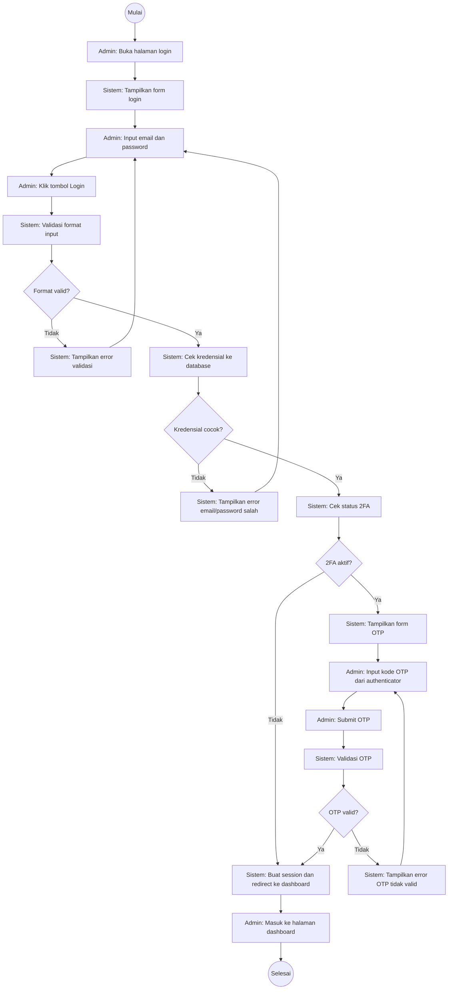

*Sumber: Hasil Perancangan (2026)*

Pada gambar 4.3 activity diagram login, proses yang dilakukan aktor admin yaitu membuka halaman login, mengisi email dan password, kemudian klik login. Sistem akan memvalidasi format input dan mencocokkan kredensial dengan database. Jika kredensial tidak cocok maka sistem menampilkan pesan error dan memberikan kesempatan untuk ulang login. Jika kredensial valid dan 2FA aktif, admin harus memasukkan kode OTP dari aplikasi authenticator. Jika OTP valid maka sistem membuat session dan mengarahkan ke halaman dashboard.
#### 4.2.3.2 Logout

Activity diagram logout adalah diagram yang memperlihatkan aliran dari aktivitas logout yang akan digambarkan pada gambar 4.4 berikut:

##### Gambar 4.4 Activity Diagram Logout Admin

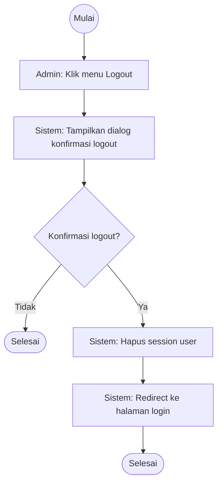

*Sumber: Hasil Perancangan (2026)*

Pada gambar 4.4 activity diagram logout, proses yang dilakukan aktor admin yaitu memilih menu logout. Sistem menampilkan dialog konfirmasi logout. Jika admin memilih tidak maka proses dibatalkan. Jika admin memilih ya maka sistem menghapus session user dan mengarahkan kembali ke halaman login.
#### 4.2.3.3 Tambah Kategori

Activity diagram tambah kategori adalah diagram yang memperlihatkan aliran dari aktivitas menambah kategori yang akan digambarkan pada gambar 4.5 berikut:

##### Gambar 4.5 Activity Diagram Tambah Kategori

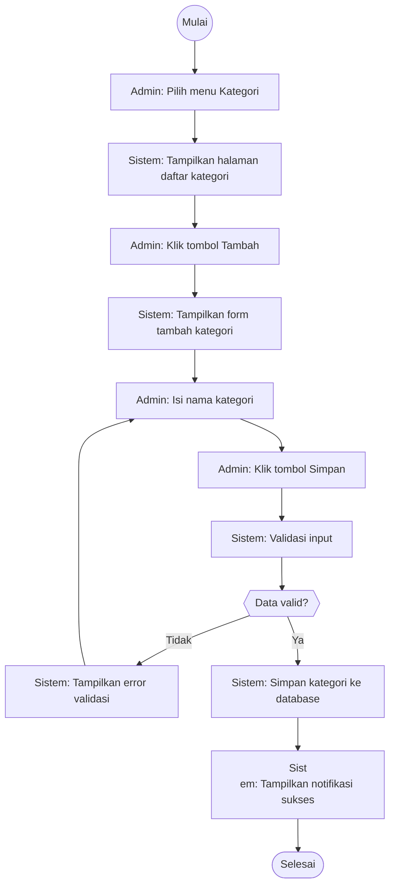

*Sumber: Hasil Perancangan (2026)*

Pada gambar 4.5 activity diagram tambah kategori, aktor admin memilih menu kategori untuk menampilkan halaman daftar kategori. Kemudian admin memilih tombol tambah, sistem menampilkan form input kategori. Admin mengisi nama kategori dan memilih tombol simpan. Sistem melakukan validasi input, jika data tidak valid maka sistem menampilkan error validasi dan meminta ulang input. Jika data valid maka sistem menyimpan kategori ke dalam database dan menampilkan notifikasi sukses.
#### 4.2.3.4 Edit Kategori

Activity diagram edit kategori adalah diagram yang memperlihatkan aliran dari aktivitas edit kategori yang akan digambarkan pada gambar 4.6 berikut:

##### Gambar 4.6 Activity Diagram Edit Kategori

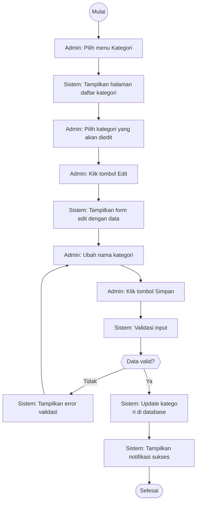

*Sumber: Hasil Perancangan (2026)*

Pada gambar 4.6 activity diagram edit kategori, aktor admin memilih menu kategori untuk menampilkan halaman daftar kategori. Kemudian admin memilih kategori yang akan diedit dan memilih tombol edit. Sistem menampilkan form edit dengan data yang sudah ada. Admin mengubah nama kategori dan memilih tombol simpan. Sistem melakukan validasi input, jika tidak valid maka menampilkan error. Jika valid maka sistem memperbarui data kategori di database dan menampilkan notifikasi sukses.
#### 4.2.3.5 Hapus Kategori

Activity diagram hapus kategori adalah diagram yang memperlihatkan aliran dari aktivitas hapus kategori yang akan digambarkan pada gambar 4.7 berikut:

##### Gambar 4.7 Activity Diagram Hapus Kategori

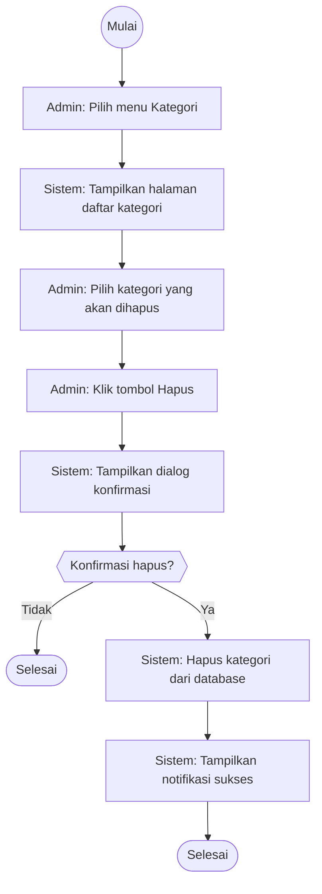

*Sumber: Hasil Perancangan (2026)*

Pada gambar 4.7 activity diagram hapus kategori, aktor admin memilih menu kategori untuk menampilkan halaman daftar kategori. Kemudian admin memilih kategori yang akan dihapus dan memilih tombol hapus. Sistem menampilkan dialog konfirmasi hapus. Jika admin memilih tidak maka proses dibatalkan. Jika admin memilih ya maka sistem menghapus kategori dari database dan menampilkan notifikasi sukses.
#### 4.2.3.6 Tambah Produk

Activity diagram tambah produk adalah diagram yang memperlihatkan aliran dari aktivitas menambah produk yang akan digambarkan pada gambar 4.8 berikut:

##### Gambar 4.8 Activity Diagram Tambah Produk

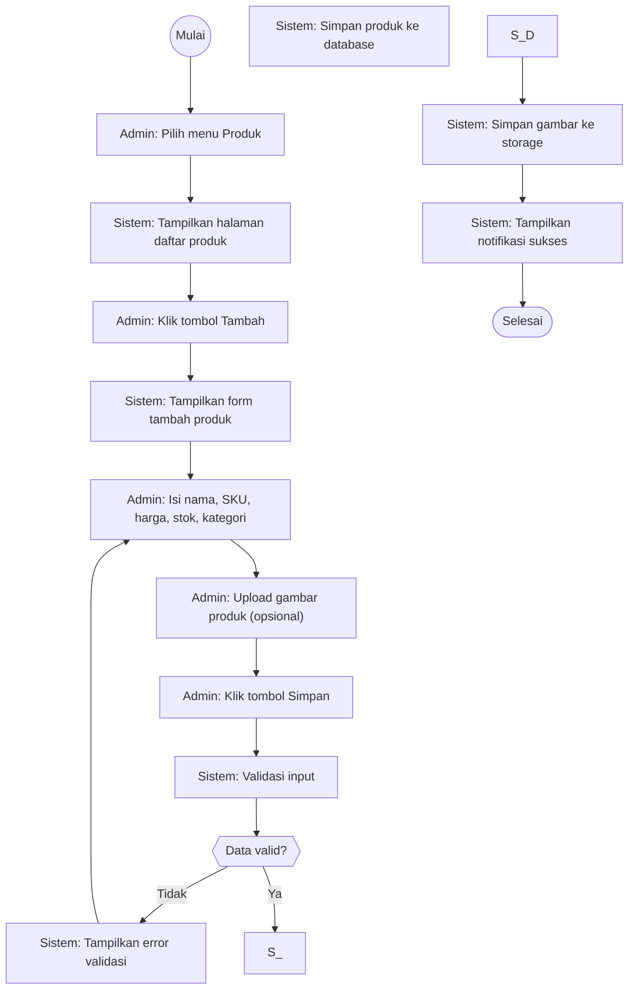

*Sumber: Hasil Perancangan (2026)*

Pada gambar 4.8 activity diagram tambah produk, aktor admin memilih menu produk untuk menampilkan halaman daftar produk. Kemudian admin memilih tombol tambah, sistem menampilkan form input produk. Admin mengisi data produk meliputi nama, SKU, harga, stok, dan kategori serta dapat mengunggah gambar produk secara opsional, kemudian memilih tombol simpan. Sistem melakukan validasi input, jika data tidak valid maka menampilkan error. Jika valid maka sistem menyimpan data produk dan gambar ke dalam database serta menampilkan notifikasi sukses.
#### 4.2.3.7 Edit Produk

Activity diagram edit produk adalah diagram yang memperlihatkan aliran dari aktivitas edit produk yang akan digambarkan pada gambar 4.9 berikut:

##### Gambar 4.9 Activity Diagram Edit Produk

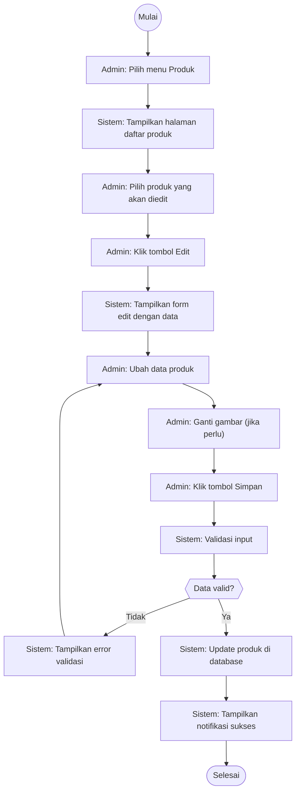

*Sumber: Hasil Perancangan (2026)*

Pada gambar 4.9 activity diagram edit produk, aktor admin memilih menu produk untuk menampilkan halaman daftar produk. Kemudian admin memilih produk yang akan diedit dan memilih tombol edit. Sistem menampilkan form edit dengan data yang sudah ada. Admin mengubah data produk dan dapat mengganti gambar jika diperlukan, kemudian memilih tombol simpan. Sistem melakukan validasi input, jika tidak valid maka menampilkan error. Jika valid maka sistem memperbarui data produk di database dan menampilkan notifikasi sukses.
#### 4.2.3.8 Hapus Produk

Activity diagram hapus produk adalah diagram yang memperlihatkan aliran dari aktivitas hapus produk yang akan digambarkan pada gambar 4.10 berikut:

##### Gambar 4.10 Activity Diagram Hapus Produk

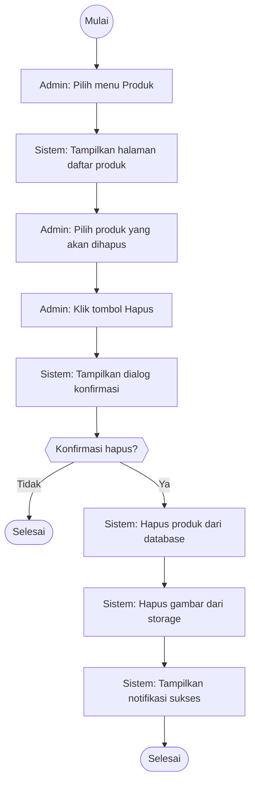

*Sumber: Hasil Perancangan (2026)*

Pada gambar 4.10 activity diagram hapus produk, aktor admin memilih menu produk untuk menampilkan halaman daftar produk. Kemudian admin memilih produk yang akan dihapus dan memilih tombol hapus. Sistem menampilkan dialog konfirmasi hapus. Jika admin memilih tidak maka proses dibatalkan. Jika admin memilih ya maka sistem menghapus data produk dan gambar dari database serta menampilkan notifikasi sukses.
#### 4.2.3.9 Transaksi Penjualan

Activity diagram transaksi penjualan adalah diagram yang memperlihatkan aliran dari aktivitas transaksi penjualan yang akan digambarkan pada gambar 4.11 berikut:

##### Gambar 4.11 Activity Diagram Transaksi Penjualan

```mermaid
flowchart TD
  start((Mulai))
  A_A["Admin: Buka halaman transaksi POS"]
  start --> A_A
  S_A["Sistem: Tampilkan interface POS dengan daftar produk"]
  A_A --> S_A
  S_B["Sistem: Inisialisasi keranjang kosong"]
  S_A --> S_B
  A_B["Admin: Cari produk berdasarkan nama/SKU"]
  S_B --> A_B
  S_C["Sistem: Filter produk real-time"]
  A_B --> S_C
  S_D["Sistem: Tampilkan hasil pencarian"]
  S_C --> S_D
  A_C["Admin: Pilih produk"]
  S_D --> A_C
  S_E["Sistem: Cek ketersediaan stok"]
  A_C --> S_E
  D_A{{"Stok tersedia?"}}
  S_E --> D_A
  D_A -->|Tidak| E_A["Sistem: Tampilkan notifikasi stok habis"]
  E_A --> A_B
  D_A -->|Ya| S_F["Sistem: Tambah ke keranjang, quantity = 1"]
  S_F --> D_B{{"Admin ingin ubah quantity?"}}
  D_B -->|Tidak| S_I
  D_B -->|Ya| A_D["Admin: Input quantity baru"]
  A_D --> S_G["Sistem: Validasi quantity"]
  S_G --> D_C{{"Quantity <= stok?"}}
  D_C -->|Tidak| E_B["Sistem: Tampilkan error melebihi stok"]
  E_B --> A_D
  D_C -->|Ya| S_H["Sistem: Hitung subtotal"]
  S_H --> S_I["Sistem: Update total keranjang"]
  S_I --> D_D{{"Ada produk lain?"}}
  D_D -->|Ya| A_B
  D_D -->|Tidak| A_E["Admin: Input nama customer"]
  A_E --> A_F["Admin: Pilih metode pembayaran"]
  A_F --> S_J["Sistem: Tampilkan total amount"]
  S_J --> A_G["Admin: Input jumlah pembayaran"]
  A_G --> S_K["Sistem: Validasi pembayaran"]
  S_K --> D_E{{"Pembayaran cukup?"}}
  D_E -->|Tidak| E_C["Sistem: Tampilkan error pembayaran kurang"]
  E_C --> A_G
  D_E -->|Ya| S_L["Sistem: Hitung kembalian"]
  S_L --> S_M["Sistem: Tampilkan kembalian"]
  S_M --> A_H["Admin: Konfirmasi transaksi"]
  A_H --> A_I["Admin: Klik Process Payment"]
  A_I --> S_N["Sistem: Mulai database transaction"]
  S_N --> S_O["Sistem: Generate nomor invoice"]
  S_O --> S_P["Sistem: Simpan data transaksi"]
  S_P --> S_Q["Sistem: Simpan item transaksi"]
  S_Q --> S_R["Sistem: Kurangi stok setiap produk"]
  S_R --> S_S["Sistem: Commit transaction"]

  S_S --> S_T["Sistem: Generate struk PDF"]
  S_T --> S_U["Sistem: Tampilkan notifikasi sukses"]
  S_U --> A_J["Admin: Klik Print untuk mencetak struk"]
  A_J --> S_V["Sistem: Cetak/download struk"]
  S_V --> S_W["Sistem: Reset keranjang dan form"]
  S_W --> end_success([Selesai])
```

*Sumber: Hasil Perancangan (2026)*

Pada gambar 4.11 activity diagram transaksi penjualan, aktor admin membuka halaman transaksi POS, sistem menampilkan interface dengan daftar produk dan menginisialisasi keranjang kosong. Admin mencari produk berdasarkan nama atau SKU, sistem menyaring dan menampilkan hasil pencarian secara real-time. Admin memilih produk, sistem memeriksa ketersediaan stok. Jika stok tidak tersedia maka menampilkan notifikasi dan kembali ke pencarian. Jika stok tersedia maka sistem menambahkan produk ke keranjang. Admin dapat mengubah quantity yang akan divalidasi sistem. Proses diulang untuk setiap produk. Setelah selesai, admin memasukkan nama customer dan memilih metode pembayaran. Admin memasukkan jumlah pembayaran yang divalidasi sistem. Jika pembayaran cukup maka sistem memproses transaksi dengan menyimpan data ke database, mengurangi stok, dan menampilkan struk.
#### 4.2.3.10 Lihat Riwayat Transaksi

Activity diagram lihat riwayat transaksi adalah diagram yang memperlihatkan aliran dari aktivitas melihat riwayat transaksi yang akan digambarkan pada gambar 4.12 berikut:

##### Gambar 4.12 Activity Diagram Lihat Riwayat Transaksi

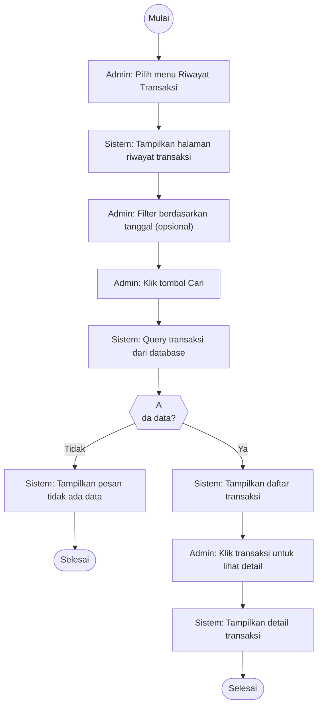

*Sumber: Hasil Perancangan (2026)*

Pada gambar 4.12 activity diagram lihat riwayat transaksi, aktor admin memilih menu riwayat transaksi, sistem menampilkan halaman riwayat transaksi. Admin memilih kriteria filter seperti tanggal atau status, sistem menampilkan daftar transaksi sesuai kriteria. Admin memilih salah satu transaksi untuk melihat detail, sistem menampilkan informasi lengkap transaksi tersebut.
#### 4.2.3.11 Tambah User

Activity diagram tambah user adalah diagram yang memperlihatkan aliran dari aktivitas menambah user yang akan digambarkan pada gambar 4.13 berikut:

##### Gambar 4.13 Activity Diagram Tambah User

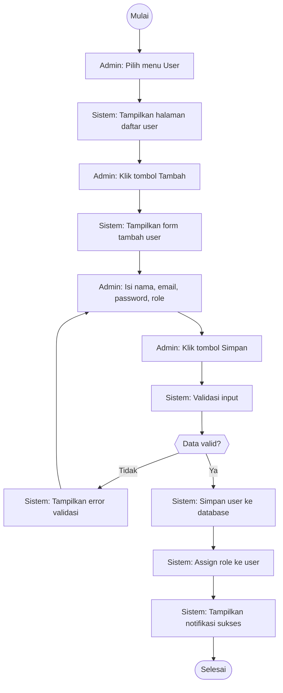

*Sumber: Hasil Perancangan (2026)*

Pada gambar 4.13 activity diagram tambah user, aktor admin memilih menu user untuk menampilkan halaman daftar user. Kemudian admin memilih tombol tambah, sistem menampilkan form input user. Admin mengisi data user berupa nama, email, password, dan role, kemudian memilih tombol simpan. Sistem melakukan validasi input dan memeriksa keunikan email. Jika data tidak valid atau email sudah terdaftar maka sistem menampilkan error. Jika valid maka sistem menyimpan user ke dalam database dan menampilkan notifikasi sukses.
#### 4.2.3.12 Edit User

Activity diagram edit user adalah diagram yang memperlihatkan aliran dari aktivitas edit user yang akan digambarkan pada gambar 4.14 berikut:

##### Gambar 4.14 Activity Diagram Edit User

```mermaid
flowchart TD
  start((Mulai))
  A_A["Admin: Pilih menu User"]
  start --> A_A
  S_A["Sistem: Tampilkan halaman daftar user"]
  A_A --> S_A
  A_B["Admin: Pilih user yang akan diedit"]
  S_A --> A_B
  A_C["Admin: Klik tombol Edit"]
  A_B --> A_C
  S_B["Sistem: Tampilkan form edit dengan data"]
  A_C --> S_B
  A_D["Admin: Ubah data user"]
  S_B -
-> A_D
  A_E["Admin: Klik tombol Simpan"]
  A_D --> A_E
  S_C["Sistem: Validasi input"]
  A_E --> S_C
  D_A{{"Data valid?"}}
  S_C --> D_A
  D_A -->|Tidak| E_A["Sistem: Tampilkan error validasi"]
  E_A --> A_D
  D_A -->|Ya| S_D["Sistem: Update user di database"]
  S_D --> S_E["Sistem: Update role user"]
  S_E --> S_F["Sistem: Tampilkan notifikasi sukses"]
  S_F --> end_success([Selesai])
```

*Sumber: Hasil Perancangan (2026)*

Pada gambar 4.14 activity diagram edit user, aktor admin memilih menu user untuk menampilkan halaman daftar user. Kemudian admin memilih user yang akan diedit dan memilih tombol edit. Sistem menampilkan form edit dengan data yang sudah ada. Admin mengubah data user dan memilih tombol simpan. Sistem melakukan validasi, jika valid maka memperbarui data user di database dan menampilkan notifikasi sukses.
#### 4.2.3.13 Hapus User

Activity diagram hapus user adalah diagram yang memperlihatkan aliran dari aktivitas hapus user yang akan digambarkan pada gambar 4.15 berikut:

##### Gambar 4.15 Activity Diagram Hapus User

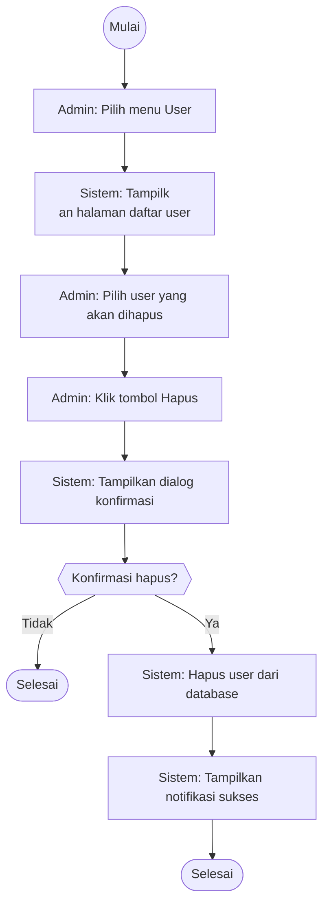

*Sumber: Hasil Perancangan (2026)*

Pada gambar 4.15 activity diagram hapus user, aktor admin memilih menu user untuk menampilkan halaman daftar user. Kemudian admin memilih user yang akan dihapus dan memilih tombol hapus. Sistem menampilkan dialog konfirmasi hapus. Jika admin memilih tidak maka proses dibatalkan. Jika admin memilih ya maka sistem menghapus user dari database dan menampilkan notifikasi sukses.
#### 4.2.3.14 Kelola Role

Activity diagram kelola role adalah diagram yang memperlihatkan aliran dari aktivitas mengelola role yang akan digambarkan pada gambar 4.16 berikut:

##### Gambar 4.16 Activity Diagram Kelola Role

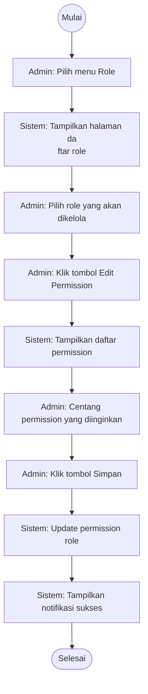

*Sumber: Hasil Perancangan (2026)*

Pada gambar 4.16 activity diagram kelola role, aktor admin memilih menu role untuk menampilkan halaman daftar role. Kemudian admin dapat menambah role baru dengan mengisi nama role, mengedit role yang sudah ada, atau menghapus role. Setiap aksi melewati validasi sistem dan konfirmasi sebelum data disimpan atau dihapus dari database.
#### 4.2.3.15 Settings Toko

Activity diagram settings toko adalah diagram yang memperlihatkan aliran dari aktivitas pengaturan toko yang akan digambarkan pada gambar 4.17 berikut:

##### Gambar 4.17 Activity Diagram Settings Toko

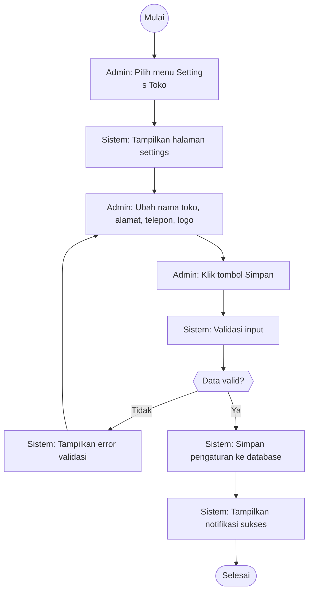

*Sumber: Hasil Perancangan (2026)*

Pada gambar 4.17 activity diagram settings toko, aktor admin memilih menu settings untuk menampilkan halaman pengaturan toko. Admin mengedit data toko seperti nama, alamat, telepon, dan logo, kemudian memilih tombol simpan. Sistem memverifikasi data yang diinputkan, jika valid maka menyimpan perubahan ke database dan menampilkan notifikasi sukses.
#### 4.2.3.16 Update Profil

Activity diagram update profil adalah diagram yang memperlihatkan aliran dari aktivitas memperbarui profil yang akan digambarkan pada gambar 4.18 berikut:

##### Gambar 4.18 Activity Diagram Update Profil

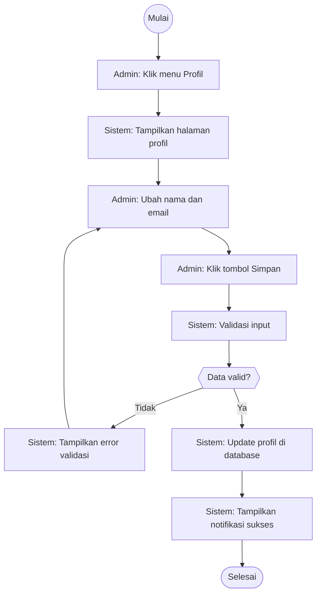

*Sumber: Hasil Perancangan (2026)*

Pada gambar 4.18 activity diagram update profil, proses yang dilakukan aktor admin yaitu memilih menu profil, sistem menampilkan halaman profil. Admin mengubah data profil seperti nama dan email, kemudian memilih tombol simpan. Sistem memvalidasi input, jika data tidak valid maka sistem menampilkan error. Jika valid maka sistem memperbarui data profil di database dan menampilkan notifikasi sukses.

#### 4.2.3.17 Ubah Password

Activity diagram ubah password adalah diagram yang memperlihatkan aliran dari aktivitas mengubah password yang akan digambarkan pada gambar 4.19 berikut:

##### Gambar 4.19 Activity Diagram Ubah Password

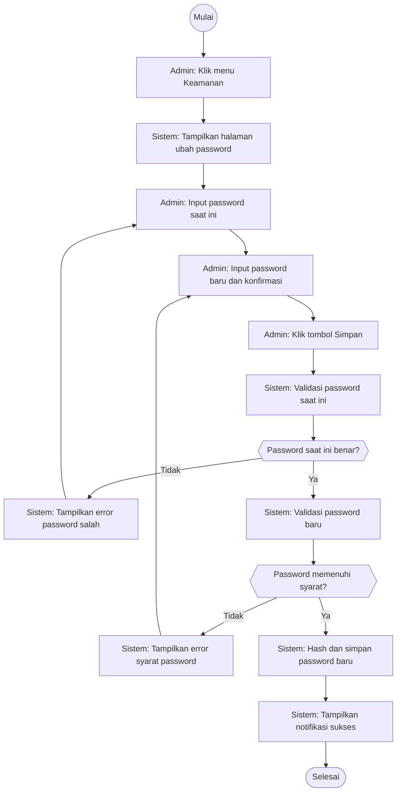

*Sumber: Hasil Perancangan (2026)*

Pada gambar 4.18 activity diagram update profil, aktor admin memilih menu settings profil untuk menampilkan halaman edit profil. Admin mengedit data profil berupa nama dan email, kemudian memilih tombol simpan. Sistem memverifikasi data, jika email sudah terdaftar maka menampilkan error. Jika valid maka menyimpan perubahan ke database dan menampilkan notifikasi sukses.
#### 4.2.3.18 Generate Laporan

Activity diagram generate laporan adalah diagram yang memperlihatkan aliran dari aktivitas menghasilkan laporan yang akan digambarkan pada gambar 4.20 berikut:

##### Gambar 4.20 Activity Diagram Generate Laporan

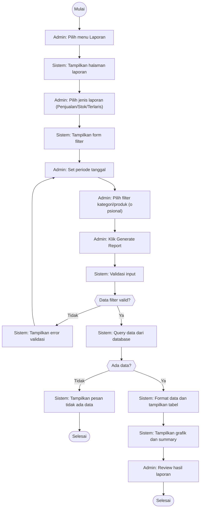

*Sumber: Hasil Perancangan (2026)*

Pada gambar 4.20 activity diagram generate laporan, aktor admin memilih menu laporan untuk menampilkan halaman laporan. Admin memilih jenis laporan dan menentukan periode tanggal serta filter lainnya, kemudian memilih tombol generate. Sistem melakukan query data sesuai filter dan menampilkan hasil dalam bentuk tabel dan grafik.
#### 4.2.3.19 Export PDF

Activity diagram export PDF adalah diagram yang memperlihatkan aliran dari aktivitas mengekspor laporan ke PDF yang akan digambarkan pada gambar 4.21 berikut:

##### Gambar 4.21 Activity Diagram Export PDF

```mermaid
flowchart TD
  start((Mulai))
  A_A["Admin: Pada halaman laporan, klik Export PDF"]
  start --> A_A
  S_A["Sistem: Generate PDF dengan library TCPDF"]
  A_A --> S_A
  S_B["Sistem: Set header dengan logo toko"]
  S_A --> S_B
  S_C["Sistem: Format tabel laporan"]
  S_B --> S_C
  S_D["Sistem: Tambah nomor halaman dan timestamp"]
  S_C --> S_D
  S_E["Sistem: Output file PDF"]
  S_D --> S_E
  S_F["Sistem: Download file ke browser"]
  S_E --> S_F
  A_B["Admin: Simpan file PDF"]
  S_F --> A_B
  A_C["Admin: Buka dan review file"]
  A_B --> A_C
  end_success([Selesai])
```

*Sumber: Hasil Perancangan (2026)*

Pada gambar 4.21 activity diagram export PDF, proses yang dilakukan aktor admin yaitu memilih tombol export PDF setelah laporan ditampilkan. Sistem mengenerate file PDF dari data laporan dan menyediakan file untuk diunduh.
#### 4.2.3.20 Export Excel

Activity diagram export Excel adalah diagram yang memperlihatkan aliran dari aktivitas mengekspor laporan ke Excel yang akan digambarkan pada gambar 4.22 berikut:

##### Gambar 4.22 Activity Diagram Export Excel

```mermaid
flowchart TD
  start((Mulai))
  A_A["Admin: Pada halaman laporan, klik Export Excel"]
  start --> A_A
  S_A["Sistem: Generate Excel dengan PhpSpreadsheet"]
  A_A --> S_A
  S_B["Sistem: Buat worksheet dan header"]
  S_A --> S_B
  S_C["Sistem: Isi data laporan"]
  S_B --> S_C
  S_D["Sistem: Format cells, borders, colors"]
  S_C --> S_D
  S_E["Sistem: Auto-size column width"]
  S_D --> S_E
  S_F["Sistem: Output file XLSX"]
  S_E --> S_F
  S_G["Sistem: Download file ke browser"]
  S_F --> S_G
  A_B["Admin: Simpan file Excel"]
  S_G --> A_B
  A_C["Admin: Buka dan review file"]
  A_B --> A_C
  end_success([Selesai])
```

*Sumber: Hasil Perancangan (2026)*

Pada gambar 4.22 activity diagram export Excel, aktor admin memilih tombol export Excel setelah laporan ditampilkan. Sistem mengenerate file Excel dari data laporan dan menyediakan file untuk diunduh.
---

### Activity Diagram Pemilik

Activity diagram untuk aktor Pemilik mencakup fungsionalitas pengelolaan master data (produk dan kategori), monitoring transaksi, serta laporan bisnis.

#### 4.2.3.21 Login

Activity diagram login adalah diagram yang memperlihatkan aliran dari aktivitas login yang akan digambarkan pada gambar 4.23 berikut:

##### Gambar 4.23 Activity Diagram Login Pemilik

```mermaid
flowchart TD
  start((Mulai))
  A_A["Pemilik: Buka halaman login"]
  start --> A_A
  S_A["Sistem: Tampilkan form login"]
  A_A --> S_A
  A_B["Pemilik: Input email dan password"]
  S_A --> A_B
  A_C["Pemilik: Klik tombol Login"]
  A_B --> A_C
  S_B["Sistem: Validasi format input"]
  A_C --> S_B
  D_A{"Format valid?"}
  S_B --> D_A
  D_A -->|Tidak| E_A["Sistem: Tampilkan error validasi"]
  E_A -->
 A_B
  D_A -->|Ya| S_C["Sistem: Cek kredensial ke database"]
  S_C --> D_B{"Kredensial cocok?"}
  D_B -->|Tidak| E_B["Sistem: Tampilkan error email/password salah"]
  E_B --> A_B
  D_B -->|Ya| S_D["Sistem: Cek status 2FA"]
  S_D --> D_C{"2FA aktif?"}
  D_C -->|Tidak| S_G
  D_C -->|Ya| S_E["Sistem: Tampilkan form OTP"]
  S_E --> A_D["Pemilik: Input kode OTP dari authenticator"]
  A_D --> A_E["Pemilik: Submit OT
P"]
  A_E --> S_F["Sistem: Validasi OTP"]
  S_F --> D_D{"OTP valid?"}
  D_D -->|Tidak| E_C["Sistem: Tampilkan error OTP tidak valid"]
  E_C --> A_D
  D_D -->|Ya| S_G["Sistem: Buat session dan redirect ke dashboard"]
  S_G --> A_F["Pemilik: Masuk ke halaman dashboard"]
  A_F --> end_success([Selesai])
```

*Sumber: Hasil Perancangan (2026)*

Pada gambar 4.23 activity diagram login, proses yang dilakukan aktor pemilik yaitu membuka halaman login, mengisi email dan password, kemudian klik login. Sistem akan memvalidasi kredensial dengan database. Jika kredensial tidak cocok maka sistem menampilkan pesan error dan memberikan kesempatan untuk ulang login. Jika kredensial valid maka sistem membuat session dan mengarahkan ke halaman dashboard pemilik.
#### 4.2.3.22 Logout

Activity diagram logout adalah diagram yang memperlihatkan aliran dari aktivitas logout yang akan digambarkan pada gambar 4.24 berikut:

##### Gambar 4.24 Activity Diagram Logout Pemilik

```mermaid
flowchart TD
  start((Mulai))
  A_A["Pemilik: Klik menu Logout"]
  start --> A_A
  S_A["Sistem: Tampilkan dialog konfirmasi logout"]
  A_A --> S_A
  D_A{"Konfirmasi logout?"}
  S_A --> D_A
  D_A -->|Tidak| end_cancel([Selesai])
  D_A -->|Ya| S_B["Sistem: Hapus session user"]
  S_B --> S_C["Sistem: Redirect ke halaman login"]
  S_C --> end_s
uccess([Selesai])
```

*Sumber: Hasil Perancangan (2026)*

Pada gambar 4.24 activity diagram logout, proses yang dilakukan aktor pemilik yaitu memilih menu logout. Sistem menampilkan dialog konfirmasi logout. Jika pemilik memilih tidak maka proses dibatalkan. Jika pemilik memilih ya maka sistem menghapus session dan mengarahkan kembali ke halaman login.
#### 4.2.3.23 Tambah Kategori

Activity diagram tambah kategori adalah diagram yang memperlihatkan aliran dari aktivitas menambah kategori yang akan digambarkan pada gambar 4.25 berikut:

##### Gambar 4.25 Activity Diagram Tambah Kategori (Pemilik)

```mermaid
flowchart TD
  start((Mulai))
  A_A["Pemilik: Pilih menu Kategori"]
  start --> A_A
  S_A["Sistem: Tampilkan halaman daftar kategori"]
  A_A --> S_A
  A_B["Pemilik: Klik tombol Tambah"]
  S_A --> A_B
  S_B["Sistem: Tampilkan form tambah kategori"]
  A_B --> S_B
  A_C["Pemilik: Isi nama kategori"]
  S_B --> A_C
  A_D["Pemilik: Klik tombol Simpan"]
  A_C --> A_D
  S_C["Sistem: Validasi input"]
  A_D --> S_C
  D_A{{"Data valid?"}}
  S_C --> D_A
  D_A -->|Tidak| E_A["Sistem: Tampilkan error validasi"]
  E_A --> A_C
  D_A -->|Ya| S_D["Sistem: Simpan kategori ke database"]
  S_D --> S_E["Sistem: Tampilkan notifikasi sukses"]
  S_E --> end_success([Selesai])
```

*Sumber: Hasil Perancangan (2026)*

Pada gambar 4.25 activity diagram tambah kategori, proses yang dilakukan aktor pemilik yaitu memilih menu kategori untuk menampilkan halaman daftar kategori. Kemudian pemilik memilih tombol tambah, sistem menampilkan form input kategori. Pemilik mengisi nama kategori dan memilih tombol simpan. Sistem melakukan validasi input, jika data valid maka menyimpan kategori ke dalam database dan menampilkan notifikasi sukses.
#### 4.2.3.24 Edit Kategori

Activity diagram edit kategori adalah diagram yang memperlihatkan aliran dari aktivitas edit kategori yang akan digambarkan pada gambar 4.26 berikut:

##### Gambar 4.26 Activity Diagram Edit Kategori (Pemilik)

```mermaid
flowchart TD
  start((Mulai))
  A_A["Pemilik: Pilih menu Kategori"]
  start --> A_A
  S_A["Sistem: Tampilkan halaman daftar kategori"]
  A_A --> S_A
  A_B["Pemilik: Pilih kategori yang akan diedit"]
  S_A --> A_B
  A_C["Pemilik: Klik tombol Edit"]
  A_B --> A_C
  S_B["Sistem: Tampilkan form edit dengan data"]
  A_C --> S_B
  A_D["Pemilik: Ubah nama kategori"]
  S_B --> A_D
  A_E["Pemilik: Klik tombol Simpan"]
  A_D --> A_E
  S_C["Sistem: Validasi input"]
  A_E --> S_C
  D_A{{"Data valid?"}}
  S_C --> D_A
  D_A -->|T
idak| E_A["Sistem: Tampilkan error validasi"]
  E_A --> A_D
  D_A -->|Ya| S_D["Sistem: Update kategori di database"]
  S_D --> S_E["Sistem: Tampilkan notifikasi sukses"]
  S_E --> end_success([Selesai])
```

*Sumber: Hasil Perancangan (2026)*

Pada gambar 4.26 activity diagram edit kategori, proses yang dilakukan aktor pemilik yaitu memilih menu kategori untuk menampilkan halaman daftar kategori. Kemudian pemilik memilih kategori yang akan diedit dan memilih tombol edit. Sistem menampilkan form edit. Pemilik mengubah nama kategori dan memilih tombol simpan. Sistem memvalidasi dan memperbarui data kategori di database.
#### 4.2.3.25 Hapus Kategori

Activity diagram hapus kategori adalah diagram yang memperlihatkan aliran dari aktivitas hapus kategori yang akan digambarkan pada gambar 4.27 berikut:

##### Gambar 4.27 Activity Diagram Hapus Kategori (Pemilik)

```mermaid
flowchart TD
  start((Mulai))
  A_A["Pemilik: Pilih menu Kategori"]
  start --> A_A
  S_A["Sistem: Tampilkan halaman daftar kategori"]
  A_A --> S_A
  A_B["Pemilik: Pilih kategori yang akan dihapus"]
  S_A --> A_B
  A_C["Pemilik: Klik tombol Hapus"]
  A_B --> A_C
  S_B["Sistem: Tampilkan dialog konfirmasi"]
  A_C --> S_B
  D_A{{"Konfirmasi hapus?"}}
  S_B --> D_A
  D_A -->|Tidak| end_cancel([Selesai])
  D_A -->|Ya| S_C["Sistem: Hapus kategori dari database"]
  S_C --> S_D["Sistem: Tampilka
n notifikasi sukses"]
  S_D --> end_success([Selesai])
```

*Sumber: Hasil Perancangan (2026)*

Pada gambar 4.27 activity diagram hapus kategori, proses yang dilakukan aktor pemilik yaitu memilih menu kategori untuk menampilkan halaman daftar kategori. Kemudian pemilik memilih kategori yang akan dihapus dan memilih tombol hapus. Sistem menampilkan dialog konfirmasi. Jika pemilik mengonfirmasi maka sistem menghapus kategori dari database dan menampilkan notifikasi sukses.
#### 4.2.3.26 Tambah Produk

Activity diagram tambah produk adalah diagram yang memperlihatkan aliran dari aktivitas menambah produk yang akan digambarkan pada gambar 4.28 berikut:

##### Gambar 4.28 Activity Diagram Tambah Produk (Pemilik)

```mermaid
flowchart TD
  start((Mulai))
  A_A["Pemilik: Pilih menu Produk"]
  start --> A_A
  S_A["Sistem: Tampilkan halaman daftar produk"]
  A_A --> S_A
  A_B["Pemilik: Klik tombol Tambah"]
  S_A --> A_B
  S_B["Sistem: Tampilkan form tambah produk"]
  A_B --> S_B
  A_C["Pemilik: Isi nama, SKU, harga, stok, kategori"]
  S_B --> A_C
  A_D["Pemilik: Upload gambar produk (opsional)"]
  A_C --> A_D
  A_E["Pemilik: Klik tombol Simpan"]
  A_D --> A_E
  S_C["Sistem: Validasi input"]
  A_E --> S_C
  D_A{{"Data valid?"}}
  S_C --> D_A
  D_A -->|Tidak| E_A["Sistem: Tampilkan error validasi"]
  E_A --> A_C
  D_A -->|Ya| S_D["Sistem
: Simpan produk ke database"]
  S_D --> S_E["Sistem: Tampilkan notifikasi sukses"]
  S_E --> end_success([Selesai])
```

*Sumber: Hasil Perancangan (2026)*

Pada gambar 4.28 activity diagram tambah produk, proses yang dilakukan aktor pemilik yaitu memilih menu produk untuk menampilkan halaman daftar produk. Kemudian pemilik memilih tombol tambah, sistem menampilkan form input produk. Pemilik mengisi data produk dan memilih tombol simpan. Sistem melakukan validasi, jika valid maka menyimpan produk ke database dan menampilkan notifikasi sukses.
#### 4.2.3.27 Edit Produk

Activity diagram edit produk adalah diagram yang memperlihatkan aliran dari aktivitas edit produk yang akan digambarkan pada gambar 4.29 berikut:

##### Gambar 4.29 Activity Diagram Edit Produk (Pemilik)

```mermaid
flowchart TD
  start((Mulai))
  A_A["Pemilik: Pilih menu Produk"]
  start --> A_A
  S_A["Sistem: Tampilkan halaman daftar produk"]
  A_A --> S_A
  A_B["Pemilik: Pilih produk yang akan diedit"]
  S_A --> A_B
  A_C["Pemilik: Klik tombol Edit"]
  A_B --> A_C
  S_B["Sistem: Tampilkan form edit dengan data"]
  A_C --> S_B
  A_D["Pemilik: Ubah data produk"]
  S_B --> A_D
  A_E["Pemilik: Klik to
mbol Simpan"]
  A_D --> A_E
  S_C["Sistem: Validasi input"]
  A_E --> S_C
  D_A{{"Data valid?"}}
  S_C --> D_A
  D_A -->|Tidak| E_A["Sistem: Tampilkan error validasi"]
  E_A --> A_D
  D_A -->|Ya| S_D["Sistem: Update produk di database"]
  S_D --> S_E["Sistem: Tampilkan notifikasi sukses"]
  S_E --> end_success([Selesai])
```

*Sumber: Hasil Perancangan (2026)*

Pada gambar 4.29 activity diagram edit produk, proses yang dilakukan aktor pemilik yaitu memilih menu produk untuk menampilkan halaman daftar produk. Kemudian pemilik memilih produk yang akan diedit dan memilih tombol edit. Sistem menampilkan form edit. Pemilik mengubah data produk dan memilih tombol simpan. Sistem memvalidasi dan memperbarui data produk di database.
#### 4.2.3.28 Hapus Produk

Activity diagram hapus produk adalah diagram yang memperlihatkan aliran dari aktivitas hapus produk yang akan digambarkan pada gambar 4.30 berikut:

##### Gambar 4.30 Activity Diagram Hapus Produk (Pemilik)

```mermaid
flowchart TD
  start((Mulai))
  A_A["Pemilik: Pilih menu Produk"]
  start --> A_A
  S_A["Sistem: Tampilkan halaman daftar produk"]
  A_A --> S_A
  A_B["Pemilik: Pilih produk yang akan dihapus"]
  S_A --> A_B
  A_C["Pemilik: Klik tombol Hapus"]
  A_B --> A_C
  S_B["Sistem: Tampilkan dialog konfirmasi"]
  A_C --> S_B
  D_A{{"Konfirma
si hapus?"}}
  S_B --> D_A
  D_A -->|Tidak| end_cancel([Selesai])
  D_A -->|Ya| S_C["Sistem: Hapus produk dari database"]
  S_C --> S_D["Sistem: Tampilkan notifikasi sukses"]
  S_D --> end_success([Selesai])
```

*Sumber: Hasil Perancangan (2026)*

Pada gambar 4.30 activity diagram hapus produk, proses yang dilakukan aktor pemilik yaitu memilih menu produk untuk menampilkan halaman daftar produk. Kemudian pemilik memilih produk yang akan dihapus dan memilih tombol hapus. Sistem menampilkan dialog konfirmasi. Jika pemilik mengonfirmasi maka sistem menghapus produk dari database dan menampilkan notifikasi sukses.
#### 4.2.3.29 Lihat Riwayat Transaksi

Activity diagram lihat riwayat transaksi adalah diagram yang memperlihatkan aliran dari aktivitas melihat riwayat transaksi yang akan digambarkan pada gambar 4.31 berikut:

##### Gambar 4.31 Activity Diagram Lihat Riwayat Transaksi (Pemilik)

```mermaid
flowchart TD
  start((Mulai))
  A_A["Pemilik: Pilih menu Riwayat Transaksi"]
  start --> A_A
  S_A["Sistem: Tampilkan halaman riwayat transaksi"]
  A_A --> S_A
  A_B["Pemilik: Filter berdasarkan tanggal (opsional)"]
  S_A --> A_B
  A_C["Pemilik: Klik tombol Cari"]
  A_B --> A_C
  S_B["Sistem: Query transaksi dari database"]
  A_C --> S_B
  D_A{{"Ada data?"}}
  S_B --> D_A
  D_A -->|Tidak| E_A["Sistem: Tampilkan pesan tidak ada data"]
  E_A --> end_empty([Selesai])
  D_A -->|Ya| S_C["Sistem: Tampilkan daftar transaksi"]
  S_C --> A_D["Pemilik: Klik transaksi untuk lihat detail"]
  A_D --> S_D["Sistem: Tampilkan detail transaksi"]
  S_D --> end_
success([Selesai])
```

*Sumber: Hasil Perancangan (2026)*

Pada gambar 4.31 activity diagram lihat riwayat transaksi, proses yang dilakukan aktor pemilik yaitu memilih menu riwayat transaksi, sistem menampilkan halaman riwayat transaksi. Pemilik memilih kriteria filter, sistem menampilkan daftar transaksi sesuai kriteria. Pemilik dapat memilih transaksi untuk melihat detail lebih lanjut.
#### 4.2.3.30 Generate Laporan

Activity diagram generate laporan adalah diagram yang memperlihatkan aliran dari aktivitas menghasilkan laporan yang akan digambarkan pada gambar 4.32 berikut:

##### Gambar 4.32 Activity Diagram Generate Laporan (Pemilik)

```mermaid
flowchart TD
  start((Mulai))
  A_A["Pemilik: Pilih menu Laporan"]
  start --> A_A
  S_A["Sistem: Tampilkan halaman laporan"]
  A_A --> S_A
  A_B["Pemilik: Pilih jenis laporan (Penjualan/Stok/Terlaris)"]
  S_A --> A_B
  S_B["Sistem: Tampilkan form filter"]
  A_B --> S_B
  A_C["Pemilik: Set periode tanggal"]
  S_B --> A_C
  A_D["Pemilik: Klik Generate Report"]
  A_C --> A_D
  S_C["Sistem: Validasi input"]
  A_D --> S_C
  D_A{{"Data filter valid?"}}
  S_C --> D_A
  D_A -->|Tidak| E_A["Sistem: Tampilkan 
error validasi"]
  E_A --> A_C
  D_A -->|Ya| S_D["Sistem: Query data dari database"]
  S_D --> D_B{{"Ada data?"}}
  D_B -->|Tidak| E_B["Sistem: Tampilkan pesan tidak ada data"]
  E_B --> end_empty([Selesai])
  D_B -->|Ya| S_E["Sistem: Format data dan tampilkan tabel"]
  S_E --> S_F["Sistem: Tampilkan grafik dan summary"]
  S_F --> A_E["Pemilik: Review hasil laporan"]
  A_E --> end_success([Selesai])
```

*Sumber: Hasil Perancangan (2026)*

Pada gambar 4.32 activity diagram generate laporan, proses yang dilakukan aktor pemilik yaitu memilih menu laporan untuk menampilkan halaman laporan. Pemilik memilih jenis laporan dan menentukan periode tanggal, kemudian memilih tombol generate. Sistem melakukan query dan menampilkan hasil laporan dalam bentuk tabel dan grafik.
#### 4.2.3.31 Export PDF

Activity diagram export PDF adalah diagram yang memperlihatkan aliran dari aktivitas mengekspor laporan ke PDF yang akan digambarkan pada gambar 4.33 berikut:

##### Gambar 4.33 Activity Diagram Export PDF (Pemilik)

```mermaid
flowchart TD
  start((Mulai))
  A_A["Pemilik: Pada halaman laporan, klik Export PDF"]
  start --> A_A
  S_A["Sistem: Generate PDF denga
n library TCPDF"]
  A_A --> S_A
  S_B["Sistem: Set header dengan logo toko"]
  S_A --> S_B
  S_C["Sistem: Format tabel laporan"]
  S_B --> S_C
  S_D["Sistem: Tambah nomor halaman dan timestamp"]
  S_C --> S_D
  S_E["Sistem: Output file PDF"]
  S_D --> S_E
  S_F["Sistem: Download file ke browser"]
  S_E --> S_F
  A_B["Pemilik: Simpan file PDF"]
  S_F --> A_B
  A_C["Pemilik: Buka dan review file"]
  A_B --> A_C
  end_success([Selesai])
```

*Sumber: Hasil Perancangan (2026)*

Pada gambar 4.33 activity diagram export PDF, proses yang dilakukan aktor pemilik yaitu memilih tombol export PDF setelah laporan ditampilkan. Sistem mengenerate file PDF dan menyediakannya untuk diunduh.
#### 4.2.3.32 Export Excel

Activity diagram export Excel adalah diagram yang memperlihatkan aliran dari aktivitas mengekspor laporan ke Excel yang akan digambarkan pada gambar 4.34 berikut:

##### Gambar 4.34 Activity Diagram Export Excel (Pemilik)

```mermaid
flowchart TD
  start((Mulai))
  A_A["Pemilik: Pada halaman lapo
ran, klik Export Excel"]
  start --> A_A
  S_A["Sistem: Generate Excel dengan PhpSpreadsheet"]
  A_A --> S_A
  S_B["Sistem: Buat worksheet dan header"]
  S_A --> S_B
  S_C["Sistem: Isi data laporan"]
  S_B --> S_C
  S_D["Sistem: Format cells, borders, colors"]
  S_C --> S_D
  S_E["Sistem: Output file XLSX"]
  S_D --> S_E
  S_F["Sistem: Download file ke browser"]
  S_E --> S_F
  A_B["Pemilik: Simpan file Excel"]
  S_F --> A_B
  A_C["Pemilik: Buka dan review file"]
  A_B --> A_C
  end_success([Selesai])
```

*Sumber: Hasil Perancangan (2026)*

Pada gambar 4.34 activity diagram export Excel, proses yang dilakukan aktor pemilik yaitu memilih tombol export Excel setelah laporan ditampilkan. Sistem mengenerate file Excel dan menyediakannya untuk diunduh.
#### 4.2.3.33 Update Profil

Activity diagram update profil adalah diagram yang memperlihatkan aliran dari aktivitas memperbarui profil yang akan digambarkan pada gambar 4.35 berikut:

##### Gambar 4.35 Activity Diagram Update Profil (Pemilik)

```mermaid
flowchart TD
  start((Mulai))
  A_A["Pemilik: Klik menu Profil"]
  start --> A_A
  S_A["Sistem: Tampilkan halaman profil"]
  A_A --> S_A
  A_B["Pemilik: Ubah nama dan email"]
  S_A --> A_B
  A_C["Pemilik: Klik tombol Simpan"]
  A_B --> A_C
  S_B["Sistem: Validasi input"]
  A_C --> 
S_B
  D_A{{"Data valid?"}}
  S_B --> D_A
  D_A -->|Tidak| E_A["Sistem: Tampilkan error validasi"]
  E_A --> A_B
  D_A -->|Ya| S_C["Sistem: Update profil di database"]
  S_C --> S_D["Sistem: Tampilkan notifikasi sukses"]
  S_D --> end_success([Selesai])
```

*Sumber: Hasil Perancangan (2026)*

Pada gambar 4.35 activity diagram update profil, proses yang dilakukan aktor pemilik yaitu memilih menu settings profil untuk menampilkan halaman edit profil. Pemilik mengedit data profil dan memilih tombol simpan. Sistem memverifikasi data, jika valid maka menyimpan perubahan dan menampilkan notifikasi sukses.
#### 4.2.3.34 Ubah Password

Activity diagram ubah password adalah diagram yang memperlihatkan aliran dari aktivitas mengubah password yang akan digambarkan pada gambar 4.36 berikut:

##### Gambar 4.36 Activity Diagram Ubah Password (Pemilik)

```mermaid
flowchart TD
  start((Mulai))
  A_A["Pemilik: Klik menu Keamanan"]
  start --> A_A
  S_A["Sistem: Tampilkan halaman ubah password"]
  A_A --> S_A
  A_B["Pemilik: Input password saat ini"]
  S_A --> A_B
  A_C["Pemilik: Input password baru dan konfirmasi"]
  A_B --> A_C
  A_D["Pemilik: Klik tombol Simpan"]
  A_C --> A_D
  S_B["Sistem: Validasi password saat ini"]
  A_D --> S_B
  D_A{{"Password saat ini benar?"}}
  S_B --> D_A
  D_A -->|Tidak| E_A["Sistem: Tampilkan error password salah"]
  E_A --> A_B
  D_A -->|Ya| S_C["Sistem: Validasi password baru"]
  S_C --> D_B{{"Password memenuhi syarat?"}}
  D_B -->|Tidak| E_B["Sistem: Tampilkan error syarat password"]
  E_B --> A_C
  D_B -->|Ya| S_D["Sistem: Hash dan simpan password baru"]
  S_D --> S_E["Sistem: Tampilkan notifikasi sukses"]
  S_E --> end_success([Selesai])
```

*Sumber: Hasil Perancangan (2026)*

Pada gambar 4.36 activity diagram ubah password, proses yang dilakukan aktor pemilik yaitu memilih menu ubah password untuk menampilkan halaman form. Pemilik mengisi password lama, password baru, dan konfirmasi, kemudian memilih tombol simpan. Sistem memvalidasi password lama dan mencocokkan konfirmasi. Jika valid maka menyimpan password baru ke database.
## 4.2.4 Sequence Diagram

Sequence diagram merupakan diagram UML yang menggambarkan interaksi antar objek dalam sistem berdasarkan urutan waktu. Diagram ini menunjukkan aliran pesan antara objek-objek yang terlibat dalam suatu proses.

### 4.2.4.1 Sequence Diagram Login

Sequence diagram login menggambarkan interaksi yang terjadi ketika user melakukan autentikasi. Diagram ini melibatkan enam objek utama: User, Browser, Router, AuthController, User Model, dan MySQL Database.

### Gambar 4.37 Sequence Diagram Login

```mermaid
sequenceDiagram
  actor User
  participant Browser
  participant Router as Laravel Router
  participant Auth as Fortify AuthController
  participant Model as User Model
  participant DB as MySQL

  User->>Browser: Akses halaman login
  Browser->>Router: GET /login
  Router->>Browser: Tampilkan form login
  User->>Browser: Input email & password, Klik Login
  Browser->>Router: POST /login {email, password, _token}
  Router->>Auth: Validasi CSRF token
  Auth->>Auth: Validasi format email
  Auth->>Auth: Validasi password required
  Auth->>Model: Attempt login where(email)
  Model->>DB: SELECT * FROM users WHERE email = ?
  DB-->>Model: User data

  alt User tidak ditemukan
    Model-->>Auth: null
    Auth-->>Browser: 422 Validation Error
    Browser-->>User: Tampilkan error
  else User ditemuk
an
    Model-->>Auth: User object
    Auth->>Auth: Hash::check(password, user->password)
    alt Password salah
      Auth-->>Browser: 422 Validation Error
      Browser-->>User: Tampilkan error
    else Password benar
      alt 2FA aktif
        Auth->>DB: SELECT two_factor_secret FROM users
        DB-->>Auth: Secret exists
        Auth-->>Browser: Redirect /two-factor-challenge
        Browser-->>User: Tampilkan form OTP
        User->>Browser: Input 6-digit OTP
        Browser->>Router: POST /two-factor-challenge
        Router->>Auth: Validasi OTP
        Auth->>Auth: Google2FA::verifyKey(secret, code)
        alt OTP tidak valid
          Auth-->>Browser: 422 Validation Error
          Browser-->>User: Tampilkan error
        else OTP valid
          Auth->>Auth: Auth::login(user)
        end
      else 2FA tidak aktif
        Auth->>Auth: Auth::login(user)
      end
      Auth->>DB: INSERT INTO sessions
      DB-->>Auth: Session created
      Auth->>Auth: Regenerate session ID
      Auth->>Auth: Log login activity
      Auth-->>Browser: 302 Redirect /dashboard
      Browser->>Router: GET /dashboard
      Router->>Browser: Dashboard view
      Browser-->>User: Tampilkan dashboard
    end
  end
```

*Sumber: Hasil Perancangan (2026)*
### Penjelasan Sequence Diagram Login

Sequence diagram login menjelaskan secara detail urutan interaksi antar komponen dalam proses autentikasi:

**1. Inisialisasi Halaman Login**

Proses dimulai ketika User mengakses halaman login melalui Browser. Browser mengirimkan HTTP request GET /login ke Laravel Router. Router kemudian mengarahkan request ke Fortify AuthController yang akan merender dan mengembalikan form login ke Browser untuk ditampilkan kepada User.

**2. Submit Kredensial**

User mengisi email dan password kemudian menekan tombol "Login". Browser mengirimkan HTTP request POST /login yang berisi data email, password, dan CSRF token. Router menerima request dan melakukan validasi CSRF token terlebih dahulu sebelum meneruskan ke AuthController.

**3. Validasi dan Autentikasi**

AuthController melakukan validasi format email dan memastikan password tidak kosong. Setelah validasi lolos, AuthController memanggil fungsi attempt login pada User Model. User Model melakukan query SELECT ke MySQL untuk mencari user berdasarkan email.

**4. Verifikasi Password**

- Jika user tidak ditemukan (database mengembalikan null), AuthController mengembalikan error 422 "Invalid credentials" ke Browser dan User melihat pesan error.
- Jika user ditemukan, AuthController menggunakan fungsi Hash::check() untuk memverifikasi password yang diinput dengan hash yang tersimpan di database.
- Jika password salah, sistem mengembalikan error yang sama.

**5. Verifikasi 2FA (Opsional)**

Jika password benar, AuthController memeriksa apakah user memiliki secret key 2FA yang tersimpan:
- Jika 2FA aktif, sistem mengarahkan User ke halaman /two-factor-challenge
- User memasukkan 6-digit OTP dari aplikasi Google Authenticator
- AuthController memverifikasi OTP menggunakan library Google2FA
- Jika OTP valid, sistem melanjutkan ke pembuatan session
- Jika OTP tidak valid, sistem mengembalikan error

**6. Pembuatan Session**

Setelah autentikasi berhasil (dengan atau tanpa 2FA), AuthController menjalankan fungsi Auth::login() yang akan:
- Membuat session baru dan menyimpannya ke tabel sessions di database
- Meregenerate session ID untuk mencegah session fixation
- Mencatat aktivitas login
- Mengembalikan response redirect ke /dashboard dengan Set-Cookie header

**7. Akses Dashboard**

Browser menerima response redirect dan secara otomatis mengirimkan request GET /dashboard dengan menyertakan cookie session. Router memproses request dan mengembalikan halaman dashboard kepada User.

**Poin Keamanan pada Proses Login:**
- Seluruh komunikasi menggunakan protokol HTTPS
- CSRF token melindungi dari cross-site request forgery
- Password diverifikasi menggunakan bcrypt (tidak pernah di-dekripsi)
- Session disimpan di database untuk keamanan yang lebih baik
- 2FA memberikan lapisan keamanan tambahan
- Brute force protection melalui pembatasan percobaan login

### 4.2.4.2 Sequence Diagram Transaksi Penjualan

Sequence diagram transaksi penjualan menggambarkan interaksi yang terjadi ketika admin melakukan transaksi POS. Diagram ini melibatkan enam objek: Admin, Browser, Livewire Component, Transaction Model, Product Model, TransactionItem Model, dan MySQL Database.

### Gambar 4.38 Sequence Diagram Transaksi

```mermaid
sequenceDiagram
  actor Admin
  participant Browser
  participant Livewire as Livewire TransactionComponent
  participant TrxModel as Transaction Model
  participant ProdModel as Product Model
  participant ItemModel as TransactionItem Model
  participant DB as MySQL

  Admin->>Browser: Akses halaman POS
  Browser->>Livewire: Mount TransactionComponent
  Livewire->>ProdModel: getActiveProductsWithCategories()
  ProdModel-->>Livewire: Collection produk
  Livewire-->>Browser: Render interface POS

  Admin->>Browser: Ketik di search box
  Browser->>Livewire: wire:model.live update
  Livewire->>Livewire: filterProducts(keyword)
  Livewire-->>Browser: Update daftar produk

  Admin->>Browser: Klik produk
  Browser->>Livewire: wire:click addToCart(productId)
  Livewire->>ProdModel: findOrFail(productId)
  ProdModel-->>Livewire: Product object
  Livewire->>Livewire: validateStock(product)

  alt Stok habis
    Livewire-->>Browser: Toast error Stok habis
  else Stok tersedia
    Livewire->>Livewire: tambah ke cart session
    Livewire-->>Browser: Update cart + total
  end

  Admin->>Browser: Ubah quantity
  Browser->>Livewire: wire:click updateQuantity
  Livewire->>Livewire: recalculateSubtotal
  Livewire-->>Browser: Update subtotal + total

  Admin->>Browser: Input customer name
  Admin->>Browser: Input paid amount
  Browser->>Livewire: wire:model update fields

  Admin->>Browser: Klik Process Payment
  Browser->>Livewire: wire:click processPayment()
  Livewire->>Livewire: validatePayment()
  alt Pembayaran kurang
    Livewire-->>Browser: Error Pembayaran kurang
  else Pembayaran cukup
    Livewire->>DB: DB::beginTransaction()
    Livewire->>TrxModel: create(transaction data)
    TrxModel-->>Livewire: Transaction object
    loop Setiap item di cart
      Livewire->>ItemModel: create(item data)
      Livewire->>ProdModel: decrementStock(productId, qty)
    end
    Livewire->>DB: DB::commit()
    Livewire->>Livewire: generateInvoiceNumber()
    Livewire->>Livewire: generateReceipt()
    Livewire-->>Browser: Notifikasi sukses + auto download struk
  end

  Admin->>Browser: Klik Print Struk
  Browser-->>Admin: Dialog print
```

*Sumber: Hasil Perancangan (2026)*
### Penjelasan Sequence Diagram Transaksi

Sequence diagram transaksi penjualan menjelaskan interaksi detail yang terjadi dalam sebuah transaksi POS. Karakteristik utama dari proses ini adalah penggunaan Livewire yang memungkinkan komunikasi real-time antara browser dan server tanpa reload halaman.

**1. Inisialisasi POS**

Proses dimulai ketika Admin membuka halaman transaksi POS. Browser mengirimkan request yang me-mount Livewire TransactionComponent. Component ini melakukan query ke Product Model untuk mengambil seluruh produk aktif beserta kategorinya. Data produk dikembalikan dalam bentuk Collection dan di-render menjadi interface POS yang terdiri dari daftar produk dan keranjang belanja.

**2. Pencarian Produk**

Admin mengetik di kolom pencarian. Fitur wire:model.live dari Livewire mengirimkan setiap perubahan input ke server secara real-time. Component memfilter koleksi produk berdasarkan kata kunci pencarian. Browser memperbarui tampilan daftar produk tanpa reload.

**3. Penambahan Item ke Keranjang**

Admin mengklik tombol tambah pada produk yang diinginkan. Browser mengirimkan event wire:click yang memanggil method addToCart() dengan parameter product ID. Component melakukan:
- Query ke Product Model untuk mengambil data produk terkini
- Validasi ketersediaan stok
- Jika stok habis, mengirim notifikasi error ke Browser
- Jika stok tersedia, menambahkan data produk ke array $cart, menghitung total, dan mengirimkan update tampilan ke Browser

**4. Input Pembayaran dan Eksekusi**

Proses pembayaran dimulai dengan input nama customer dan jumlah pembayaran. Component menghitung kembalian secara real-time menggunakan wire:model.

Ketika Admin mengklik "Process Payment":
- Component melakukan validasi akhir (keranjang tidak kosong, nama customer terisi, pembayaran >= total)
- Memulai MySQL database transaction menggunakan DB::beginTransaction()
- Membuat record baru di tabel transactions
- Untuk setiap item di keranjang, membuat record di tabel transaction_items
- Mengurangi stok produk menggunakan method decrement()
- Melakukan commit transaction jika semua berhasil
- Menghasilkan struk PDF
- Mengirim notifikasi sukses ke Browser
- Browser menampilkan notifikasi dan mendownload file struk

**Keunggulan Arsitektur Livewire:**
- Komunikasi real-time tanpa JavaScript framework tambahan
- State management di sisi server (aman untuk data sensitif)
- Validasi ganda (client + server)
- Database transaction untuk konsistensi data
- Loading state untuk UX yang baik

### 4.2.4.3 Sequence Diagram Generate Laporan

Sequence diagram laporan menggambarkan interaksi yang terjadi ketika user (Pemilik/Admin) membuat laporan bisnis. Diagram ini melibatkan objek: User, Browser, Livewire ReportComponent, Transaction Model, Product Model, PDF Generator, Excel Exporter, dan MySQL Database.

### Gambar 4.39 Sequence Diagram Laporan

```mermaid
sequenceDiagram
  actor Pemilik
  participant Browser
  participant Livewire as Livewire ReportComponent
  participant TrxModel as Transaction Model
  participant ProdModel as Product Model
  participant PDF as PDF Generator
  participant XLSX as Excel Generator

  Pemilik->>Browser: Akses halaman laporan
  Browser->>Livewire: Mount ReportComponent
  Livewire-->>Browser: Render halaman laporan

  Pemilik->>Browser: Pilih jenis laporan
  Pemilik->>Browser: Set date range (start_date, end_date)
  Pemilik->
>Browser: Pilih filter kategori (opsional)
  Pemilik->>Browser: Klik Generate Report
  Browser->>Livewire: wire:click generateReport(filter)
  Livewire->>Livewire: validateDateRange()
  alt Date range tidak valid
    Livewire-->>Browser: Tampilkan error message
  else Date range valid
    alt Laporan Penjualan
      Livewire->>TrxModel: getSalesReport(start, end, category)
      TrxModel-->>Livewire: Data laporan penjualan
    else Laporan Stok
      Livewire->>ProdModel: getStockReport(category)
      ProdModel-->>Livewire: Data laporan stok
    else Laporan Produk Terlaris
      Livewire->>TrxModel: getBestSellingProducts(start, end)
      TrxModel-->>Livewire: Data produk terlaris
    end
    Livewire-->>Browser: Tampilkan hasil laporan + grafik
  end

  Pemilik->>Browser: Review hasil laporan
  alt Pemilik ingin export
    Pemilik->>Browser: Pilih format export (PDF/Excel)
    alt Format PDF
      Browser->>Livewire: wire:click exportPDF()
      Livewire->>PDF: generate(laporanData)
      PDF-->>Livewire: File PDF
      Livewire-->>Browser: Download file PDF
    else Format Excel
      Browser->>Livewire: wire:click exportExcel()
      Livewire->>XLSX: generate(laporanData)
      XLSX-->>Livewire: File XLSX
      Livewire-->>Browser: Download file XLSX
    end
  end
```

*Sumber: Hasil Perancangan (2026)*
### Penjelasan Sequence Diagram Laporan

**1. Inisialisasi dan Konfigurasi**

User membuka halaman laporan. Livewire ReportComponent di-mount dan menampilkan form filter. User memilih jenis laporan, mengatur periode tanggal, dan opsi filter lainnya. Component memperbarui state sesuai input user.

**2. Generate Report**

User mengklik "Generate Report". Component memvalidasi input dan melakukan query sesuai jenis laporan:
- **Laporan Penjualan**: Data dari tabel transactions di-join dengan transaction_items dan products, di-group berdasarkan tanggal
- **Laporan Stok**: Data dari products di-join dengan categories, dengan kalkulasi status stok
- **Laporan Produk Terlaris**: Data dari transaction_items di-group, di-sorting, dan di-limit

Hasil query di-format dan dikirim ke Browser untuk ditampilkan dalam bentuk tabel dan grafik.

**3. Export PDF**

Saat user memilih export ke PDF, Component memanggil PDF Generator:
- Membuat instance TCPDF
- Mengatur informasi dokumen (judul, author, subject)
- Menambahkan header dengan logo toko
- Membuat tabel laporan dengan format yang rapi
- Menambahkan footer dengan nomor halaman
- Mengembalikan binary PDF

Browser menerima response dan mendownload file PDF.

**4. Export Excel**

Saat user memilih export ke Excel, Component memanggil Excel Exporter:
- Membuat Spreadsheet baru menggunakan PhpSpreadsheet
- Mengatur worksheet name
- Menambahkan header row dengan styling bold
- Menambahkan data rows
- Menerapkan borders dan styling sel
- Mengatur auto-size kolom
- Menambahkan formula (SUM, AVERAGE)
- Freeze header row

Browser menerima response dan mendownload file Excel.

---

## 4.2.5 Class Diagram

Class diagram merupakan diagram UML yang menggambarkan struktur class dalam sistem beserta atribut, method, dan relasi antar class. Diagram ini menjadi dasar dalam implementasi pemrograman berorientasi objek.

### Gambar 4.40 Class Diagram Sistem POS DW

```mermaid
classDiagram
  class User {
    -id: bigint
    -name: string
    -email: string
    -email_verified_at: timestamp
    -password: string
    -two_factor_secret: text
    -two_factor_recovery_codes: text
    -two_factor_confirmed_at: timestamp
    -remember_token: string
    -created_at: timestamp
    -updated_at: timestamp
    +initials() string
    +transactions() HasMany
    +roles() BelongsToMany
  }

  class Role {
    -id: bigint
    -name: string
    -guard_name: string
    -created_at: timestamp
    -updated_at: timestamp
    +permissions() BelongsToMany
    +users() BelongsToMany
  }

  class Permission {
    -id: bigint
    -name: string
    -guard_name: string
    -created_at: timestamp
    -updated_at: timestamp
    +roles() BelongsToMany
  }

  class Category {
    -id: bigint
    -name: string
    -slug: string
    -description: text
    -created_at: timestamp
    -updated_at: timestamp
    +products() HasMany
  }

  class Product {
    -id: bigint
    -category_id: bigint
    -name: string
    -slug: string
    -sku: string
    -price: decimal(12,2)
    -stock: integer
    -is_unlimited_stock: boolean
    -image: string

    -description: text
    -is_active: boolean
    -created_at: timestamp
    -updated_at: timestamp
    +getImageUrlAttribute() string
    +category() BelongsTo
    +transactionItems() HasMany
  }

  class Transaction {
    -id: bigint
    -user_id: bigint
    -customer: string
    -invoice_number: string
    -total_amount: decimal(12,2)
    -paid_amount: decimal(12,2)
    -change_amount: decimal(12,2)
    -payment_method: string
    -notes: text
    -created_at: timestamp
    -updated_at: timestamp
    +user() BelongsTo
    +items() HasMany
    +generateInvoiceNumber() string
  }

  class TransactionItem {
    -id: bigint
    -transaction_id: bigint
    -product_id: bigint
    -quantity: integer
    -unit_price: decimal(12,2)
    -subtotal: decimal(12,2)
    -created_at: timestamp
    -updated_at: timestamp
    +transaction() BelongsTo
    +product() BelongsTo
  }

  class Setting {
    -id: bigint
    -key: string
    -value: text
    -created_at: timestamp
    -updated_at: timestamp
    +get(key) mixed
    +set(key, value) void
  }

  User "1" --> "0..*" Transaction : creates
  User "0..*" --> "0..*" Role : has
  Role "0..*" --> "0..*" Permission : has
  Category "1" --> "0..*" Product : contains
  Product "1" --> "0..*" TransactionItem : sold in
  Transaction "1" --> "1..*" TransactionItem : contains
```

*Sumber: Hasil Perancangan (2026)*
### Deskripsi Class

Sistem POS DW memiliki delapan class utama yang merepresentasikan entitas bisnis. Berikut adalah penjelasan masing-masing class:

**Tabel 4.17 Deskripsi Class dalam Sistem**

| No | Nama Class | Tipe | Deskripsi |
|----|------------|------|-----------|
| 1 | User | Entity | Merepresentasikan pengguna sistem yang memiliki hak akses berdasarkan role |
| 2 | Role | Entity | Merepresentasikan peran atau grup pengguna dengan kumpulan permission tertentu |
| 3 | Permission | Entity | Merepresentasikan hak akses spesifik untuk melakukan operasi tertentu |
| 4 | Category | Entity | Merepresentasikan kategori atau pengelompokan produk |
| 5 | Product | Entity | Merepresentasikan produk yang dijual, menjadi inti dari sistem POS |
| 6 | Transaction | Entity | Merepresentasikan header transaksi penjualan yang berisi informasi ringkasan |
| 7 | TransactionItem | Entity | Merepresentasikan detail item dalam sebuah transaksi |
| 8 | Setting | Entity | Merepresentasikan konfigurasi dan pengaturan sistem |

*Sumber: Analisis Class Diagram (2026)*

### Atribut dan Method

#### Class User
**Atribut:**
- id: BIGINT, Primary Key, auto_increment
- name: VARCHAR(255), nama lengkap user
- email: VARCHAR(255), unique, email user
- email_verified_at: TIMESTAMP, nullable, waktu verifikasi email
- password: VARCHAR(255), password yang sudah di-hash menggunakan bcrypt
- two_factor_secret: TEXT, nullable, secret key untuk Google Authenticator
- two_factor_recovery_codes: TEXT, nullable, kode recovery untuk 2FA
- two_factor_confirmed_at: TIMESTAMP, nullable, waktu konfirmasi 2FA
- remember_token: VARCHAR(100), nullable, token untuk fitur "Remember Me"
- created_at, updated_at: TIMESTAMP

**Method:**
- initials(): string — Mengembalikan inisial nama user (contoh: "John Doe" → "JD")
- transactions(): HasMany — Mendefinisikan relasi one-to-many dengan Transaction
- roles(): BelongsToMany — Mendefinisikan relasi many-to-many dengan Role (via Spatie Permission)

#### Class Product
**Atribut:**
- id: BIGINT, Primary Key
- category_id: BIGINT, Foreign Key ke tabel categories
- name: VARCHAR(200), nama produk
- slug: VARCHAR(220), unique, URL-friendly name
- sku: VARCHAR(50), unique, indexed, Stock Keeping Unit
- price: DECIMAL(12,2), default 0, harga jual produk
- stock: INTEGER, default 0, jumlah stok tersedia
- is_unlimited_stock: BOOLEAN, default false, flag stok unlimited
- image: VARCHAR(255), nullable, path file gambar produk
- description: TEXT, nullable, deskripsi produk
- is_active: BOOLEAN, default true, indexed, status aktif produk

**Method:**
- getImageUrlAttribute(): string — Accessor untuk mendapatkan URL lengkap gambar produk. Jika gambar tidak ada, mengembalikan URL default image. Jika URL sudah lengkap (http), mengembalikan URL asli. Jika file ada di storage, mengembalikan URL storage.
- category(): BelongsTo — Relasi ke Category
- transactionItems(): HasMany — Relasi ke TransactionItem

#### Class Transaction
**Atribut:**
- id: BIGINT, Primary Key
- user_id: BIGINT, Foreign Key ke tabel users (nullable)
- customer: VARCHAR(255), nama customer
- invoice_number: VARCHAR(50), unique, nomor invoice auto-generated
- total_amount: DECIMAL(12,2), total nilai transaksi
- paid_amount: DECIMAL(12,2), jumlah pembayaran
- change_amount: DECIMAL(12,2), default 0, jumlah kembalian
- payment_method: VARCHAR(20), default 'cash', metode pembayaran
- notes: TEXT, nullable, catatan transaksi
- created_at, updated_at: TIMESTAMP

**Method:**
- user(): BelongsTo — Relasi ke User
- items(): HasMany — Relasi ke TransactionItem
- generateInvoiceNumber(): string — Method untuk menghasilkan nomor invoice unik dengan format tertentu

#### Class TransactionItem
**Atribut:**
- id: BIGINT, Primary Key
- transaction_id: BIGINT, Foreign Key ke tabel transactions
- product_id: BIGINT, Foreign Key ke tabel products
- quantity: INTEGER, jumlah item
- unit_price: DECIMAL(12,2), harga satuan saat transaksi
- subtotal: DECIMAL(12,2), hasil kalkulasi quantity * unit_price
- created_at, updated_at: TIMESTAMP

**Method:**
- transaction(): BelongsTo — Relasi ke Transaction
- product(): BelongsTo — Relasi ke Product

### Relasi Antar Class

**Tabel 4.18 Relasi dan Kardinalitas**

| No | Class 1 | Relasi | Class 2 | Kardinalitas | Deskripsi |
|----|---------|--------|---------|--------------|-----------|
| 1 | User | → | Transaction | 1 : N | Satu user dapat membuat banyak transaksi. Satu transaksi dimiliki oleh satu user |
| 2 | User | → | Role | M : N | Satu user dapat memiliki banyak role. Satu role dapat dimiliki oleh banyak user |
| 3 | Role | → | Permission | M : N | Satu role dapat memiliki banyak permission. Satu permission dapat dimiliki oleh banyak role |
| 4 | Category | → | Product | 1 : N | Satu kategori dapat menampung banyak produk. Satu produk hanya memiliki satu kategori |
| 5 | Product | → | TransactionItem | 1 : N | Satu produk dapat muncul di banyak transaksi. Satu item transaksi hanya mereferensi satu produk |
| 6 | Transaction | → | TransactionItem | 1 : N | Satu transaksi memiliki minimal satu item. Satu item hanya milik satu transaksi |

*Sumber: Analisis Class Diagram (2026)*

### Penjelasan Relasi

**1. Relasi User - Transaction (One-to-Many)**

Relasi ini menunjukkan bahwa seorang user dapat melakukan banyak transaksi penjualan. Implementasi pada sisi User menggunakan method `transactions(): HasMany` dan pada sisi Transaction menggunakan method `user(): BelongsTo`. Foreign key `user_id` berada di tabel transactions.

**2. Relasi User - Role (Many-to-Many)**

Relasi ini menggunakan tabel pivot `model_has_roles` dari package Spatie Laravel Permission. Seorang user dapat memiliki lebih dari satu role (misalnya seorang Admin juga bisa menjadi Pemilik), dan sebuah role dapat dimiliki oleh banyak user. Relasi ini memungkinkan fleksibilitas dalam pengaturan hak akses.

**3. Relasi Category - Product (One-to-Many)**

Relasi ini menunjukkan bahwa satu kategori produk dapat menampung banyak produk. Sebagai contoh, kategori "Makanan Ringan" dapat berisi produk "Keripik Singkong", "Kacang Garuda", dan sebagainya. Foreign key `category_id` berada di tabel products.

**4. Relasi Transaction - TransactionItem (One-to-Many)**

Relasi ini merupakan representasi dari konsep header-detail dalam sistem transaksi. Satu transaksi dapat memiliki banyak item (produk yang dibeli). Setiap item transaksi mencatat quantity, unit_price, dan subtotal pada saat transaksi terjadi, sehingga data historis tetap akurat meskipun harga produk berubah kemudian.

**5. Relasi Product - TransactionItem (One-to-Many)**

Relasi ini menghubungkan produk dengan item transaksi. Penting untuk dicatat bahwa data harga di tabel transaction_items menggunakan nilai `unit_price` yang merupakan harga produk pada saat transaksi, bukan harga produk terkini. Hal ini dilakukan untuk menjaga akurasi data historis penjualan.

---

## 4.2.6 Analisis Input dan Output

Analisis input dan output data pada Sistem POS DW dapat dilihat pada uraian berikut.

### Analisis Input

Analisis input pada POS DW merupakan analisis yang digunakan untuk merancang data yang dibutuhkan sistem. Berikut analisis input sistem:

| Nama Input | Fungsi | Media | Frekuensi | Struktur Data |
|------------|--------|-------|-----------|---------------|
| Data Kategori | Menambahkan data kategori produk | Form web | Setiap ada kategori baru | Nama, Slug |
| Data Produk | Menambahkan data produk | Form web | Setiap ada produk baru | Nama, SKU, Harga, Stok, Kategori, Deskripsi, Gambar |
| Data User | Menambahkan data pengguna sistem | Form web | Setiap ada user baru | Nama, Email, Password, Role |
| Data Transaksi | Mencatat transaksi penjualan | Form POS | Setiap transaksi | Produk, Quantity, Customer, Metode Bayar, Jumlah Bayar |
| Data Role | Menambahkan role pengguna | Form web | Setiap ada role baru | Nama Role |
| Permission | Mengatur hak akses | Form web | Setiap perubahan akses | Role, Daftar Permission |
| Data Toko | Mengatur konfigurasi toko | Form web | Setiap ada perubahan | Nama, Alamat, Telepon, Logo |
| Data Profil | Memperbarui profil pengguna | Form web | Setiap ada perubahan | Nama, Email |
| Ubah Password | Mengganti password akun | Form web | Setiap ada perubahan | Password Lama, Password Baru, Konfirmasi |

*Sumber: Analisis Sistem (2026)*

### Analisis Output

Analisis output pada POS DW merupakan analisis yang digunakan untuk merancang data yang dihasilkan sistem. Berikut analisis output sistem:

| Nama Output | Fungsi | Media | Frekuensi | Struktur Data |
|-------------|--------|-------|-----------|---------------|
| Dashboard | Menampilkan ringkasan data | Halaman web | Setiap login | Total produk, stok menipis, transaksi hari ini, grafik penjualan |
| Laporan Penjualan | Menampilkan data penjualan | Halaman web / PDF / Excel | Setiap diminta | Tanggal, Invoice, Customer, Item, Total, Status |
| Laporan Stok | Menampilkan data stok produk | Halaman web / PDF / Excel | Setiap diminta | Nama produk, SKU, Stok, Stok Minimal, Status |
| Laporan Produk Terlaris | Menampilkan produk terlaris | Halaman web / PDF / Excel | Setiap diminta | Nama produk, Total terjual, Total pendapatan |
| Struk Transaksi | Bukti transaksi penjualan | Cetak PDF | Setiap transaksi | Nama toko, Tanggal, Item, Quantity, Harga, Total, Kembalian |
| Daftar Produk | Menampilkan data produk | Halaman web | Setiap akses | Nama, Kategori, Harga, Stok, Status |
| Daftar Kategori | Menampilkan data kategori | Halaman web | Setiap akses | Nama, Jumlah produk |
| Daftar User | Menampilkan data pengguna | Halaman web | Setiap akses | Nama, Email, Role, Status |

*Sumber: Analisis Sistem (2026)*

---

## Ringkasan Perancangan Sistem

Perancangan sistem yang telah dijelaskan pada sub-bab ini mencakup enam aspek pemodelan UML dan analisis data yang saling melengkapi:

1. **Flowchart Sistem** memberikan gambaran alur kerja sistem secara keseluruhan, dari login hingga logout, yang menjadi acuan dasar pengembangan.

2. **Use Case Diagram** mengidentifikasi dua aktor (Admin, Pemilik) dengan 23 use case yang mencakup seluruh fungsionalitas sistem. Setiap use case telah dijelaskan secara detail termasuk aliran utama dan alternatif.

3. **Activity Diagram** memodelkan 34 proses bisnis yang dikelompokkan per aktor (20 diagram Admin, 14 diagram Pemilik) meliputi autentikasi, CRUD master data, transaksi, laporan, export, dan pengaturan. Setiap diagram memiliki swimlane aktor dan sistem.

4. **Sequence Diagram** menjelaskan interaksi antar objek dalam sistem secara temporal untuk proses login, transaksi, dan laporan. Diagram ini memperlihatkan bagaimana Livewire memfasilitasi komunikasi real-time antara browser dan server.

5. **Class Diagram** menggambarkan delapan class utama dengan atribut, method, dan relasi antar class. Relasi yang teridentifikasi meliputi one-to-many (User-Transaction, Category-Product, Transaction-TransactionItem) dan many-to-many (User-Role, Role-Permission).

6. **Analisis Input dan Output** mengidentifikasi sembilan data input utama yang dibutuhkan sistem dan delapan data output yang dihasilkan sistem, mencakup kebutuhan data master, transaksi, dan pelaporan.

Seluruh perancangan ini telah mempertimbangkan aspek keamanan (autentikasi berlapis, proteksi brute force, CSRF), kemudahan penggunaan (interface real-time, validasi interaktif), skalabilitas (struktur database yang ternormalisasi), dan maintainability (pola desain MVC yang terstruktur).

Perancangan yang telah dibuat akan menjadi blueprint dalam tahap implementasi sistem yang dijelaskan pada sub-bab selanjutnya.

---

## Navigasi

| [← Daftar Isi](./README.md) | [← 4.1 Analisis Kebutuhan](./4.1-analisis-kebutuhan-sistem.md) | [4.3 Perancangan Basis Data →](./4.3-perancangan-basis-data.md) |
|:---:|:---:|:---:|
