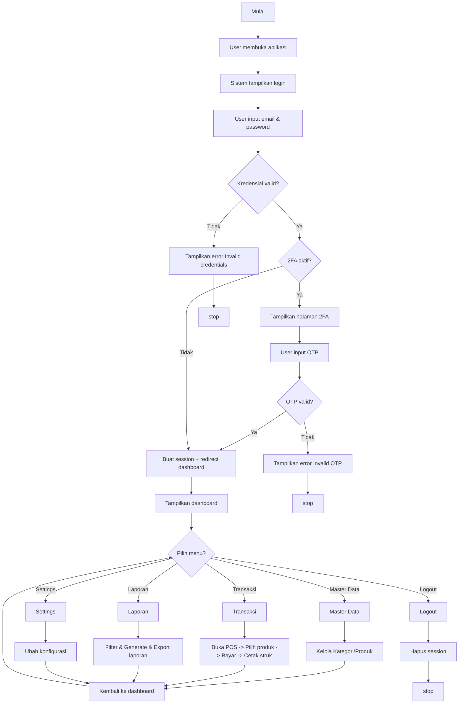
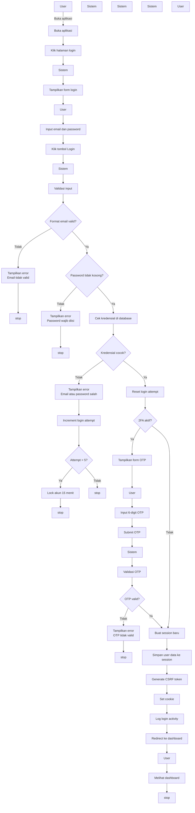
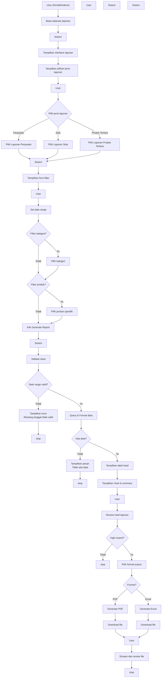
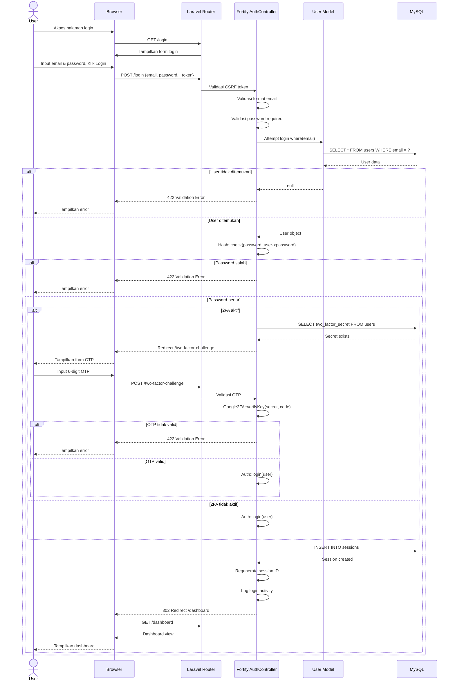
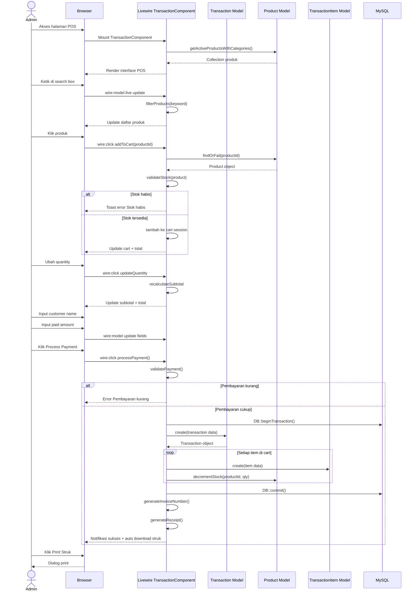
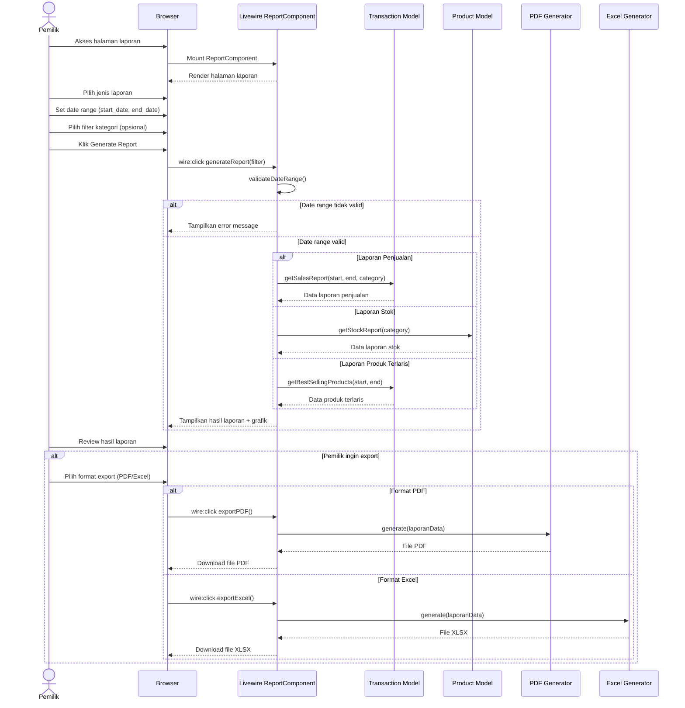
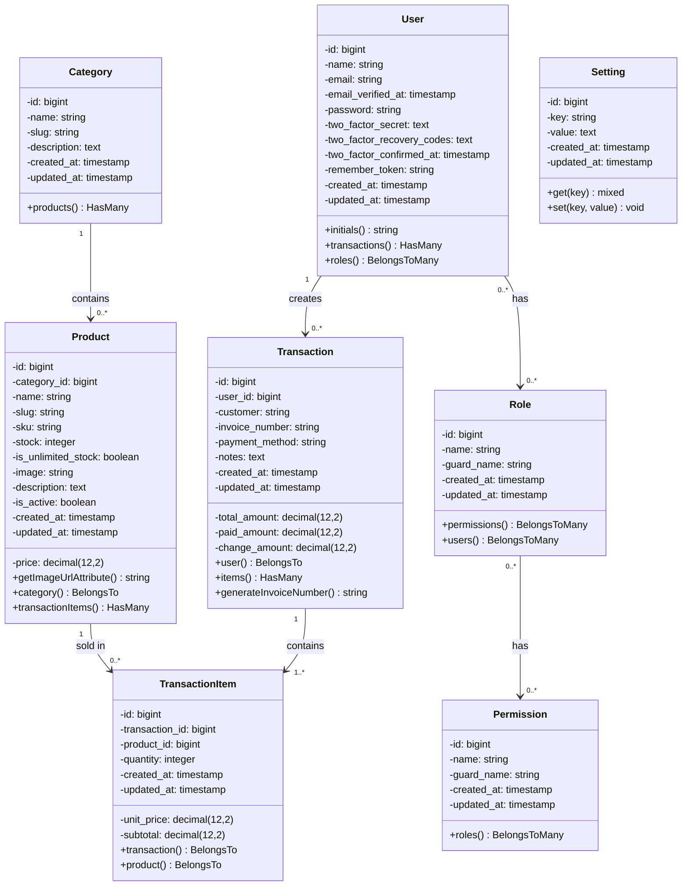

# 4.2 PERANCANGAN SISTEM

Perancangan sistem merupakan tahapan yang sangat penting dalam siklus pengembangan perangkat lunak. Pada tahapan ini dilakukan pemodelan sistem menggunakan pendekatan berorientasi objek dengan menggunakan Unified Modeling Language (UML). Perancangan sistem bertujuan untuk memberikan gambaran yang jelas dan lengkap mengenai bagaimana sistem akan dibangun, baik dari segi alur proses, interaksi antar komponen, maupun struktur data yang digunakan.

Perancangan sistem POS DW mencakup beberapa aspek penting yang akan dijelaskan secara detail pada sub-bab berikut:

1. Flowchart Sistem untuk menggambarkan alur kerja sistem secara keseluruhan
2. Use Case Diagram untuk mengidentifikasi aktor dan fungsionalitas sistem
3. Activity Diagram untuk memodelkan alur aktivitas bisnis
4. Sequence Diagram untuk menjelaskan interaksi antar objek dalam sistem
5. Class Diagram untuk menggambarkan struktur class dan relasi antar class

---

## 4.2.1 Flowchart Sistem

Flowchart atau diagram alir merupakan representasi grafis dari langkah-langkah yang harus dilalui dalam suatu proses. Dalam konteks Sistem POS DW, flowchart digunakan untuk menggambarkan alur kerja aplikasi dari awal hingga akhir, mulai dari user membuka aplikasi hingga proses logout.

### Gambar 4.1 Flowchart Sistem POS DW



*Sumber: Hasil Perancangan (2026)*

### Penjelasan Flowchart

Flowchart sistem POS DW menggambarkan alur kerja aplikasi secara menyeluruh. Berikut adalah penjelasan detail setiap tahapan:

**1. Tahap Inisialisasi**

Proses dimulai ketika user membuka aplikasi melalui browser. Sistem kemudian akan menampilkan halaman login sebagai gerbang utama untuk mengakses sistem. Pada tahap ini, sistem belum memberikan akses ke halaman manapun sebelum user berhasil melakukan autentikasi.

**2. Tahap Autentikasi**

Tahap autentikasi merupakan proses verifikasi identitas user. User memasukkan email dan password yang akan divalidasi oleh sistem. Terdapat dua decision point pada tahap ini:

- **Decision Point 1 - Validasi Kredensial**: Sistem akan memeriksa kecocokan email dan password dengan data yang tersimpan di database. Jika kredensial tidak valid, sistem akan menampilkan pesan error dan proses dihentikan. Jika valid, proses dilanjutkan ke pengecekan 2FA.

- **Decision Point 2 - Verifikasi 2FA**: Jika user telah mengaktifkan Two Factor Authentication (2FA), sistem akan menampilkan halaman khusus untuk memasukkan kode OTP. Sistem akan memvalidasi kode OTP yang dimasukkan. Jika OTP tidak valid, sistem menampilkan error dan proses dihentikan. Jika valid, atau jika 2FA tidak aktif, sistem akan membuat session user dan mengarahkan ke dashboard.

**3. Tahap Menu Utama**

Setelah berhasil login, sistem menampilkan dashboard yang berisi informasi statistik dan navigasi menu. User dapat memilih menu yang tersedia sesuai dengan hak akses yang dimiliki:

- **Master Data**: Menu untuk mengelola kategori dan produk
- **Transaksi**: Menu untuk melakukan transaksi penjualan POS
- **Laporan**: Menu untuk melihat dan mengekspor laporan
- **Settings**: Menu untuk mengatur konfigurasi sistem
- **Logout**: Menu untuk keluar dari sistem

**4. Tahap Transaksi**

Pada menu transaksi, user dapat memilih produk, memasukkan pembayaran, dan memproses transaksi. Setelah transaksi berhasil, sistem secara otomatis akan mengurangi stok produk dan menampilkan struk yang dapat dicetak.

**5. Tahap Logout**

Ketika user memilih menu logout, sistem akan menghapus session user, membersihkan data autentikasi, dan mengembalikan user ke halaman login.

---

## 4.2.2 Use Case Diagram

Use case diagram merupakan diagram UML yang digunakan untuk menggambarkan interaksi antara aktor (pengguna) dengan sistem. Diagram ini menunjukkan fungsionalitas yang disediakan oleh sistem dan siapa saja yang dapat mengakses fungsionalitas tersebut.

### Gambar 4.2 Use Case Diagram Sistem POS DW

```mermaid
usecaseDiagram
  actor Admin
  actor Pemilik

  usecase UC01 as "UC-01: Login"
  usecase UC02 as "UC-02: Setup 2FA"
  usecase UC03 as "UC-03: Logout"
  usecase UC04 as "UC-04: Kelola Kategori"
  usecase UC05 as "UC-05: Kelola Produk"
  usecase UC06 as "UC-06: Upload Gambar Produk"
  usecase UC07 as "UC-07: Kelola Stok"
  usecase UC08 as "UC-08: Transaksi Penjualan"
  usecase UC09 as "UC-09: Tambah Item ke Cart"
  usecase UC10 as "UC-10: Proses Pembayaran"
  usecase UC11 as "UC-11: Cetak Struk"
  usecase UC12 as "UC-12: Lihat Riwayat Transaksi"
  usecase UC13 as "UC-13: Laporan Penjualan"
  usecase UC14 as "UC-14: Laporan Stok"
  usecase UC15 as "UC-15: Laporan Produk Terlaris"
  usecase UC16 as "UC-16: Export PDF"
  usecase UC17 as "UC-17: Export Excel"
  usecase UC18 as "UC-18: Kelola User"
  usecase UC19 as "UC-19: Kelola Role"
  usecase UC20 as "UC-20: Kelola Permission"
  usecase UC21 as "UC-21: Settings Toko"
  usecase UC22 as "UC-22: Settings Profil"
  usecase UC23 as "UC-23: Ubah Password"

  Admin --> UC01
  Admin --> UC02
  Admin --> UC03
  Admin --> UC04
  Admin --> UC05
  Admin --> UC06
  Admin --> UC07
  Admin --> UC08
  Admin --> UC09
  Admin --> UC10
  Admin --> UC11
  Admin --> UC12
  Admin --> UC13
  Admin --> UC14
  Admin --> UC15
  Admin --> UC16
  Admin --> UC17
  Admin --> UC18
  Admin --> UC19
  Admin --> UC20
  Admin --> UC21
  Admin --> UC22
  Admin --> UC23

  Pemilik --> UC01
  Pemilik --> UC02
  Pemilik --> UC03
  Pemilik --> UC12
  Pemilik --> UC13
  Pemilik --> UC14
  Pemilik --> UC15
  Pemilik --> UC16
  Pemilik --> UC17
  Pemilik --> UC22
  Pemilik --> UC23

  UC08 ..> UC09 : <<include>>
  UC08 ..> UC10 : <<include>>
  UC10 ..> UC11 : <<include>>
  UC05 ..> UC06 : <<include>>
  UC13 ..> UC16 : <<extend>>
  UC13 ..> UC17 : <<extend>>
  UC14 ..> UC16 : <<extend>>
  UC14 ..> UC17 : <<extend>>
  UC15 ..> UC16 : <<extend>>
  UC15 ..> UC17 : <<extend>>
```

*Sumber: Hasil Perancangan (2026)*

### Identifikasi Aktor

Berdasarkan hasil analisis kebutuhan sistem, terdapat dua aktor yang akan berinteraksi dengan sistem POS DW. Berikut adalah penjelasan masing-masing aktor:

**Tabel 4.1 Daftar Aktor Sistem**

| No | Aktor | Deskripsi | Hak Akses Utama |
|----|-------|-----------|-----------------|
| 1 | Admin | Pengguna dengan hak akses penuh terhadap seluruh sistem. Admin bertanggung jawab dalam pengelolaan master data, transaksi penjualan, pengaturan sistem, dan manajemen user | Kelola seluruh modul (master data, transaksi, laporan, user, role, permission, settings) |
| 2 | Pemilik | Pengguna yang bertugas melakukan monitoring dan analisis bisnis. Pemilik membutuhkan data laporan untuk pengambilan keputusan | Lihat dashboard, generate laporan, lihat riwayat transaksi, export laporan ke PDF/Excel, update profil |

*Sumber: Analisis Kebutuhan Sistem (2026)*

### Daftar Use Case

Sistem POS DW memiliki 23 use case yang merepresentasikan seluruh fungsionalitas yang tersedia. Berikut adalah daftar lengkap use case beserta deskripsi dan aktor yang terlibat:

**Tabel 4.2 Daftar Use Case**

| Kode | Use Case | Deskripsi | Aktor |
|------|----------|-----------|-------|
| UC-01 | Login | Proses autentikasi user ke dalam sistem menggunakan email dan password | Admin, Pemilik |
| UC-02 | Setup 2FA | Mengaktifkan atau menonaktifkan fitur Two Factor Authentication | Admin, Pemilik |
| UC-03 | Logout | Proses keluar dari sistem dan menghapus session | Admin, Pemilik |
| UC-04 | Kelola Kategori | Mengelola data kategori produk (Create, Read, Update, Delete) | Admin |
| UC-05 | Kelola Produk | Mengelola data produk termasuk informasi detail, harga, dan stok | Admin |
| UC-06 | Upload Gambar Produk | Mengunggah dan mengelola gambar untuk setiap produk | Admin |
| UC-07 | Kelola Stok | Melakukan penyesuaian stok produk secara manual | Admin |
| UC-08 | Transaksi Penjualan | Melakukan proses transaksi penjualan dari awal hingga akhir | Admin |
| UC-09 | Tambah Item ke Cart | Menambahkan produk ke dalam keranjang belanja | Admin |
| UC-10 | Proses Pembayaran | Melakukan kalkulasi dan memproses pembayaran transaksi | Admin |
| UC-11 | Cetak Struk | Mencetak struk atau invoice hasil transaksi | Admin |
| UC-12 | Lihat Riwayat Transaksi | Melihat daftar transaksi yang telah dilakukan | Admin, Pemilik |
| UC-13 | Laporan Penjualan | Menghasilkan laporan penjualan berdasarkan periode waktu | Admin, Pemilik |
| UC-14 | Laporan Stok | Menghasilkan laporan stok produk termasuk stok menipis | Admin, Pemilik |
| UC-15 | Laporan Produk Terlaris | Menghasilkan laporan produk dengan penjualan tertinggi | Admin, Pemilik |
| UC-16 | Export PDF | Mengekspor laporan ke dalam format PDF | Admin, Pemilik |
| UC-17 | Export Excel | Mengekspor laporan ke dalam format Excel | Admin, Pemilik |
| UC-18 | Kelola User | Mengelola data pengguna sistem (CRUD) | Admin |
| UC-19 | Kelola Role | Mengelola role atau peran pengguna dalam sistem | Admin |
| UC-20 | Kelola Permission | Mengelola hak akses untuk setiap role | Admin |
| UC-21 | Settings Toko | Mengatur konfigurasi toko (nama, alamat, logo, telepon) | Admin |
| UC-22 | Settings Profil | Memperbarui profil pengguna (nama, email) | Admin, Pemilik |
| UC-23 | Ubah Password | Mengganti password akun pengguna | Admin, Pemilik |

*Sumber: Analisis Kebutuhan Sistem (2026)*

### Relasi Include dan Extend

Pada use case diagram terdapat beberapa relasi yang menjelaskan ketergantungan antar use case:

- **Relasi Include**: Use case UC-08 (Transaksi Penjualan) mencakup UC-09 (Tambah Item ke Cart) dan UC-10 (Proses Pembayaran). Ini berarti bahwa untuk melakukan transaksi penjualan, user harus terlebih dahulu menambahkan item ke keranjang dan melakukan proses pembayaran. Selanjutnya, UC-10 (Proses Pembayaran) mencakup UC-11 (Cetak Struk) yang berarti setelah pembayaran berhasil, sistem akan mencetak struk secara otomatis. UC-05 (Kelola Produk) mencakup UC-06 (Upload Gambar Produk) karena dalam pengelolaan produk, pengguna dapat mengunggah gambar produk.

- **Relasi Extend**: UC-13 (Laporan Penjualan), UC-14 (Laporan Stok), dan UC-15 (Laporan Produk Terlaris) memiliki relasi extend ke UC-16 (Export PDF) dan UC-17 (Export Excel). Ini berarti bahwa export laporan merupakan fungsionalitas opsional yang dapat dilakukan setelah laporan ditampilkan.

### Deskripsi Detail Use Case Utama

Berikut adalah penjelasan detail untuk use case yang menjadi inti dari sistem POS DW:

#### UC-08: Transaksi Penjualan

Use case Transaksi Penjualan merupakan use case utama dalam sistem POS DW yang memungkinkan admin untuk melayani transaksi penjualan kepada customer.

**Tabel 4.3 Spesifikasi Use Case Transaksi Penjualan**

| Elemen | Deskripsi |
|--------|-----------|
| **ID Use Case** | UC-08 |
| **Nama Use Case** | Transaksi Penjualan |
| **Aktor** | Admin |
| **Deskripsi** | Admin melakukan proses transaksi penjualan produk kepada customer melalui interface Point of Sale (POS), dimulai dari pemilihan produk, input pembayaran, hingga mencetak struk |
| **Precondition** | 1. User sudah login ke sistem 2. Minimal ada 1 produk aktif dengan stok tersedia 3. User memiliki permission untuk melakukan transaksi |
| **Postcondition** | 1. Transaksi tersimpan di database 2. Stok produk berkurang secara otomatis 3. Invoice number ter-generate 4. Struk siap dicetak |

**Main Flow (Aliran Utama):**

1. Admin membuka halaman transaksi POS
2. Sistem menampilkan interface POS yang terdiri dari daftar produk dan keranjang belanja
3. Admin mencari produk dengan mengetikkan nama atau SKU pada kolom pencarian
4. Sistem menampilkan hasil pencarian secara real-time tanpa perlu reload halaman
5. Admin memilih produk yang akan dibeli dengan mengklik tombol tambah
6. Sistem melakukan validasi ketersediaan stok produk
7. Jika stok tersedia, sistem menambahkan produk ke keranjang dengan quantity default 1
8. Admin dapat mengubah quantity produk sesuai kebutuhan (opsional)
9. Sistem menghitung subtotal per item dan total keseluruhan secara real-time
10. Admin mengulangi langkah 3-9 untuk setiap produk yang akan dibeli (opsional)
11. Admin memasukkan nama customer
12. Admin memilih metode pembayaran (Cash/Debit/Credit/E-Wallet)
13. Admin memasukkan jumlah pembayaran
14. Sistem menghitung dan menampilkan jumlah kembalian
15. Admin mengkonfirmasi transaksi dengan menekan tombol "Process Payment"
16. Sistem memulai database transaction untuk menjaga konsistensi data
17. Sistem menyimpan data transaksi ke tabel transactions
18. Sistem menyimpan detail item ke tabel transaction_items
19. Sistem mengurangi stok produk sesuai quantity yang dibeli
20. Sistem melakukan commit database transaction
21. Sistem menghasilkan struk dalam format PDF
22. Sistem menampilkan notifikasi sukses dan struk siap dicetak
23. Admin mencetak struk untuk diberikan kepada customer
24. Sistem mereset form untuk transaksi berikutnya

**Alternative Flow (Aliran Alternatif):**

| Kode | Skenario | Langkah | Respons Sistem |
|------|----------|---------|----------------|
| A1 | Stok tidak tersedia | Langkah 6 | Sistem menampilkan notifikasi "Stok tidak tersedia" dan tidak menambahkan produk ke keranjang. Kembali ke langkah 3 |
| A2 | Quantity melebihi stok | Langkah 8 | Sistem membatasi quantity maksimal sesuai stok tersedia dan menampilkan peringatan |
| A3 | Pembayaran kurang | Langkah 14 | Sistem menampilkan error "Jumlah pembayaran kurang" dan meminta input ulang |
| A4 | Database error | Langkah 18 | Sistem melakukan rollback transaction, menampilkan pesan error, dan tidak ada perubahan stok |

*Sumber: Analisis Use Case (2026)*

#### UC-13: Laporan Penjualan

**Tabel 4.4 Spesifikasi Use Case Laporan Penjualan**

| Elemen | Deskripsi |
|--------|-----------|
| **ID Use Case** | UC-13 |
| **Nama Use Case** | Laporan Penjualan |
| **Aktor** | Admin, Pemilik |
| **Deskripsi** | User dapat melihat dan menghasilkan laporan penjualan berdasarkan periode waktu tertentu dengan berbagai opsi filter |
| **Precondition** | 1. User sudah login 2. Terdapat data transaksi yang tersimpan di database |
| **Postcondition** | 1. Data laporan ditampilkan dalam bentuk tabel dan grafik 2. User dapat mengekspor laporan (opsional) |

**Main Flow:**
1. User membuka halaman laporan
2. Sistem menampilkan form filter (jenis laporan, tanggal, kategori)
3. User memilih jenis laporan "Penjualan"
4. User menentukan periode tanggal (start_date dan end_date)
5. User dapat memfilter berdasarkan kategori (opsional)
6. User mengklik tombol "Generate Report"
7. Sistem melakukan query dengan filter yang dipilih
8. Sistem menampilkan data penjualan dalam bentuk tabel
9. Sistem menampilkan grafik penjualan
10. Sistem menampilkan summary statistic (total penjualan, rata-rata, jumlah transaksi)
11. User dapat mengekspor laporan ke PDF atau Excel (opsional)

*Sumber: Analisis Use Case (2026)*

#### UC-05: Kelola Produk

**Tabel 4.5 Spesifikasi Use Case Kelola Produk**

| Elemen | Deskripsi |
|--------|-----------|
| **ID Use Case** | UC-05 |
| **Nama Use Case** | Kelola Produk |
| **Aktor** | Admin |
| **Deskripsi** | Admin dapat mengelola data produk yang meliputi penambahan, perubahan, penghapusan, dan pencarian data produk |
| **Precondition** | 1. User sudah login sebagai Admin 2. Kategori produk sudah tersedia |
| **Postcondition** | Data produk berhasil ditambahkan/diubah/dihapus |

**Main Flow (Menambah Produk Baru):**
1. Admin memilih menu produk
2. Sistem menampilkan daftar produk
3. Admin mengklik tombol "Tambah Produk"
4. Sistem menampilkan form input produk
5. Admin mengisi data produk (nama, kategori, SKU, harga, stok, deskripsi)
6. Admin dapat mengupload gambar produk (opsional)
7. Admin mengatur status aktif dan opsi unlimited stock (opsional)
8. Admin mengklik tombol "Save"
9. Sistem melakukan validasi input
10. Jika valid, sistem menyimpan data produk ke database
11. Sistem menampilkan notifikasi sukses

*Sumber: Analisis Use Case (2026)*

---

## 4.2.3 Activity Diagram

Activity diagram merupakan diagram UML yang digunakan untuk memodelkan alur kerja (workflow) suatu proses bisnis. Diagram ini menggambarkan urutan aktivitas dari satu titik awal hingga titik akhir, termasuk decision point dan aktivitas paralel. Dalam sistem POS DW, terdapat tiga activity diagram utama yang merepresentasikan proses-proses kritis.

### 4.2.3.1 Activity Diagram Login

Activity diagram login menggambarkan alur aktivitas saat user melakukan autentikasi ke dalam sistem.

### Gambar 4.3 Activity Diagram Login



*Sumber: Hasil Perancangan (2026)*

### Penjelasan Activity Diagram Login

Activity diagram login terdiri dari dua swimlane yang merepresentasikan dua entitas berbeda:

**Swimlane User**: Mencakup aktivitas yang dilakukan oleh pengguna, yaitu membuka aplikasi, mengklik halaman login, menginput email dan password, mengklik tombol "Login", dan menginput OTP (jika 2FA aktif).

**Swimlane Sistem**: Mencakup aktivitas yang dilakukan oleh sistem, yaitu menampilkan form login, melakukan validasi input, memeriksa kredensial di database, memvalidasi OTP, membuat session, dan mengarahkan ke dashboard.

Berikut adalah penjelasan detail dari setiap aktivitas:

1. **User membuka aplikasi dan mengklik halaman login**: Proses dimulai ketika user mengakses URL aplikasi melalui browser.

2. **Sistem menampilkan form login**: Sistem akan merender halaman login yang berisi form input email, password, checkbox "Remember Me", dan tombol login.

3. **User menginput email dan password**: User memasukkan kredensial yang dimiliki.

4. **Sistem melakukan validasi input**: Sistem memeriksa format email dan memastikan password tidak kosong. Validasi dilakukan di sisi client untuk memberikan feedback cepat. Jika format email tidak valid, sistem akan menampilkan pesan error "Email tidak valid". Jika password kosong, sistem menampilkan "Password wajib diisi".

5. **Sistem memeriksa kredensial di database**: Setelah validasi format lolos, sistem melakukan query ke database untuk mencocokkan email dan password yang di-hash menggunakan bcrypt. Jika kredensial tidak cocok, sistem akan menampilkan pesan error "Email atau password salah". Sistem juga melakukan pencatatan percobaan login untuk mencegah brute force attack. Jika percobaan login gagal lebih dari 5 kali, akun akan dikunci selama 15 menit.

6. **Pengecekan 2FA**: Jika kredensial valid, sistem memeriksa apakah user telah mengaktifkan fitur 2FA. Jika 2FA aktif, sistem akan menampilkan form input 6-digit OTP dan user harus memasukkan kode dari aplikasi authenticator (Google Authenticator). Jika 2FA tidak aktif, sistem langsung membuat session.

7. **Sistem membuat session dan redirect**: Sistem membuat session baru, menyimpan data user, dan mengarahkan user ke halaman dashboard. User kemudian dapat melihat dashboard dan mulai menggunakan sistem.

#### 4.2.3.2 Activity Diagram Transaksi Penjualan

Activity diagram transaksi penjualan menggambarkan alur aktivitas dari proses transaksi POS yang dilakukan oleh admin.

### Gambar 4.4 Activity Diagram Transaksi POS

```mermaid
flowchart TD
  Admin1["Admin"]
  Sistem1["Sistem"]
  Admin2["Admin"]
  Sistem2["Sistem"]
  Admin3["Admin"]
  Sistem3["Sistem"]
  Admin4["Admin"]
  Sistem4["Sistem"]
  Admin5["Admin"]
  Admin6["Admin"]
  Sistem5["Sistem"]
  Admin7["Admin"]
  Sistem6["Sistem"]
  Admin8["Admin"]
  Sistem7["Sistem"]
  Admin9["Admin"]
  Sistem8["Sistem"]

  Admin1 --> A1[Buka halaman transaksi POS]
  A1 --> Sistem1
  Sistem1 --> B1[Tampilkan interface POS]
  B1 --> B2[Load daftar produk]
  B2 --> B3[Inisialisasi keranjang kosong]
  B3 --> Admin2
  Admin2 --> C1[Cari produk
ketik nama/SKU]
  C1 --> Sistem2
  Sistem2 --> D1[Filter produk real-time]
  D1 --> D2[Tampilkan hasil pencarian]
  D2 --> Admin3
  Admin3 --> E1[Pilih produk]
  E1 --> Sistem3
  Sistem3 --> F1[Cek ketersediaan stok]
  F1 --> F2{Stok tersedia?}
  F2 -->|Tidak| F3[Tampilkan notifikasi<br>Stok habis]
  F3 --> Stop1[stop]
  F2 -->|Ya| F4[Tambahkan ke keranjang]
  F4 --> F5[Set quantity = 1]
  F5 --> Admin4
  Admin4 --> G1{Ingin ubah quantity?}
  G1 -->|Ya| G2[Input quantity baru]
  G2 --> Sistem4
  Sistem4 --> H1{Quantity > stok?}
  H1 -->|Ya| H2[Tampilkan error<br>Melebihi stok]
  H2 --> H3[Set quantity = stok maks]
  H1 -->|Tidak| H4[Hitung subtotal]
  G1 -->|Tidak| H4
  H3 --> H4
  H4 --> I1[Update keranjang]
  I1 --> I2[Hitung total keseluruhan]
  I2 --> I3[Tampilkan total]
  I3 --> Admin5
  Admin5 --> J1{Ada produk lain?}
  J1 -->|Ya| C1
  J1 -->|Tidak| J2[Input nama customer]
  J2 --> J3[Pilih metode pembayaran]
  J3 --> Sistem5
  Sistem5 --> K1[Tampilkan total amount]
  K1 --> Admin6
  Admin6 --> L1[Input paid amount]
  L1 --> Sistem6
  Sistem6 --> M1[Validasi pembayaran]
  M1 --> M2{Paid >= Total?}
  M2 -->|Tidak| M3[Tampilkan error<br>Pembayaran kurang]
  M3 --> Stop2[stop]
  M2 -->|Ya| M4[Hitung kembalian]
  M4 --> M5[Tampilkan kembalian]
  M5 --> Admin7
  Admin7 --> N1[Konfirmasi transaksi]
  N1 --> N2[Klik Process Payment]
  N2 --> Sistem7
  Sistem7 --> O1[Mulai DB transaction]
  O1 --> O2[Generate invoice number]
  O2 --> O3[Simpan data transaksi]
  O3 --> O4[Simpan transaction items]
  O4 --> O5[Kurangi stok tiap item]
  O5 --> O6[Commit transaction]
  O6 --> O7[Log transaksi berhasil]
  O7 --> O8[Generate struk PDF]
  O8 --> Admin8
  Admin8 --> P1[Review struk]
  P1 --> P2[Klik Print]
  P2 --> Sistem8
  Sistem8 --> Q1[Cetak/download struk]
  Q1 --> Q2[Tampilkan notifikasi sukses]
  Q2 --> Q3[Kosongkan keranjang]
  Q3 --> Q4[Reset form]
  Q4 --> Admin9
  Admin9 --> R1[Serahkan struk ke customer]
  R1 --> Stop3[stop]
```



*Sumber: Hasil Perancangan (2026)*

### Penjelasan Activity Diagram Transaksi

Activity diagram transaksi penjualan terdiri dari dua swimlane yaitu **Admin** dan **Sistem**. Diagram ini merupakan yang paling kompleks karena menggambarkan alur bisnis inti dari sistem POS DW.

**Tahap 1: Inisialisasi POS**
- Admin membuka halaman transaksi POS
- Sistem menampilkan interface POS dengan daftar produk dan menginisialisasi keranjang kosong

**Tahap 2: Pemilihan Produk**
- Admin mencari produk dengan mengetikkan nama atau SKU
- Sistem menampilkan produk secara real-time. Jika stok tidak tersedia, sistem memberikan notifikasi

**Tahap 3: Manajemen Keranjang**
- Setiap produk yang dipilih ditambahkan ke keranjang dengan quantity default 1
- Admin dapat mengubah quantity dan sistem akan memvalidasi ketersediaan stok
- Sistem menghitung subtotal per item dan total keseluruhan secara real-time

**Tahap 4: Pembayaran**
- Admin memasukkan nama customer dan memilih metode pembayaran
- Admin memasukkan jumlah pembayaran
- Sistem memvalidasi apakah jumlah pembayaran mencukupi
- Jika kurang, sistem menampilkan error dan meminta input ulang

**Tahap 5: Eksekusi Transaksi**
- Admin mengkonfirmasi transaksi
- Sistem memulai database transaction
- Sistem menyimpan data header transaksi dan detail item
- Sistem mengurangi stok setiap produk
- Sistem melakukan commit transaction jika semua berhasil
- Sistem menghasilkan struk PDF dan menampilkan notifikasi sukses

**Tahap 6: Penyelesaian**
- Admin mencetak struk untuk customer
- Sistem mereset keranjang dan form untuk transaksi berikutnya

#### 4.2.3.3 Activity Diagram Generate Laporan

### Gambar 4.5 Activity Diagram Generate Laporan



*Sumber: Hasil Perancangan (2026)*

### Penjelasan Activity Diagram Laporan

Activity diagram laporan terdiri dari swimlane **User (Pemilik/Admin)** dan **Sistem**. Diagram ini menggambarkan proses pembuatan laporan bisnis yang melibatkan pemilihan jenis laporan, pengaturan filter, hingga export data.

**Tahap 1: Pemilihan Jenis Laporan**
- User membuka halaman laporan dan memilih jenis laporan yang diinginkan
- Terdapat tiga pilihan: Laporan Penjualan, Laporan Stok, dan Laporan Produk Terlaris
- Sistem menampilkan form filter yang sesuai dengan jenis laporan yang dipilih

**Tahap 2: Konfigurasi Filter**
- User menentukan periode tanggal (rentang mulai dan akhir)
- User dapat memfilter berdasarkan kategori atau produk spesifik (opsional)
- User mengklik tombol "Generate Report"
- Sistem melakukan validasi input termasuk memastikan tanggal mulai tidak lebih besar dari tanggal akhir

**Tahap 3: Query dan Processing**
- Sistem melakukan query ke database sesuai jenis laporan:
  - **Laporan Penjualan**: Query ke tabel transactions dengan join ke transaction_items dan products, melakukan aggregasi data per periode
  - **Laporan Stok**: Query ke tabel products dengan join ke categories, menghitung stok tersedia, dan menandai stok yang menipis
  - **Laporan Produk Terlaris**: Query ke tabel transaction_items dengan group by product_id, menghitung total quantity, dan mengurutkan berdasarkan penjualan tertinggi

**Tahap 4: Tampilan Hasil**
- Sistem menampilkan data dalam bentuk tabel dan grafik
- Sistem menampilkan summary statistics
- Jika tidak ada data, sistem menampilkan pesan "Tidak ada data"

**Tahap 5: Export (Opsional)**
- User dapat memilih untuk mengekspor laporan ke PDF atau Excel
- Untuk PDF: Sistem menggunakan library untuk menghasilkan file PDF dengan format yang rapi
- Untuk Excel: Sistem menghasilkan file Excel dengan styling dan formula yang sesuai

---

## 4.2.4 Sequence Diagram

Sequence diagram merupakan diagram UML yang menggambarkan interaksi antar objek dalam sistem berdasarkan urutan waktu. Diagram ini menunjukkan aliran pesan antara objek-objek yang terlibat dalam suatu proses.

### 4.2.4.1 Sequence Diagram Login

Sequence diagram login menggambarkan interaksi yang terjadi ketika user melakukan autentikasi. Diagram ini melibatkan enam objek utama: User, Browser, Router, AuthController, User Model, dan MySQL Database.

### Gambar 4.6 Sequence Diagram Login



*Sumber: Hasil Perancangan (2026)*

### Penjelasan Sequence Diagram Login

Sequence diagram login menjelaskan secara detail urutan interaksi antar komponen dalam proses autentikasi:

**1. Inisialisasi Halaman Login**

Proses dimulai ketika User mengakses halaman login melalui Browser. Browser mengirimkan HTTP request GET /login ke Laravel Router. Router kemudian mengarahkan request ke Fortify AuthController yang akan merender dan mengembalikan form login ke Browser untuk ditampilkan kepada User.

**2. Submit Kredensial**

User mengisi email dan password kemudian menekan tombol "Login". Browser mengirimkan HTTP request POST /login yang berisi data email, password, dan CSRF token. Router menerima request dan melakukan validasi CSRF token terlebih dahulu sebelum meneruskan ke AuthController.

**3. Validasi dan Autentikasi**

AuthController melakukan validasi format email dan memastikan password tidak kosong. Setelah validasi lolos, AuthController memanggil fungsi attempt login pada User Model. User Model melakukan query SELECT ke MySQL untuk mencari user berdasarkan email.

**4. Verifikasi Password**

- Jika user tidak ditemukan (database mengembalikan null), AuthController mengembalikan error 422 "Invalid credentials" ke Browser dan User melihat pesan error.
- Jika user ditemukan, AuthController menggunakan fungsi Hash::check() untuk memverifikasi password yang diinput dengan hash yang tersimpan di database.
- Jika password salah, sistem mengembalikan error yang sama.

**5. Verifikasi 2FA (Opsional)**

Jika password benar, AuthController memeriksa apakah user memiliki secret key 2FA yang tersimpan:
- Jika 2FA aktif, sistem mengarahkan User ke halaman /two-factor-challenge
- User memasukkan 6-digit OTP dari aplikasi Google Authenticator
- AuthController memverifikasi OTP menggunakan library Google2FA
- Jika OTP valid, sistem melanjutkan ke pembuatan session
- Jika OTP tidak valid, sistem mengembalikan error

**6. Pembuatan Session**

Setelah autentikasi berhasil (dengan atau tanpa 2FA), AuthController menjalankan fungsi Auth::login() yang akan:
- Membuat session baru dan menyimpannya ke tabel sessions di database
- Meregenerate session ID untuk mencegah session fixation
- Mencatat aktivitas login
- Mengembalikan response redirect ke /dashboard dengan Set-Cookie header

**7. Akses Dashboard**

Browser menerima response redirect dan secara otomatis mengirimkan request GET /dashboard dengan menyertakan cookie session. Router memproses request dan mengembalikan halaman dashboard kepada User.

**Poin Keamanan pada Proses Login:**
- Seluruh komunikasi menggunakan protokol HTTPS
- CSRF token melindungi dari cross-site request forgery
- Password diverifikasi menggunakan bcrypt (tidak pernah di-dekripsi)
- Session disimpan di database untuk keamanan yang lebih baik
- 2FA memberikan lapisan keamanan tambahan
- Brute force protection melalui pembatasan percobaan login

### 4.2.4.2 Sequence Diagram Transaksi Penjualan

Sequence diagram transaksi penjualan menggambarkan interaksi yang terjadi ketika admin melakukan transaksi POS. Diagram ini melibatkan enam objek: Admin, Browser, Livewire Component, Transaction Model, Product Model, TransactionItem Model, dan MySQL Database.

### Gambar 4.7 Sequence Diagram Transaksi



*Sumber: Hasil Perancangan (2026)*

### Penjelasan Sequence Diagram Transaksi

Sequence diagram transaksi penjualan menjelaskan interaksi detail yang terjadi dalam sebuah transaksi POS. Karakteristik utama dari proses ini adalah penggunaan Livewire yang memungkinkan komunikasi real-time antara browser dan server tanpa reload halaman.

**1. Inisialisasi POS**

Proses dimulai ketika Admin membuka halaman transaksi POS. Browser mengirimkan request yang me-mount Livewire TransactionComponent. Component ini melakukan query ke Product Model untuk mengambil seluruh produk aktif beserta kategorinya. Data produk dikembalikan dalam bentuk Collection dan di-render menjadi interface POS yang terdiri dari daftar produk dan keranjang belanja.

**2. Pencarian Produk**

Admin mengetik di kolom pencarian. Fitur wire:model.live dari Livewire mengirimkan setiap perubahan input ke server secara real-time. Component memfilter koleksi produk berdasarkan kata kunci pencarian. Browser memperbarui tampilan daftar produk tanpa reload.

**3. Penambahan Item ke Keranjang**

Admin mengklik tombol tambah pada produk yang diinginkan. Browser mengirimkan event wire:click yang memanggil method addToCart() dengan parameter product ID. Component melakukan:
- Query ke Product Model untuk mengambil data produk terkini
- Validasi ketersediaan stok
- Jika stok habis, mengirim notifikasi error ke Browser
- Jika stok tersedia, menambahkan data produk ke array $cart, menghitung total, dan mengirimkan update tampilan ke Browser

**4. Input Pembayaran dan Eksekusi**

Proses pembayaran dimulai dengan input nama customer dan jumlah pembayaran. Component menghitung kembalian secara real-time menggunakan wire:model.

Ketika Admin mengklik "Process Payment":
- Component melakukan validasi akhir (keranjang tidak kosong, nama customer terisi, pembayaran >= total)
- Memulai MySQL database transaction menggunakan DB::beginTransaction()
- Membuat record baru di tabel transactions
- Untuk setiap item di keranjang, membuat record di tabel transaction_items
- Mengurangi stok produk menggunakan method decrement()
- Melakukan commit transaction jika semua berhasil
- Menghasilkan struk PDF
- Mengirim notifikasi sukses ke Browser
- Browser menampilkan notifikasi dan mendownload file struk

**Keunggulan Arsitektur Livewire:**
- Komunikasi real-time tanpa JavaScript framework tambahan
- State management di sisi server (aman untuk data sensitif)
- Validasi ganda (client + server)
- Database transaction untuk konsistensi data
- Loading state untuk UX yang baik

### 4.2.4.3 Sequence Diagram Generate Laporan

Sequence diagram laporan menggambarkan interaksi yang terjadi ketika user (Pemilik/Admin) membuat laporan bisnis. Diagram ini melibatkan objek: User, Browser, Livewire ReportComponent, Transaction Model, Product Model, PDF Generator, Excel Exporter, dan MySQL Database.

### Gambar 4.8 Sequence Diagram Laporan



*Sumber: Hasil Perancangan (2026)*

### Penjelasan Sequence Diagram Laporan

**1. Inisialisasi dan Konfigurasi**

User membuka halaman laporan. Livewire ReportComponent di-mount dan menampilkan form filter. User memilih jenis laporan, mengatur periode tanggal, dan opsi filter lainnya. Component memperbarui state sesuai input user.

**2. Generate Report**

User mengklik "Generate Report". Component memvalidasi input dan melakukan query sesuai jenis laporan:
- **Laporan Penjualan**: Data dari tabel transactions di-join dengan transaction_items dan products, di-group berdasarkan tanggal
- **Laporan Stok**: Data dari products di-join dengan categories, dengan kalkulasi status stok
- **Laporan Produk Terlaris**: Data dari transaction_items di-group, di-sorting, dan di-limit

Hasil query di-format dan dikirim ke Browser untuk ditampilkan dalam bentuk tabel dan grafik.

**3. Export PDF**

Saat user memilih export ke PDF, Component memanggil PDF Generator:
- Membuat instance TCPDF
- Mengatur informasi dokumen (judul, author, subject)
- Menambahkan header dengan logo toko
- Membuat tabel laporan dengan format yang rapi
- Menambahkan footer dengan nomor halaman
- Mengembalikan binary PDF

Browser menerima response dan mendownload file PDF.

**4. Export Excel**

Saat user memilih export ke Excel, Component memanggil Excel Exporter:
- Membuat Spreadsheet baru menggunakan PhpSpreadsheet
- Mengatur worksheet name
- Menambahkan header row dengan styling bold
- Menambahkan data rows
- Menerapkan borders dan styling sel
- Mengatur auto-size kolom
- Menambahkan formula (SUM, AVERAGE)
- Freeze header row

Browser menerima response dan mendownload file Excel.

---

## 4.2.5 Class Diagram

Class diagram merupakan diagram UML yang menggambarkan struktur class dalam sistem beserta atribut, method, dan relasi antar class. Diagram ini menjadi dasar dalam implementasi pemrograman berorientasi objek.

### Gambar 4.9 Class Diagram Sistem POS DW



*Sumber: Hasil Perancangan (2026)*

### Deskripsi Class

Sistem POS DW memiliki delapan class utama yang merepresentasikan entitas bisnis. Berikut adalah penjelasan masing-masing class:

**Tabel 4.6 Deskripsi Class dalam Sistem**

| No | Nama Class | Tipe | Deskripsi |
|----|------------|------|-----------|
| 1 | User | Entity | Merepresentasikan pengguna sistem yang memiliki hak akses berdasarkan role |
| 2 | Role | Entity | Merepresentasikan peran atau grup pengguna dengan kumpulan permission tertentu |
| 3 | Permission | Entity | Merepresentasikan hak akses spesifik untuk melakukan operasi tertentu |
| 4 | Category | Entity | Merepresentasikan kategori atau pengelompokan produk |
| 5 | Product | Entity | Merepresentasikan produk yang dijual, menjadi inti dari sistem POS |
| 6 | Transaction | Entity | Merepresentasikan header transaksi penjualan yang berisi informasi ringkasan |
| 7 | TransactionItem | Entity | Merepresentasikan detail item dalam sebuah transaksi |
| 8 | Setting | Entity | Merepresentasikan konfigurasi dan pengaturan sistem |

*Sumber: Analisis Class Diagram (2026)*

### Atribut dan Method

#### Class User
**Atribut:**
- id: BIGINT, Primary Key, auto_increment
- name: VARCHAR(255), nama lengkap user
- email: VARCHAR(255), unique, email user
- email_verified_at: TIMESTAMP, nullable, waktu verifikasi email
- password: VARCHAR(255), password yang sudah di-hash menggunakan bcrypt
- two_factor_secret: TEXT, nullable, secret key untuk Google Authenticator
- two_factor_recovery_codes: TEXT, nullable, kode recovery untuk 2FA
- two_factor_confirmed_at: TIMESTAMP, nullable, waktu konfirmasi 2FA
- remember_token: VARCHAR(100), nullable, token untuk fitur "Remember Me"
- created_at, updated_at: TIMESTAMP

**Method:**
- initials(): string — Mengembalikan inisial nama user (contoh: "John Doe" → "JD")
- transactions(): HasMany — Mendefinisikan relasi one-to-many dengan Transaction
- roles(): BelongsToMany — Mendefinisikan relasi many-to-many dengan Role (via Spatie Permission)

#### Class Product
**Atribut:**
- id: BIGINT, Primary Key
- category_id: BIGINT, Foreign Key ke tabel categories
- name: VARCHAR(200), nama produk
- slug: VARCHAR(220), unique, URL-friendly name
- sku: VARCHAR(50), unique, indexed, Stock Keeping Unit
- price: DECIMAL(12,2), default 0, harga jual produk
- stock: INTEGER, default 0, jumlah stok tersedia
- is_unlimited_stock: BOOLEAN, default false, flag stok unlimited
- image: VARCHAR(255), nullable, path file gambar produk
- description: TEXT, nullable, deskripsi produk
- is_active: BOOLEAN, default true, indexed, status aktif produk

**Method:**
- getImageUrlAttribute(): string — Accessor untuk mendapatkan URL lengkap gambar produk. Jika gambar tidak ada, mengembalikan URL default image. Jika URL sudah lengkap (http), mengembalikan URL asli. Jika file ada di storage, mengembalikan URL storage.
- category(): BelongsTo — Relasi ke Category
- transactionItems(): HasMany — Relasi ke TransactionItem

#### Class Transaction
**Atribut:**
- id: BIGINT, Primary Key
- user_id: BIGINT, Foreign Key ke tabel users (nullable)
- customer: VARCHAR(255), nama customer
- invoice_number: VARCHAR(50), unique, nomor invoice auto-generated
- total_amount: DECIMAL(12,2), total nilai transaksi
- paid_amount: DECIMAL(12,2), jumlah pembayaran
- change_amount: DECIMAL(12,2), default 0, jumlah kembalian
- payment_method: VARCHAR(20), default 'cash', metode pembayaran
- notes: TEXT, nullable, catatan transaksi
- created_at, updated_at: TIMESTAMP

**Method:**
- user(): BelongsTo — Relasi ke User
- items(): HasMany — Relasi ke TransactionItem
- generateInvoiceNumber(): string — Method untuk menghasilkan nomor invoice unik dengan format tertentu

#### Class TransactionItem
**Atribut:**
- id: BIGINT, Primary Key
- transaction_id: BIGINT, Foreign Key ke tabel transactions
- product_id: BIGINT, Foreign Key ke tabel products
- quantity: INTEGER, jumlah item
- unit_price: DECIMAL(12,2), harga satuan saat transaksi
- subtotal: DECIMAL(12,2), hasil kalkulasi quantity * unit_price
- created_at, updated_at: TIMESTAMP

**Method:**
- transaction(): BelongsTo — Relasi ke Transaction
- product(): BelongsTo — Relasi ke Product

### Relasi Antar Class

**Tabel 4.7 Relasi dan Kardinalitas**

| No | Class 1 | Relasi | Class 2 | Kardinalitas | Deskripsi |
|----|---------|--------|---------|--------------|-----------|
| 1 | User | → | Transaction | 1 : N | Satu user dapat membuat banyak transaksi. Satu transaksi dimiliki oleh satu user |
| 2 | User | → | Role | M : N | Satu user dapat memiliki banyak role. Satu role dapat dimiliki oleh banyak user |
| 3 | Role | → | Permission | M : N | Satu role dapat memiliki banyak permission. Satu permission dapat dimiliki oleh banyak role |
| 4 | Category | → | Product | 1 : N | Satu kategori dapat menampung banyak produk. Satu produk hanya memiliki satu kategori |
| 5 | Product | → | TransactionItem | 1 : N | Satu produk dapat muncul di banyak transaksi. Satu item transaksi hanya mereferensi satu produk |
| 6 | Transaction | → | TransactionItem | 1 : N | Satu transaksi memiliki minimal satu item. Satu item hanya milik satu transaksi |

*Sumber: Analisis Class Diagram (2026)*

### Penjelasan Relasi

**1. Relasi User - Transaction (One-to-Many)**

Relasi ini menunjukkan bahwa seorang user dapat melakukan banyak transaksi penjualan. Implementasi pada sisi User menggunakan method `transactions(): HasMany` dan pada sisi Transaction menggunakan method `user(): BelongsTo`. Foreign key `user_id` berada di tabel transactions.

**2. Relasi User - Role (Many-to-Many)**

Relasi ini menggunakan tabel pivot `model_has_roles` dari package Spatie Laravel Permission. Seorang user dapat memiliki lebih dari satu role (misalnya seorang Admin juga bisa menjadi Pemilik), dan sebuah role dapat dimiliki oleh banyak user. Relasi ini memungkinkan fleksibilitas dalam pengaturan hak akses.

**3. Relasi Category - Product (One-to-Many)**

Relasi ini menunjukkan bahwa satu kategori produk dapat menampung banyak produk. Sebagai contoh, kategori "Makanan Ringan" dapat berisi produk "Keripik Singkong", "Kacang Garuda", dan sebagainya. Foreign key `category_id` berada di tabel products.

**4. Relasi Transaction - TransactionItem (One-to-Many)**

Relasi ini merupakan representasi dari konsep header-detail dalam sistem transaksi. Satu transaksi dapat memiliki banyak item (produk yang dibeli). Setiap item transaksi mencatat quantity, unit_price, dan subtotal pada saat transaksi terjadi, sehingga data historis tetap akurat meskipun harga produk berubah kemudian.

**5. Relasi Product - TransactionItem (One-to-Many)**

Relasi ini menghubungkan produk dengan item transaksi. Penting untuk dicatat bahwa data harga di tabel transaction_items menggunakan nilai `unit_price` yang merupakan harga produk pada saat transaksi, bukan harga produk terkini. Hal ini dilakukan untuk menjaga akurasi data historis penjualan.

---

## Ringkasan Perancangan Sistem

Perancangan sistem yang telah dijelaskan pada sub-bab ini mencakup lima aspek pemodelan UML yang saling melengkapi:

1. **Flowchart Sistem** memberikan gambaran alur kerja sistem secara keseluruhan, dari login hingga logout, yang menjadi acuan dasar pengembangan.

2. **Use Case Diagram** mengidentifikasi dua aktor (Admin, Pemilik) dengan 23 use case yang mencakup seluruh fungsionalitas sistem. Setiap use case telah dijelaskan secara detail termasuk aliran utama dan alternatif.

3. **Activity Diagram** memodelkan tiga proses bisnis utama: login (dengan 2FA), transaksi penjualan POS, dan generate laporan. setiap diagram dilengkapi dengan penjelasan swimlane dan decision point.

4. **Sequence Diagram** menjelaskan interaksi antar objek dalam sistem secara temporal untuk proses login, transaksi, dan laporan. Diagram ini memperlihatkan bagaimana Livewire memfasilitasi komunikasi real-time antara browser dan server.

5. **Class Diagram** menggambarkan delapan class utama dengan atribut, method, dan relasi antar class. Relasi yang teridentifikasi meliputi one-to-many (User-Transaction, Category-Product, Transaction-TransactionItem) dan many-to-many (User-Role, Role-Permission).

Seluruh perancangan ini telah mempertimbangkan aspek keamanan (autentikasi berlapis, proteksi brute force, CSRF), kemudahan penggunaan (interface real-time, validasi interaktif), skalabilitas (struktur database yang ternormalisasi), dan maintainability (pola desain MVC yang terstruktur).

Perancangan yang telah dibuat akan menjadi blueprint dalam tahap implementasi sistem yang dijelaskan pada sub-bab selanjutnya.

---

## Navigasi

| [← Daftar Isi](./README.md) | [← 4.1 Analisis Kebutuhan](./4.1-analisis-kebutuhan-sistem.md) | [4.3 Perancangan Basis Data →](./4.3-perancangan-basis-data.md) |
|:---:|:---:|:---:|
