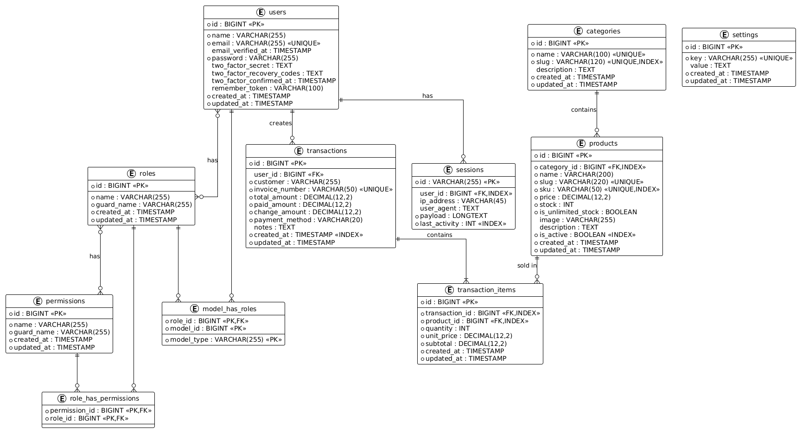

# 4.3 PERANCANGAN BASIS DATA

Basis data merupakan komponen vital dalam sistem informasi karena berfungsi sebagai tempat penyimpanan seluruh data yang diperlukan oleh sistem. Perancangan basis data yang baik akan menjamin integritas, konsistensi, dan efisiensi dalam pengelolaan data.

Perancangan basis data Sistem POS DW dilakukan melalui dua tahapan utama, yaitu pembuatan Entity Relationship Diagram (ERD) untuk memodelkan hubungan antar data, dan perancangan struktur tabel untuk mengimplementasikan model tersebut ke dalam database MySQL.

---

## 4.3.1 Entity Relationship Diagram (ERD)

Entity Relationship Diagram (ERD) adalah model data yang digunakan untuk menggambarkan hubungan antar entitas dalam suatu sistem. ERD merupakan representasi grafis dari struktur database yang menunjukkan entitas, atribut, dan relasi antar entitas.

### Gambar 4.10 Entity Relationship Diagram (ERD) Sistem POS DW

*Sumber: Hasil Perancangan (2026)*

### Penjelasan Entitas

Sistem POS DW memiliki sepuluh entitas yang saling berelasi. Berikut adalah penjelasan setiap entitas beserta fungsinya:

**Tabel 4.8 Daftar Entitas Database**

| No | Nama Entitas | Tipe | Deskripsi | Jumlah Field |
|----|-------------|------|-----------|--------------|
| 1 | users | Master | Menyimpan data pengguna sistem termasuk kredensial dan informasi 2FA | 11 |
| 2 | roles | Master | Menyimpan data role/peran pengguna (Admin, Pemilik) | 4 |
| 3 | permissions | Master | Menyimpan data hak akses spesifik untuk setiap modul | 4 |
| 4 | model_has_roles | Pivot | Menghubungkan user dengan role (many-to-many) | 3 |
| 5 | role_has_permissions | Pivot | Menghubungkan role dengan permission (many-to-many) | 2 |
| 6 | categories | Master | Menyimpan data kategori produk | 6 |
| 7 | products | Transaksi | Menyimpan data produk yang dijual | 15 |
| 8 | transactions | Transaksi | Menyimpan data header transaksi penjualan | 11 |
| 9 | transaction_items | Transaksi | Menyimpan data detail item dalam transaksi | 9 |
| 10 | sessions | Sistem | Menyimpan data session pengguna | 6 |
| 11 | settings | Sistem | Menyimpan konfigurasi dan pengaturan sistem | 4 |

*Sumber: Hasil Perancangan (2026)*

### Relasi dan Kardinalitas

Berikut adalah penjelasan relasi antar entitas dalam ERD Sistem POS DW:

**Tabel 4.9 Relasi Antar Entitas**

| No | Entitas Induk | Relasi | Entitas Anak | Kardinalitas | Foreign Key | Penjelasan |
|----|---------------|--------|--------------|--------------|-------------|------------|
| 1 | users | → | transactions | One-to-Many | user_id di transactions | Satu user dapat membuat banyak transaksi |
| 2 | users | → | sessions | One-to-Many | user_id di sessions | Satu user dapat memiliki banyak session (login dari multiple device) |
| 3 | users | → | roles | Many-to-Many | model_has_roles (pivot) | Satu user dapat memiliki banyak role, satu role dapat dimiliki banyak user |
| 4 | roles | → | permissions | Many-to-Many | role_has_permissions (pivot) | Satu role dapat memiliki banyak permission, satu permission dapat dimiliki banyak role |
| 5 | categories | → | products | One-to-Many | category_id di products | Satu kategori dapat menampung banyak produk |
| 6 | products | → | transaction_items | One-to-Many | product_id di transaction_items | Satu produk dapat muncul di banyak transaksi |
| 7 | transactions | → | transaction_items | One-to-Many | transaction_id di transaction_items | Satu transaksi memiliki minimal satu item |

*Sumber: Hasil Perancangan (2026)*

### Normalisasi Database

Database Sistem POS DW telah melalui proses normalisasi hingga bentuk normal ketiga (3NF) untuk menjamin:

1. **1NF (First Normal Form)**: Setiap kolom bersifat atomik (tidak ada nilai ganda dalam satu kolom). Contoh: kolom `name` pada tabel products hanya berisi satu nilai nama produk.
2. **2NF (Second Normal Form)**: Tidak ada ketergantungan parsial. Setiap atribut non-key bergantung sepenuhnya pada primary key. Contoh: pada tabel transaction_items, kolom `quantity` bergantung pada kombinasi (transaction_id, product_id).
3. **3NF (Third Normal Form)**: Tidak ada ketergantungan transitif. Semua atribut non-key hanya bergantung pada primary key. Contoh: pada tabel products, kolom `category_id` adalah foreign key yang memisahkan data kategori ke tabel terpisah.

---

## 4.3.2 Struktur Tabel

Berikut adalah struktur detail dari setiap tabel dalam database Sistem POS DW. Setiap tabel dijelaskan dengan format Field, Type, Length, Null, Key, Default, Extra, dan Keterangan.

### 1. Tabel users

Tabel users menyimpan data seluruh pengguna sistem. Tabel ini di-generate oleh Laravel default dan ditambahkan kolom untuk mendukung Laravel Fortify (2FA).

**Tabel 4.10 Struktur Tabel users**

| Field | Type | Length | Null | Key | Default | Extra | Keterangan |
|-------|------|--------|------|-----|---------|-------|------------|
| id | BIGINT UNSIGNED | - | NO | PRI | NULL | auto_increment | Primary key |
| name | VARCHAR | 255 | NO | - | NULL | - | Nama lengkap user |
| email | VARCHAR | 255 | NO | UNI | NULL | - | Alamat email (unique) |
| email_verified_at | TIMESTAMP | - | YES | - | NULL | - | Waktu verifikasi email |
| password | VARCHAR | 255 | NO | - | NULL | - | Password (hashed: bcrypt) |
| two_factor_secret | TEXT | - | YES | - | NULL | - | Secret key untuk Google Authenticator |
| two_factor_recovery_codes | TEXT | - | YES | - | NULL | - | Recovery codes (8 digit code) |
| two_factor_confirmed_at | TIMESTAMP | - | YES | - | NULL | - | Waktu konfirmasi 2FA |
| remember_token | VARCHAR | 100 | YES | - | NULL | - | Token untuk "Remember Me" |
| created_at | TIMESTAMP | - | YES | - | NULL | - | Waktu data dibuat |
| updated_at | TIMESTAMP | - | YES | - | NULL | - | Waktu data diupdate |

### 2. Tabel roles dan permissions

Tabel roles dan permissions beserta tabel pivot-nya di-generate oleh package Spatie Laravel Permission. Tabel-tabel ini mengimplementasikan Role-Based Access Control (RBAC).

**Tabel 4.11 Struktur Tabel roles**

| Field | Type | Length | Null | Key | Default | Extra | Keterangan |
|-------|------|--------|------|-----|---------|-------|------------|
| id | BIGINT UNSIGNED | - | NO | PRI | NULL | auto_increment | Primary key |
| name | VARCHAR | 255 | NO | - | NULL | - | Nama role (contoh: Admin, Pemilik) |
| guard_name | VARCHAR | 255 | NO | - | NULL | - | Nama guard (default: web) |
| created_at | TIMESTAMP | - | YES | - | NULL | - | Waktu data dibuat |
| updated_at | TIMESTAMP | - | YES | - | NULL | - | Waktu data diupdate |

**Tabel 4.12 Struktur Tabel permissions**

| Field | Type | Length | Null | Key | Default | Extra | Keterangan |
|-------|------|--------|------|-----|---------|-------|------------|
| id | BIGINT UNSIGNED | - | NO | PRI | NULL | auto_increment | Primary key |
| name | VARCHAR | 255 | NO | - | NULL | - | Nama permission (contoh: create-product, view-report) |
| guard_name | VARCHAR | 255 | NO | - | NULL | - | Nama guard (default: web) |
| created_at | TIMESTAMP | - | YES | - | NULL | - | Waktu data dibuat |
| updated_at | TIMESTAMP | - | YES | - | NULL | - | Waktu data diupdate |

**Tabel 4.13 Struktur Tabel model_has_roles (Pivot)**

| Field | Type | Length | Null | Key | Default | Extra | Keterangan |
|-------|------|--------|------|-----|---------|-------|------------|
| role_id | BIGINT UNSIGNED | - | NO | PRI | NULL | - | Foreign key ke roles.id |
| model_type | VARCHAR | 255 | NO | PRI | NULL | - | Nama class model (App\Models\User) |
| model_id | BIGINT UNSIGNED | - | NO | PRI | NULL | - | Foreign key ke model terkait |

**Tabel 4.14 Struktur Tabel role_has_permissions (Pivot)**

| Field | Type | Length | Null | Key | Default | Extra | Keterangan |
|-------|------|--------|------|-----|---------|-------|------------|
| permission_id | BIGINT UNSIGNED | - | NO | PRI | NULL | - | Foreign key ke permissions.id |
| role_id | BIGINT UNSIGNED | - | NO | PRI | NULL | - | Foreign key ke roles.id |

### 3. Tabel categories

Tabel categories menyimpan data kategori produk. Setiap produk wajib memiliki satu kategori.

**Tabel 4.15 Struktur Tabel categories**

| Field | Type | Length | Null | Key | Default | Extra | Keterangan |
|-------|------|--------|------|-----|---------|-------|------------|
| id | BIGINT UNSIGNED | - | NO | PRI | NULL | auto_increment | Primary key |
| name | VARCHAR | 100 | NO | UNI | NULL | - | Nama kategori (unique) |
| slug | VARCHAR | 120 | NO | UNI, MUL | NULL | - | Slug URL kategori (unique, indexed) |
| description | TEXT | - | YES | - | NULL | - | Deskripsi kategori |
| created_at | TIMESTAMP | - | YES | - | NULL | - | Waktu data dibuat |
| updated_at | TIMESTAMP | - | YES | - | NULL | - | Waktu data diupdate |

### 4. Tabel products

Tabel products merupakan tabel inti yang menyimpan data produk yang dijual. Tabel ini memiliki foreign key ke tabel categories.

**Tabel 4.16 Struktur Tabel products**

| Field | Type | Length | Null | Key | Default | Extra | Keterangan |
|-------|------|--------|------|-----|---------|-------|------------|
| id | BIGINT UNSIGNED | - | NO | PRI | NULL | auto_increment | Primary key |
| category_id | BIGINT UNSIGNED | - | NO | MUL | NULL | - | Foreign key ke categories.id |
| name | VARCHAR | 200 | NO | - | NULL | - | Nama produk |
| slug | VARCHAR | 220 | NO | UNI | NULL | - | Slug URL produk (unique) |
| sku | VARCHAR | 50 | NO | UNI, MUL | NULL | - | Stock Keeping Unit (unique, indexed) |
| price | DECIMAL | 12,2 | NO | - | 0.00 | - | Harga jual produk |
| stock | INT | - | NO | - | 0 | - | Jumlah stok |
| is_unlimited_stock | BOOLEAN | - | NO | - | FALSE | - | Flag stok tidak terbatas (untuk jasa/produk digital) |
| image | VARCHAR | 255 | YES | - | NULL | - | Path file gambar produk |
| description | TEXT | - | YES | - | NULL | - | Deskripsi produk |
| is_active | BOOLEAN | - | NO | MUL | TRUE | - | Status aktif produk (indexed) |
| created_at | TIMESTAMP | - | YES | - | NULL | - | Waktu data dibuat |
| updated_at | TIMESTAMP | - | YES | - | NULL | - | Waktu data diupdate |

**Constraint:**
- FOREIGN KEY (category_id) REFERENCES categories(id) ON DELETE CASCADE

**Index:**
- Index pada category_id untuk mempercepat join dengan tabel categories
- Index pada sku untuk mempercepat pencarian produk berdasarkan SKU
- Index pada is_active untuk mempercepat filter produk aktif

### 5. Tabel transactions

Tabel transactions menyimpan data header transaksi penjualan. Setiap transaksi memiliki nomor invoice unik yang di-generate secara otomatis oleh sistem.

**Tabel 4.17 Struktur Tabel transactions**

| Field | Type | Length | Null | Key | Default | Extra | Keterangan |
|-------|------|--------|------|-----|---------|-------|------------|
| id | BIGINT UNSIGNED | - | NO | PRI | NULL | auto_increment | Primary key |
| user_id | BIGINT UNSIGNED | - | YES | MUL | NULL | - | Foreign key ke users.id (nullable untuk data legacy) |
| customer | VARCHAR | 255 | NO | - | NULL | - | Nama customer |
| invoice_number | VARCHAR | 50 | NO | UNI | NULL | - | Nomor invoice (unique) |
| total_amount | DECIMAL | 12,2 | NO | - | 0.00 | - | Total nilai transaksi |
| paid_amount | DECIMAL | 12,2 | NO | - | 0.00 | - | Jumlah yang dibayarkan |
| change_amount | DECIMAL | 12,2 | NO | - | 0.00 | - | Jumlah kembalian |
| payment_method | VARCHAR | 20 | NO | - | cash | - | Metode pembayaran: cash, debit_card, credit_card, e_wallet |
| notes | TEXT | - | YES | - | NULL | - | Catatan transaksi (opsional) |
| created_at | TIMESTAMP | - | YES | MUL | NULL | - | Waktu transaksi (indexed untuk laporan) |
| updated_at | TIMESTAMP | - | YES | - | NULL | - | Waktu data diupdate |

**Constraint:**
- FOREIGN KEY (user_id) REFERENCES users(id) ON DELETE SET NULL

**Index:**
- Index pada created_at untuk mempercepat query laporan berdasarkan periode waktu

### 6. Tabel transaction_items

Tabel transaction_items menyimpan data detail item dari setiap transaksi. Tabel ini merupakan representasi dari konsep header-detail dalam sistem transaksi.

**Tabel 4.18 Struktur Tabel transaction_items**

| Field | Type | Length | Null | Key | Default | Extra | Keterangan |
|-------|------|--------|------|-----|---------|-------|------------|
| id | BIGINT UNSIGNED | - | NO | PRI | NULL | auto_increment | Primary key |
| transaction_id | BIGINT UNSIGNED | - | NO | MUL | NULL | - | Foreign key ke transactions.id |
| product_id | BIGINT UNSIGNED | - | NO | MUL | NULL | - | Foreign key ke products.id |
| quantity | INT | - | NO | - | 0 | - | Jumlah item yang dibeli |
| unit_price | DECIMAL | 12,2 | NO | - | 0.00 | - | Harga satuan saat transaksi (snapshot) |
| subtotal | DECIMAL | 12,2 | NO | - | 0.00 | - | Subtotal per item (quantity * unit_price) |
| created_at | TIMESTAMP | - | YES | - | NULL | - | Waktu data dibuat |
| updated_at | TIMESTAMP | - | YES | - | NULL | - | Waktu data diupdate |

**Constraint:**
- FOREIGN KEY (transaction_id) REFERENCES transactions(id) ON DELETE CASCADE
- FOREIGN KEY (product_id) REFERENCES products(id) ON DELETE CASCADE

**Index:**
- Index pada transaction_id untuk mempercepat join dengan tabel transactions
- Index pada product_id untuk mempercepat join dengan tabel products

### 7. Tabel sessions

Tabel sessions menyimpan data session pengguna yang login. Tabel ini digunakan karena Laravel dikonfigurasi menggunakan session driver database.

**Tabel 4.19 Struktur Tabel sessions**

| Field | Type | Length | Null | Key | Default | Extra | Keterangan |
|-------|------|--------|------|-----|---------|-------|------------|
| id | VARCHAR | 255 | NO | PRI | NULL | - | Session ID (primary key) |
| user_id | BIGINT UNSIGNED | - | YES | MUL | NULL | - | Foreign key ke users.id (nullable untuk guest) |
| ip_address | VARCHAR | 45 | YES | - | NULL | - | Alamat IP pengguna |
| user_agent | TEXT | - | YES | - | NULL | - | Informasi browser pengguna |
| payload | LONGTEXT | - | NO | - | NULL | - | Data session yang diserialisasi |
| last_activity | INT | - | NO | MUL | NULL | - | Timestamp UNIX aktivitas terakhir |

### 8. Tabel settings

Tabel settings menyimpan konfigurasi dan pengaturan sistem yang bersifat key-value.

**Tabel 4.20 Struktur Tabel settings**

| Field | Type | Length | Null | Key | Default | Extra | Keterangan |
|-------|------|--------|------|-----|---------|-------|------------|
| id | BIGINT UNSIGNED | - | NO | PRI | NULL | auto_increment | Primary key |
| key | VARCHAR | 255 | NO | UNI | NULL | - | Key pengaturan (unique) |
| value | TEXT | - | YES | - | NULL | - | Value pengaturan |
| created_at | TIMESTAMP | - | YES | - | NULL | - | Waktu data dibuat |
| updated_at | TIMESTAMP | - | YES | - | NULL | - | Waktu data diupdate |

### 9. Tabel cache dan jobs (Sistem)

Tabel cache dan jobs digunakan oleh Laravel untuk keperluan caching dan antrian queue. Tabel-tabel ini di-generate oleh Laravel secara default.

**Tabel 4.21 Struktur Tabel cache**

| Field | Type | Length | Null | Key | Default | Extra | Keterangan |
|-------|------|--------|------|-----|---------|-------|------------|
| key | VARCHAR | 255 | NO | PRI | NULL | - | Cache key |
| value | MEDIUMTEXT | - | NO | - | NULL | - | Cache value (serialized) |
| expiration | INT | - | NO | - | NULL | - | Timestamp UNIX kadaluarsa |

**Tabel 4.22 Struktur Tabel jobs**

| Field | Type | Length | Null | Key | Default | Extra | Keterangan |
|-------|------|--------|------|-----|---------|-------|------------|
| id | BIGINT UNSIGNED | - | NO | PRI | NULL | auto_increment | Primary key |
| queue | VARCHAR | 255 | NO | MUL | NULL | - | Nama queue |
| payload | LONGTEXT | - | NO | - | NULL | - | Data job (serialized) |
| attempts | TINYINT UNSIGNED | - | NO | - | 0 | - | Jumlah percobaan |
| reserved_at | INT UNSIGNED | - | YES | - | NULL | - | Waktu job di-reserve |
| available_at | INT UNSIGNED | - | NO | - | NULL | - | Waktu job tersedia |
| created_at | INT UNSIGNED | - | NO | - | NULL | - | Waktu job dibuat |

---

## Desain Index untuk Optimasi Query

Untuk menjamin performa query yang optimal, berikut adalah strategi indexing yang diterapkan:

**Tabel 4.23 Strategi Indexing**

| Tabel | Kolom Index | Tipe Index | Tujuan |
|-------|-------------|------------|--------|
| users | email | UNIQUE | Mempercepat pencarian user saat login |
| categories | slug | UNIQUE + INDEX | Mempercepat pencarian berdasarkan slug |
| products | sku | UNIQUE + INDEX | Mempercepat pencarian produk oleh admin |
| products | category_id | INDEX | Mempercepat join dengan categories |
| products | is_active | INDEX | Mempercepat filter produk aktif |
| transactions | created_at | INDEX | Mempercepat query laporan per periode |
| transaction_items | transaction_id | INDEX | Mempercepat join dengan transactions |
| transaction_items | product_id | INDEX | Mempercepat join dengan products |
| sessions | user_id | INDEX | Mempercepat pencarian session user |
| sessions | last_activity | INDEX | Mempercepat cleanup session expired |

---

## Ringkasan Perancangan Basis Data

Perancangan basis data Sistem POS DW menghasilkan:

1. **Entity Relationship Diagram (ERD)** yang menggambarkan 11 entitas dengan relasi one-to-many dan many-to-many
2. **13 tabel database** yang terdiri dari tabel master (users, roles, permissions, categories), tabel transaksi (products, transactions, transaction_items), tabel pivot (model_has_roles, role_has_permissions), dan tabel sistem (settings, sessions, cache, jobs)
3. **Struktur tabel lengkap** dengan tipe data yang sesuai dan constraint integrity (foreign key, unique, default value)
4. **Strategi indexing** untuk mengoptimalkan performa query pada operasi yang sering dilakukan

Perancangan ini telah melalui proses normalisasi hingga bentuk normal ketiga (3NF) dan siap diimplementasikan menggunakan Laravel Migration pada tahap implementasi.

---

## Navigasi

| [← Daftar Isi](./README.md) | [← 4.2 Perancangan Sistem](./4.2-perancangan-sistem.md) | [4.4 Perancangan Antarmuka →](./4.4-perancangan-antarmuka.md) |
|:---:|:---:|:---:|
